## [What is Zooplankton?]{style="background: #1f2937; color: #ffffff"}

- The term **zooplankton** originates from the Greek words ***zoon*** (animal) and ***planktos*** (wanderer or drifter).
- They are **heterotrophic** aquatic organisms, ranging from microscopic single-celled protozoans to large multicellular animals like jellyfish.
- Unlike nekton (active swimmers like fish), zooplankton are primarily **drifters** that move with water currents, though many exhibit significant vertical swimming capabilities.
- They occupy a central position in aquatic ecosystems, acting as the primary link between microscopic primary producers (phytoplankton) and higher trophic levels.

::: {.callout-note}
Zooplankton are not a single taxonomic group but an ecological category defined by their lifestyle.

They include members from multiple phyla across the animal kingdom, as well as some protists.

:::

## [Zooplankton...]{style="background: #1f2937; color: #ffffff"}

- The zooplankton community is composed of both **primary consumers**, which feed on phytoplankton, and **secondary consumers**, which feed on other zooplankton.
- This diverse group includes Protozoa, Metazoa, crustaceans, rotifers, open-water insect larvae, and aquatic mites.
- They serve as a vital link in the food web, transferring energy from primary producers to higher trophic levels.

## [Zooplankton...]{style="background: #1f2937; color: #ffffff"}

- While most are microscopic, some (like the jellyfish) can reach several meters in length.
- They include single-celled organisms like **zooflagellates**, **foraminiferans**, and **radiolarians**, and multicellular animals such as **pelagic cnidarians**, **ctenophores**, **molluscs**, **arthropods**, and **tunicates**.
- Despite their name, many can swim (e.g., vertical migration), but they cannot swim against major horizontal currents.

::: {.callout-note}

Zooplankton span over 12 orders of magnitude in body size, from tiny protists to giant jellyfish.
:::

## [Zooplankton...]{style="background: #1f2937; color: #ffffff"}

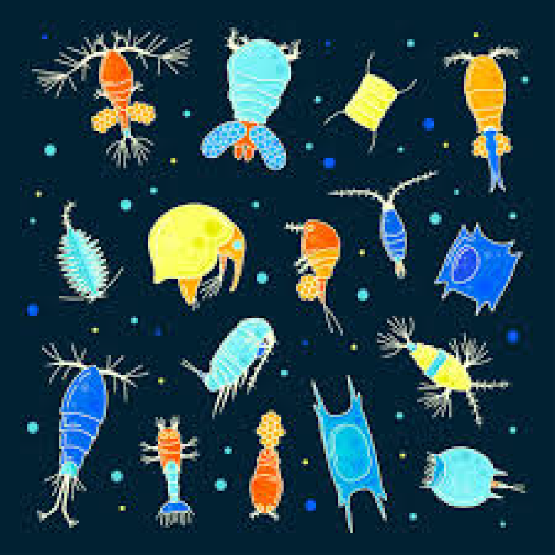

## [Importance of Zooplankton]{style="background: #1f2937; color: #ffffff"}

 Zooplankton are fundamental to aquatic ecosystems, serving as the "engine" of energy transfer and nutrient cycling. Their importance is categorized into four key roles:

**1. Foundation of the food web**

- **Trophic link:** They serve as the primary intermediate species, transferring energy from microscopic phytoplankton to larger invertebrate predators and fish.
- **Primary consumers:** By grazing on phytoplankton, they convert solar energy stored in plant biomass into animal tissue accessible to higher trophic levels.
- **Energy conduit:** Without this link, the energy produced by phytoplankton would be largely unavailable to the vast majority of marine and freshwater megafauna.

## [Importance of Zooplankton]{style="background: #1f2937; color: #ffffff"}

- In turn, zooplankton become food for a vast array of larger organisms, including;

  - *Small fish* (like sardines and herring)
  - *Larval stages* of many fish and invertebrates
  - *Shellfish* (like krill, which are a type of zooplankton themselves, but also feed on smaller zooplankton)
  - *Some seabirds*
  - Even giant *filter-feeders* like *baleen whales* (*blue whales, humpback whales*) and whale sharks.

- Without zooplankton, many of these larger animals would not have a sufficient food source, leading to a collapse of the entire ecosystem.

## [Importance of Zooplankton...]{style="background: #1f2937; color: #ffffff"}

**2. Nutrient cycling**

- Zooplankton play a vital role in recycling nutrients.
- As they consume phytoplankton and organic matter, they excrete waste products like **ammonia** and **phosphate** directly into the photic zone.
- These waste products are essential limiting nutrients that phytoplankton immediately reuse for growth, fueling further primary production.
- When predators consume zooplankton, they acquire nutrients originally synthesized by phytoplankton, moving them higher up the food web.
- This process is a key component of **biogeochemical cycles**, ensuring that essential elements are not lost but continuously recycled within the aquatic environment.

## [Importance of Zooplankton...]{style="background: #1f2937; color: #ffffff"}

**3. Biological carbon pump**

- Zooplankton contribute to the *biological carbon pump*.
- They consume large amounts of carbon-rich phytoplankton and other organic matter, which they then excrete as fecal pellets.
- These dense pellets sink rapidly, bypassing the surface recycling processes.
- When zooplankton die or perform **diel vertical migration**, they transport carbon from the surface to the deep ocean.
- This helps to sequester carbon in the deep ocean, playing a role in regulating the Earth's climate.
- This process effectively "pumps" atmospheric CO₂ into long-term storage in deep-sea sediments.

## [Importance of Zooplankton...]{style="background: #1f2937; color: #ffffff"}

**4.Indicators of ecosystem health**

- **Bio-indicators:** Because zooplankton are sensitive to changes in water quality, temperature, salinity, and pollution, their community structure serves as a "canary in the coal mine" for aquatic health.
- **Environmental monitoring:** Scientists track shifts in abundance and diversity to detect the early impacts of climate change, eutrophication, and chemical stressors.
- **Disturbance detection:** Environmental disturbances are often first visible through changes in species composition, body size distribution, and the timing of seasonal blooms.
- **Research applications:** They are used in ecological studies, water quality monitoring, and even biotechnology for drug development from biologically active compounds.

## [Importance of Zooplankton...]{style="background: #1f2937; color: #ffffff"}

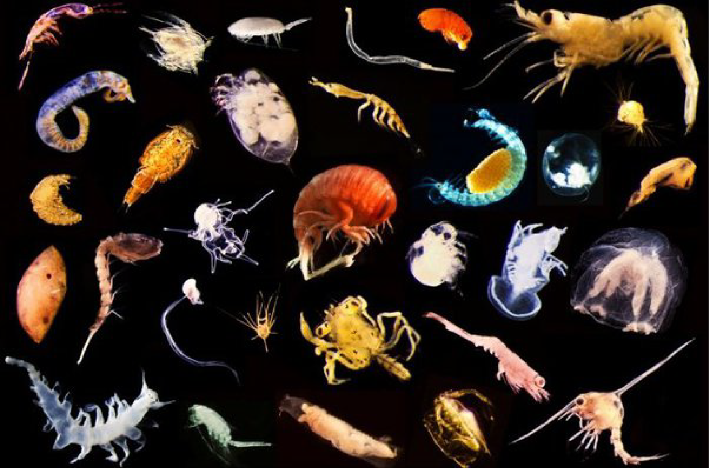

# Taxonomy and Systematics of Zooplankton

## [Taxonomy and Systematics]{style="background: #1f2937; color: #ffffff"}

- **Taxonomy** is the science of naming, defining, and classifying groups of biological organisms on the basis of shared characteristics.
- **Systematics** is a broader field that studies the diversification of living forms and their evolutionary relationships (**phylogeny**).
- Zooplankton are defined by their **ecological role** (*heterotrophic*, *drifting animals*) rather than a shared evolutionary lineage.
- This means zooplankton are incredibly diverse and polyphyletic, originating from many different phyla across the animal kingdom.

::: {.callout-tip}
Because they are grouped by **how they live** rather than **who they are related to**, zooplankton taxonomy covers everything from single-celled protists to complex vertebrates.
:::

## [Taxonomy and Systematics...]{style="background: #1f2937; color: #ffffff"}

- Zooplankton can be classified by either their size and/or by their developmental stage (life cycle).
- **Size Classification:**
  - **Picoplankton** (< 2 $\mu$m): Mostly bacteria and very small protists.
  - **Nanoplankton** (2–20 $\mu$m): Small flagellates.
  - **Microplankton** (20–200 $\mu$m): Ciliates, rotifers, and nauplii.
  - **Mesoplankton** (0.2–20 mm): Copepods, cladocerans, and small larvae.
  - **Macroplankton** (2–20 cm): Krill, small jellyfish, and arrow worms.
  - **Megaplankton** (> 20 cm): Large jellyfish and colonial salps.
- There are two categories used to classify zooplankton by their stage of development: **meroplankton and holoplankton**.

## [Taxonomy and Systematics...]{style="background: #1f2937; color: #ffffff"}

- Zooplankton are also classified by their **developmental strategy**:

1. **Meroplankton (Temporary Plankton):**
    - Organisms that spend only part of their life cycle (usually the larval stage) as plankton.
    - As they mature, they settle to the bottom (benthic) or become active swimmers (nektonic).
    - *Examples:* Larvae of crabs, lobsters, fish, corals, and sea urchins.

2. **Holoplankton (Permanent Plankton):**
    - Organisms that spend their entire life cycle drifting in the water column.
    - *Examples:* Copepods, krill, chaetognaths, and salps.

::: {.callout-important}
Meroplankton and holoplankton are found in almost every major taxonomic group, representing a diverse array of evolutionary adaptations to a drifting lifestyle.
:::

## [Taxonomy and Systematics...]{style="background: #1f2937; color: #ffffff"}

- Some amoebas such as those classified as Foraminifera and Actinopoda have hard skeletons, usually larger than 2 millimeters in diameter, that help form deep-sea sediment.

## [Major taxonomic groups in zooplankton]{style="background: #1f2937; color: #ffffff"}

1.  **Protozoan Zooplankton (Single-celled Eukaryotes)**

- These are often referred to as **microzooplankton** due to their small size.
- They include four major groups;

  - i. Foraminifera
  - ii. Radiolaria
  - iii. Ciliates
  - iv. Heterotrophic dinoflagellates

## [i. Foraminifera and Radiolaria]{style="background: #1f2937; color: #ffffff"}

**Phylum Retaria**

- Majority are marine, inhabiting all oceans from surface waters to the deep sea. Some foraminiferans occur in brackish or freshwater.
- They possess specialized **pseudopods** and often intricate spines that aid in buoyancy and prey capture.
- While many are planktonic, numerous species are **benthic**, living on or within seafloor sediments.
- Their discarded shells (tests) accumulate over millions of years, forming significant portions of deep-sea sediment and providing a vital fossil record for paleoclimatology.

::: {.callout-note}
Retaria includes the *Foraminifera* and *Radiolaria*, which are among the most important groups for studying Earth's historical climate.
:::

## [Characteristics of Retaria]{style="background: #1f2937; color: #ffffff"}

1.  **Amoeboid protists with specialized pseudopods:**

- These organisms are fundamentally **amoeboid**, meaning they can change their shape and move using cytoplasmic extensions called **pseudopods**.
- A distinctive feature of Phylum Retaria is the presence of two specialized types of pseudopods: **reticulopodia** (found in Foraminifera) and **axopodia** (found in Radiolaria).

## [Characteristics of Retaria...]{style="background: #1f2937; color: #ffffff"}
 
- **Reticulopodia (Foraminifera)**: These are fine, branching, and interconnected pseudopods that form a dynamic, net-like structure.
  - They are used for trapping food, locomotion, and in the construction of their tests (shells).

- **Axopodia (Radiolaria)**: These are long, thin, needle-like pseudopods, each supported by a central rod of microtubules (the **axoneme**).
  - They radiate outwards from the cell body and are used for buoyancy, capturing food, and sensation.

## [Characteristics of Retaria...]{style="background: #1f2937; color: #ffffff"}

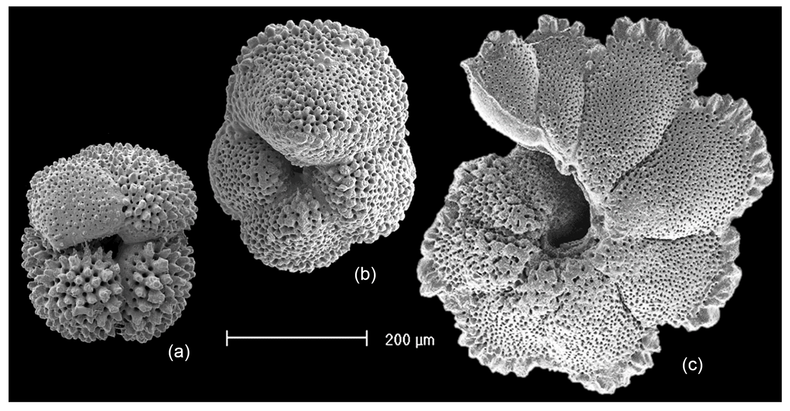

## [Characteristics of Retaria...]{style="background: #1f2937; color: #ffffff"}

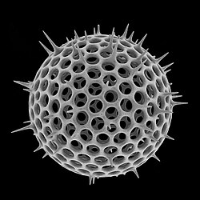

## [Characteristics of Retaria...]{style="background: #1f2937; color: #ffffff"}

**2. Production of tests or skeletons**

- Most members of Retaria produce a protective external shell, called a **test**, or an intricate internal skeleton.
- **Foraminifera**: Typically construct tests made of **calcium carbonate (CaCO₃)**.
  - These tests can be single-chambered or, more commonly, multi-chambered, with new chambers added as the organism grows.
  - Their porous shells allow pseudopods to extend outward for feeding and buoyancy.
- **Radiolaria**: Famous for their beautiful and complex internal skeletons, most commonly made of **silica (SiO₂)**.
  - These glass-like structures often feature intricate radial symmetry and long spines that increase surface area to slow sinking.

## [Characteristics of Retaria...]{style="background: #1f2937; color: #ffffff"}

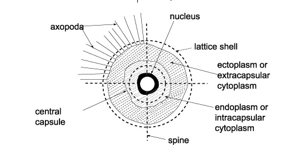

## [ii. Ciliates (e.g., Tintinnids)]{style="background: #1f2937; color: #ffffff"}

**Phylum Ciliophora**

**Characteristics**

- Characterized by the presence of hair-like organelles called cilia, used for both locomotion and creating feeding currents.
- *Tintinnids* are a prominent group of planktonic ciliates that build protective, vase-shaped shells called **loricae**, which can be composed of secreted minerals or cemented environmental particles.
- They are important grazers of nanoplankton (phytoplankton and bacteria), acting as a vital link in the **microbial loop** by making energy available to larger zooplankton.

::: {.callout-note}
Ciliates are often the most abundant microzooplankton in both marine and freshwater environments, capable of rapid population growth.
:::

## [Phylum Ciliophora]{style="background: #1f2937; color: #ffffff"}

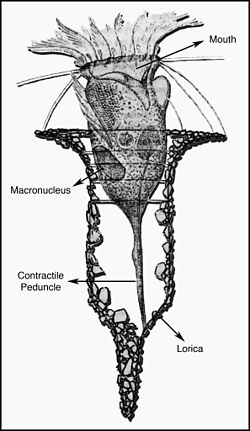 

## [iii. Heterotrophic Dinoflagellates]{style="background: #1f2937; color: #ffffff"}

**Phylum Dinoflagellata**

**Characteristics**

- They typically have two flagella.
- They are significant predators of smaller zooplankton and other protists.
- While many dinoflagellates are photosynthetic (phytoplankton), heterotrophic species lack chloroplasts and must ingest food.
- Some species are **mixotrophic**, meaning they can both photosynthesize and ingest prey.

::: {.callout-note}
Heterotrophic dinoflagellates play a major role in the microbial loop by consuming bacteria and small phytoplankton.
:::

## [2. Metazoan Zooplankton]{style="background: #1f2937; color: #ffffff"}

- **Metazoans** are multicellular animals.
- This group contains the vast majority of zooplankton diversity, spanning numerous animal phyla.
- They range from microscopic rotifers to giant jellyfish and include the most abundant animals on Earth, the copepods.

## [Phylum Arthropoda]{style="background: #1f2937; color: #ffffff"}

**Subphylum Crustacea**

- This is often the most dominant group in terms of biomass and abundance, it includes the copepods group.
- They possess chitinous exoskeleton which provides support and protection.
- They have two pairs of antenna used for sensing the environment and sometimes for swimming or feeding.
- Limbs are typically two-branched (Biramous appendages), though often modified for various functions like swimming, feeding, or gas exchange.

## [Subphylum Crustacea...]{style="background: #1f2937; color: #ffffff"}

- They possess mandibles -- jaw-like appendages for biting and grinding food.
- Compound eyes often present, may be stalked or sessile.
- Many are Nauplius larval stage.
- The body segment typically divided into a head, thorax, and abdomen, though fusion of segments (eg cephalothorax) is common.

## [Class of subphylum Crustacea]{style="background: #1f2937; color: #ffffff"}

1.  Class Maxillopoda
2.  Class Branchiopoda
3.  Class Malacostraca

## [Class Maxillopoda]{style="background: #1f2937; color: #ffffff"}

- Maxillopoda is a large class of mostly small crustaceans (typically 0.5–2mm)
- It consists of over 14,000 species of freshwater and marine copepods

## [Subclass Copepoda]{style="background: #1f2937; color: #ffffff"}

- They have small body size with a cylindrical or pear-shaped body divided into two main regions
- They possess a single, simple naupliar eye in the adult stage (though some larval forms might have paired eyes).
- Have prominent first antennae (antennules) usually long, often used for swimming, sensory perception, and in males, for grasping females during mating.
- Unlike many other crustaceans, copepods generally lack a true carapace covering the thorax.

## [Subclass Copepoda...]{style="background: #1f2937; color: #ffffff"}

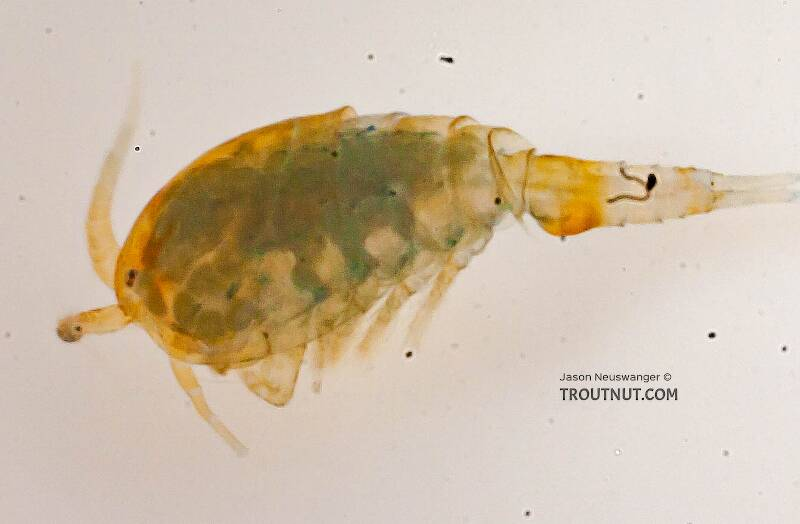

## [Subclass Copepoda...]{style="background: #1f2937; color: #ffffff"}

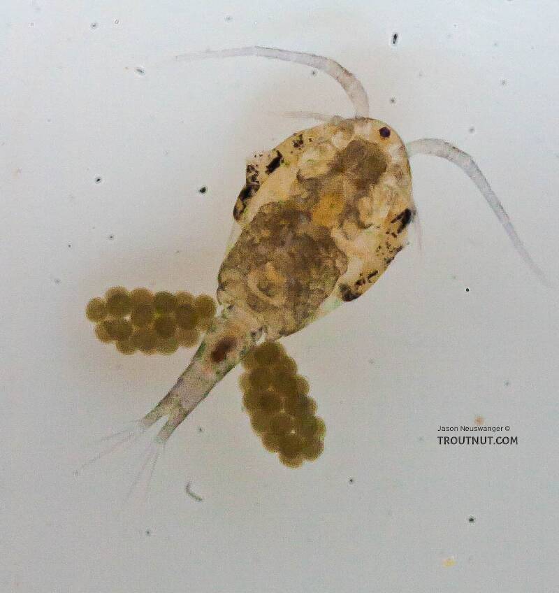

## [Subclass Copepoda...]{style="background: #1f2937; color: #ffffff"}

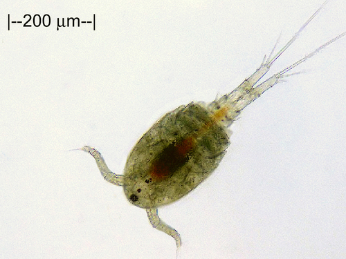

## [Class Branchiopoda, Order Cladocera]{style="background: #1f2937; color: #ffffff"}

- These are small crustaceans with a bivalved carapace that encloses the body but not the head.
- They have large, branched antennae used for swimming.
- They are found in marine waters.
- Cladocerans eat phytoplankton and other zooplankton.
- Like many species of zooplankton, cladocerans migrate to the surface at night.
- This is referred to as **diurnal migration**.
- Example *Daphnia*, *water flea*

## [Order Cladocera...]

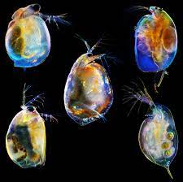

## [Order Cladocera...]

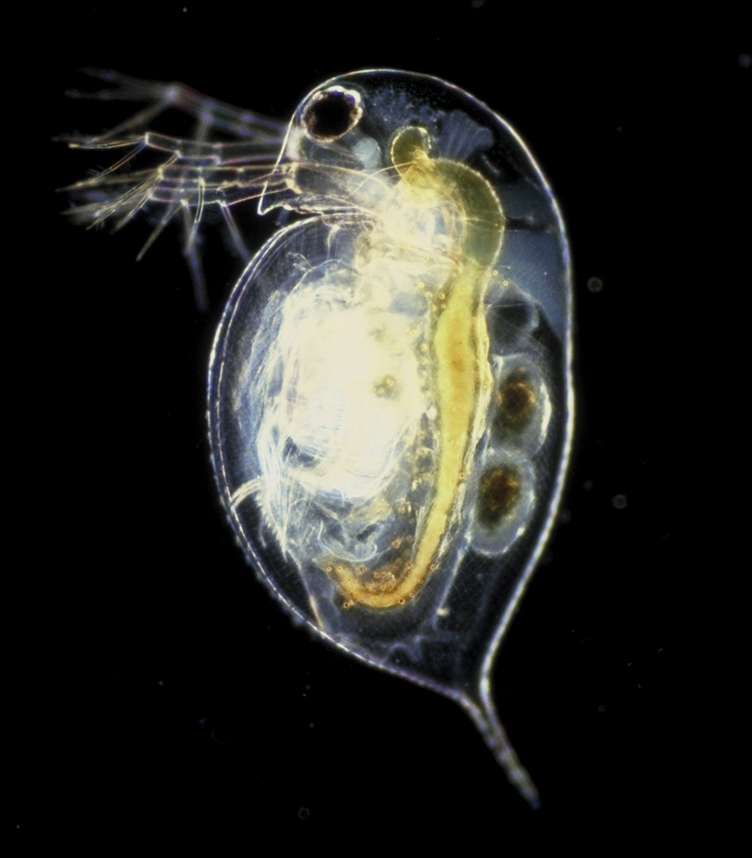 

## [Class Malacostraca]{style="background: #1f2937; color: #ffffff"}

- Body typically divided into cephalothorax and abdomen.
- Usually possess 8 thoracic and 6 abdominal segments.
- Many have a carapace covering the cephalothorax.
- Possess a tail fan formed by the telson and uropods (in many species).

## [Class Malacostraca...]{style="background: #1f2937; color: #ffffff"}

**3 Orders**

1.  Order Euphausiacea (Krill)
2.  Order Amphipoda
3.  Order Decapoda

## [Order Euphausiacea (Krill)]{style="background: #1f2937; color: #ffffff"}

- Shrimp-like crustaceans, generally larger than copepods consisting of the **Krill**
- Gills are exposed, not covered by the carapace.
- Carapace is small, covering only the anterior thorax.
- All thoracic limbs are similar and function in feeding and locomotion.
- Possess photophores (bioluminescent organs).

## [Order Euphausiacea...]{style="background: #1f2937; color: #ffffff"}

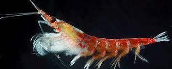

## [Order Euphausiacea...]{style="background: #1f2937; color: #ffffff"}

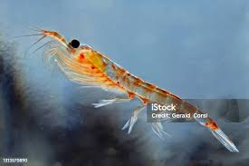

## [Order Euphausiacea...]{style="background: #1f2937; color: #ffffff"}

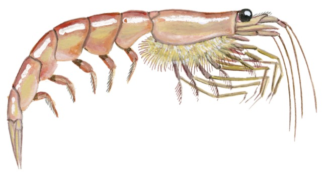

## [Order Amphipoda]{style="background: #1f2937; color: #ffffff"}

- They have lateral compressed body, they are typically flattened from side to side.
- Unlike many other malacostracans, amphipods lack a carapace.
- Many species are transparent or translucent, providing camouflage in the open ocean environment.
- They have sessile compound eyes; their eyes are directly attached to the head, not on stalks which cover almost the entire surface of their head.
- This is an adaptation for vision in the dim light of the pelagic (open ocean) environments they inhabit.
- Their gills are located on the basal segments (*coxae*) of their thoracic legs.

## [Order Amphipoda...]{style="background: #1f2937; color: #ffffff"}

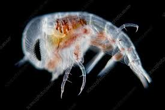

## [Order Amphipoda...]{style="background: #1f2937; color: #ffffff"}
  
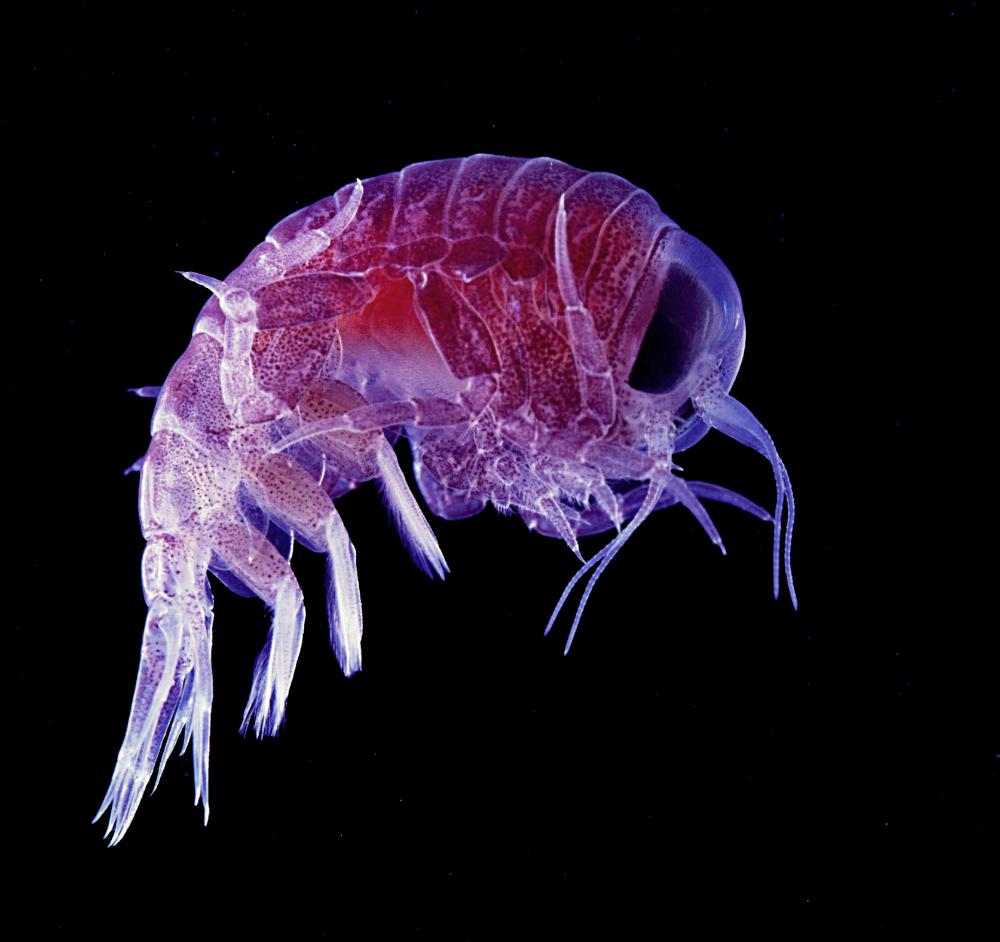

## [Order Amphipoda...]{style="background: #1f2937; color: #ffffff"}

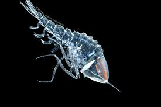

## [Order Decapoda]{style="background: #1f2937; color: #ffffff"}

- Includes the **larval stages** (e.g., nauplius, zoea, megalopa) of many familiar benthic or nektonic crustaceans like crabs and lobsters.
- They are primarily **meroplankton**, meaning they spend only their early life stages drifting in the water column.
- They possess ten legs (**pereiopods**); the name *Decapoda* literally translates to "ten-footed."
- They feature a well-developed carapace covering the **cephalothorax**, which protects the internal organs and encloses the gill chambers.

## [Order Decapoda...]{style="background: #1f2937; color: #ffffff"}

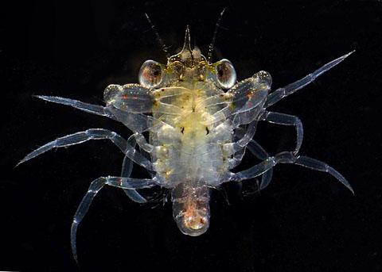

## [Order Decapoda...]{style="background: #1f2937; color: #ffffff"}

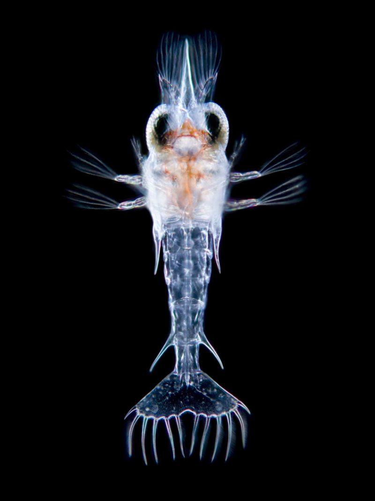

## [Phylum Cnidaria]{style="background: #1f2937; color: #ffffff"}

::: {.columns}

::: {.column width="60%"}
- **Phylum Cnidaria** contains colonial siphonophores and scyphozoans (true jellyfish).
 - They are primarily marine predators equipped with stinging tentacles.
 - They possess specialized stinging cells called **nematocysts** used for defense and capturing prey.
 - **Phylum Ctenophora** (comb jellies) are often grouped with jellyfish but lack nematocysts, moving instead via rows of fused cilia.

:::

::: {.column width="40%"}

:::
:::

## [Phylum Cnidaria...]{style="background: #1f2937; color: #ffffff"}

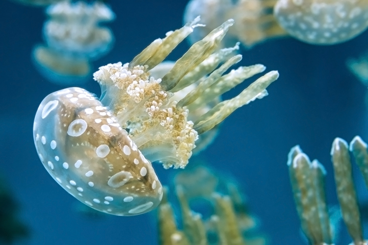

## [Phylum Cnidaria...]{style="background: #1f2937; color: #ffffff"}

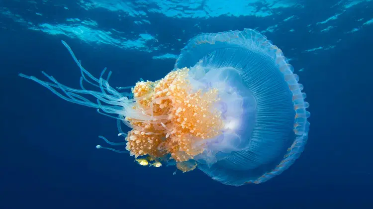

## [Defense Mechanisms]{style="background: #1f2937; color: #ffffff"}

- Cnidarians have evolved various defense mechanisms to protect themselves from predators and other threats in their environment. These mechanisms include:

## [Defense Mechanisms...]{style="background: #1f2937; color: #ffffff"}

1.  **Nematocysts**: These are specialized stinging cells that contain a coiled, barbed thread. When triggered, the thread is rapidly ejected, delivering venom to the target. Nematocysts can be used for both defense and capturing prey.
2.  **Bioluminescence**: Many cnidarians can produce light through a chemical reaction in their bodies. This bioluminescence can serve as a defense mechanism by startling predators or by attracting larger predators to attack the initial threat.
3.  **Camouflage**: Some cnidarians can blend into their surroundings, making them less visible to predators. This can involve changing color or having a body shape that mimics the environment.

## [Defense Mechanisms...]{style="background: #1f2937; color: #ffffff"}

4.  **Toxicity**: In addition to the venom delivered by nematocysts, some cnidarians produce toxins that can deter predators. These toxins can cause pain, paralysis, or even death in some cases.
5.  **Physical structures**: Some cnidarians have physical structures that provide protection, such as a hard exoskeleton or a tough outer layer that can make them less palatable or more difficult for predators to consume.

## [Defense Mechanisms...]{style="background: #1f2937; color: #ffffff"}

::::: columns
::: {.column width="60%"}
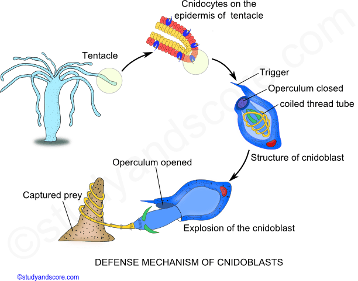
:::

::: {.column width="40%"}
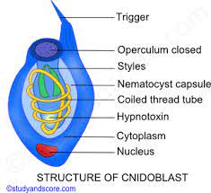
:::
:::::

## [Phylum Chordata, Subphylum Tunicata]{style="background: #1f2937; color: #ffffff"}

 - They are unique chordates that often retain a tadpole-like larval form (notochord and dorsal nerve cord) throughout their life cycle.
 - Planktonic tunicates include the holoplanktonic classes **Appendicularia** (larvaceans) and **Thaliacea** (salps, doliolids, and pyrosomes).
 - They are highly efficient filter feeders; *Appendicularia* creates a complex "mucous house" to trap ultra-fine food particles.
 - While some are holoplanktonic, many other tunicates (like sea squirts) are benthic as adults and only join the plankton as short-lived larvae.

## [Subphylum Tunicata...]{style="background: #1f2937; color: #ffffff"}

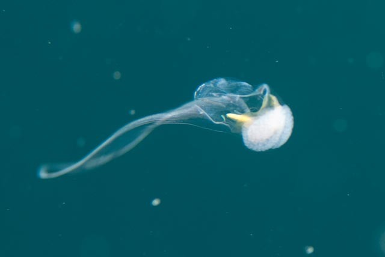

## [Subphylum Tunicata...]{style="background: #1f2937; color: #ffffff"}

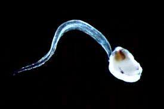

## [Phylum Chordata, Subphylum Vertebrata]{style="background: #1f2937; color: #ffffff"}

- They include fish Larvae (Ichthyoplankton)
- They are eggs and larval stages of fish that drift passively with water currents.
- Larvae often look significantly different from adult fish, lacking features like fully formed fins, scales, or pigmentation.
- They are a form of **meroplankton**, as they only spend their early life stages in the plankton before developing into nektonic (swimming) adults.

## [Subphylum Vertebrata...]{style="background: #1f2937; color: #ffffff"}

- Many possess a fin fold instead of distinct fins.
- Eyes are often relatively large and functional, for detecting food and predators.
- They possess a **lateral line system** for detecting water movement and **olfactory organs** for smell.
- Pharyngeal slits are modified into functional gills supported by gill arches.
- They are highly vulnerable to predation and environmental changes, making them important indicators for fisheries management.
- Their survival is closely linked to the timing of phytoplankton and zooplankton blooms (the "match-mismatch" hypothesis).

## [Subphylum Vertebrata...]{style="background: #1f2937; color: #ffffff"}

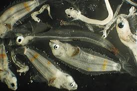

## [Fish Larvae]{style="background: #1f2937; color: #ffffff"}

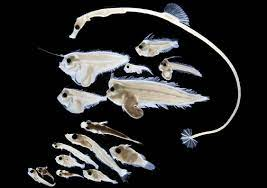

## [Fish Larvae...]{style="background: #1f2937; color: #ffffff"}

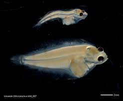

## [Phylum Chaetognatha (Arrow Worms)]{style="background: #1f2937; color: #ffffff"}

- They are commonly known as **arrow worms** -- They are voracious marine predators.
- They have transparent, torpedo-shaped body which is tapered at both ends, providing a streamlined form for rapid, darting movements.
- They have a distinct body regions which is clearly divided into a head, trunk, and tail.
- Posses a grasping spines: The head features formidable chitinous spines used to seize and hold prey (primarily copepods).
- They possess one or two pairs of lateral fins for stabilization and a powerful caudal (tail) fin for propulsion.
- They are **hermaphroditic**, possessing both male and female reproductive organs.

## [Phylum Chaetognatha...]{style="background: #1f2937; color: #ffffff"}

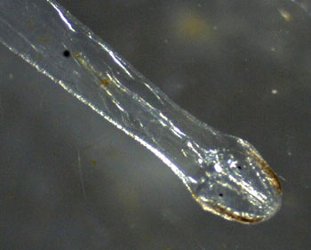

## [Phylum Chaetognatha...]{style="background: #1f2937; color: #ffffff"}

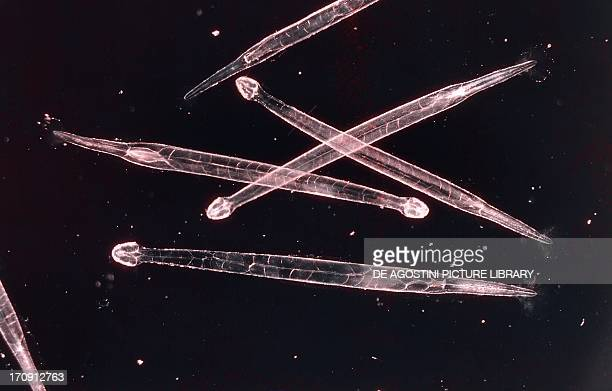

## [Phylum Chaetognatha...]{style="background: #1f2937; color: #ffffff"}

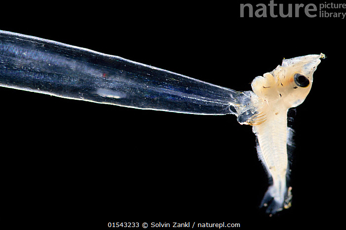

## [Phylum Chaetognatha...]{style="background: #1f2937; color: #ffffff"}

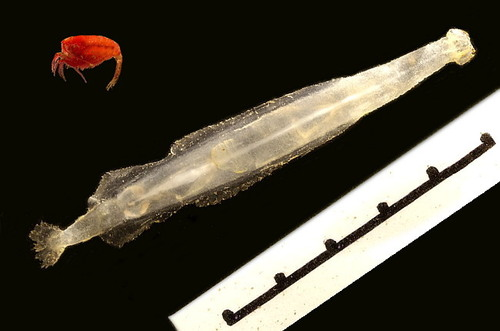

## [Phylum Mollusca]{style="background: #1f2937; color: #ffffff"}

- Includes both **meroplanktonic** larvae of benthic mollusks (like veligers) and **holoplanktonic** specialists like **pteropods** (sea butterflies) and **heteropods**.
- They possess a soft, unsegmented body, often with a muscular "foot" modified into wing-like lobes (**parapodia**) for swimming.
- Some species (e.g., *Atlanta*) maintain a small, coiled, aragonitic shell for protection.
- Others (e.g., *Carinaria*) have a reduced, cap-like shell or have lost the shell entirely to increase buoyancy and mobility.
- Pteropods are highly sensitive to **ocean acidification**, as their thin calcium carbonate shells dissolve easily in lower pH waters.

## [Phylum Mollusca...]{style="background: #1f2937; color: #ffffff"}

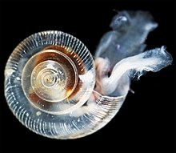

## [Phylum Mollusca...]{style="background: #1f2937; color: #ffffff"}

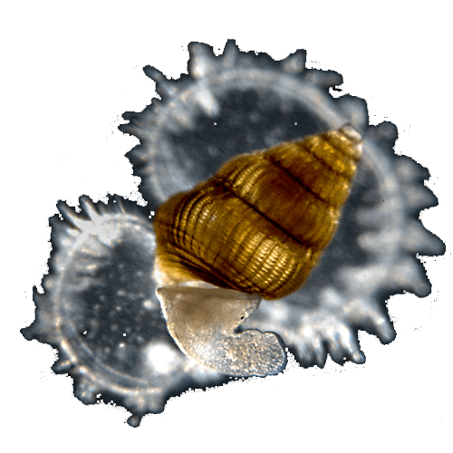

## [Phylum Annelida, Class Polychaeta]{style="background: #1f2937; color: #ffffff"}

- **Polychaeta** means **"many bristles,"** referring to the numerous chitinous bristles called **chaetae** arranged in bundles.
- Each body segment typically features a pair of fleshy, two-branched (biramous) protrusions called **parapodia** used for locomotion and respiration.
- They possess a well-developed head region, often equipped with sophisticated sensory organs including tentacles, palps, and eyespots.
- While many are benthic (like the lugworm *Arenicola marina*), many species are **holoplanktonic** or have planktonic larval stages.
- Planktonic forms are often transparent and use their parapodia as paddles for active swimming.
- They play a significant role in the marine food web as both predators and prey for larger invertebrates and fish.

## [Class Polychaeta...]{style="background: #1f2937; color: #ffffff"}

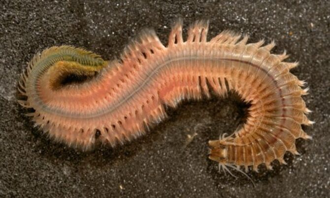

## [Class Polychaeta...]{style="background: #1f2937; color: #ffffff"}

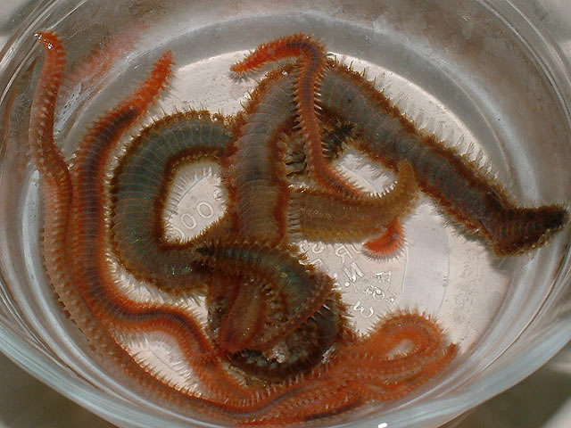

## [Class Polychaeta...]{style="background: #1f2937; color: #ffffff"}

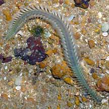
