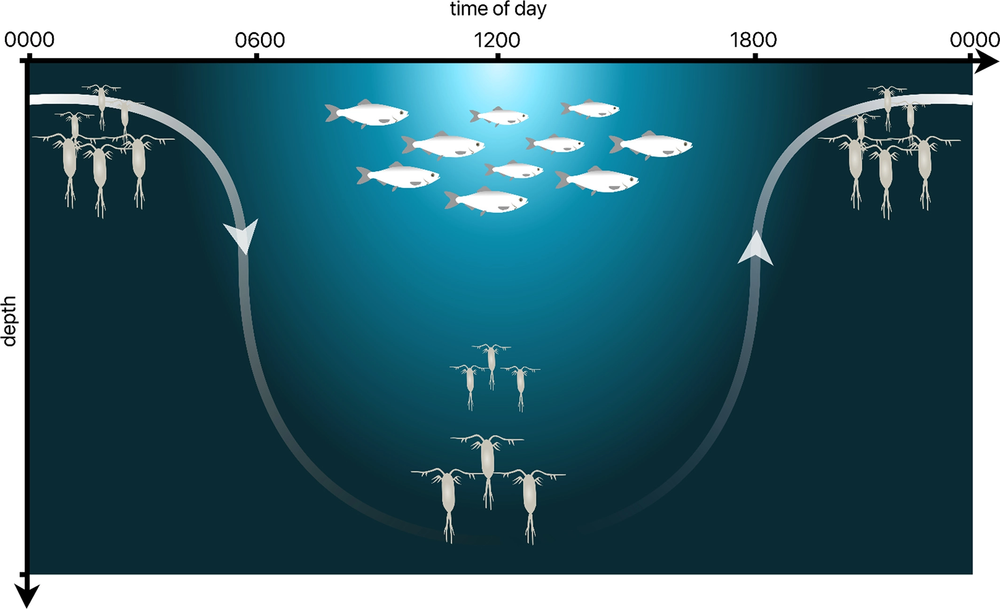
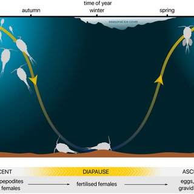
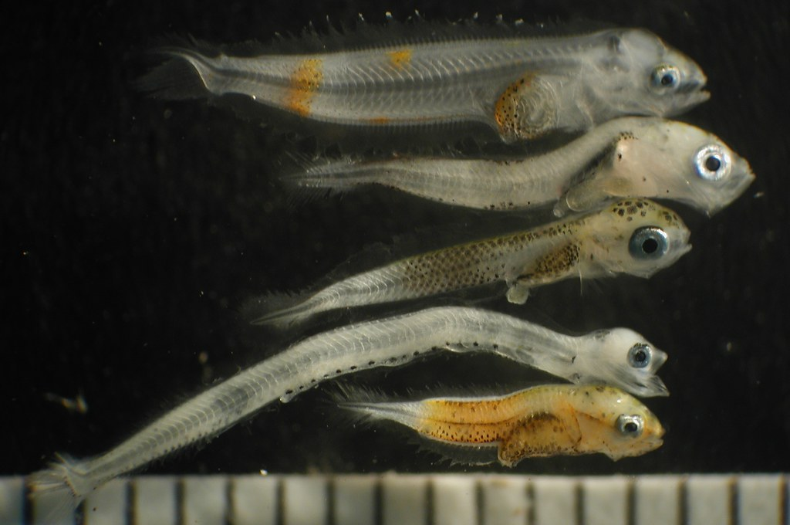
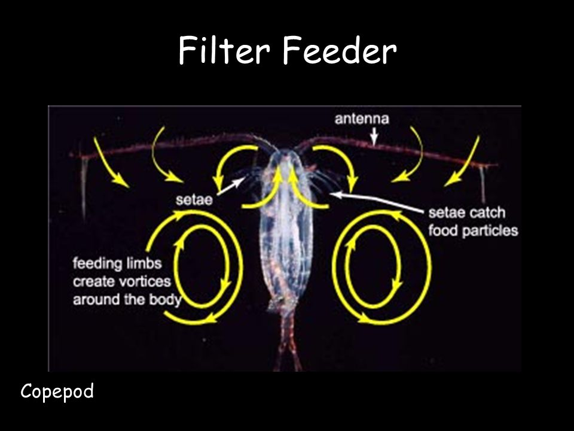
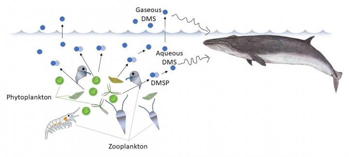
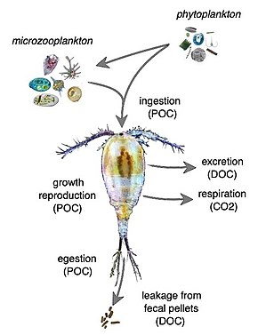
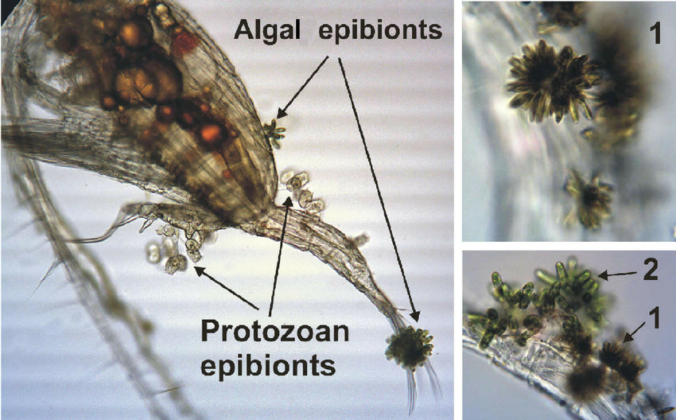
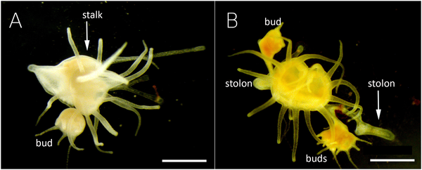

# Classification of Zooplankton based on their behavior

## Behavioral classification of zooplankton

- Zooplankton can be classified based on their behavior, morphology, genetics and ecology.

- Behavior is an important characteristic that can help us understand the ecological roles of different zooplankton species.

- The following are some examples of zooplankton classified based on their behavior:

## Zooplankton Behavioral...

- **Diel migrators:** These are zooplankton that move vertically in the water column on a daily basis.

- During the day, they stay in deeper waters to avoid predators, and at night, they move closer to the surface to feed.

- Examples of diel migrators include copepods, krill, and some species of jellyfish.

## Diel migrators

## Zooplankton Behavioral...

- **Seasonal migrators:** These are zooplankton that move vertically in the water column on a seasonal basis.

- They are often associated with changes in water temperature or other environmental factors.

- For example, some species of copepods migrate to deeper waters during the winter months when surface waters become too cold.

## Seasonal migrators

## Zooplankton Behavioral...

- **Passive drifters:** These are zooplankton that lack the ability to swim against the current, and rely on ocean currents for their dispersal.

- They include the larvae of many marine organisms, such as crabs, lobsters, and fish.

## Passive drifters

## Zooplankton Behavioral...

- **Active swimmers:** These are zooplankton that have the ability to actively swim through the water column.

- They use their appendages or fins to move through the water, and can control their movements in response to environmental cues or to avoid predators.

- Examples of active swimmers include chaetognaths, jellyfish, and some species of krill.

## Zooplankton Behavioral...

- **Filter feeders:** These are zooplankton that feed by filtering small particles from the water column.

- They use specialized structures such as cilia, setae, or bristles to capture food particles.

- Examples of filter feeders include copepods, krill, and some species of clams and mussels.

## Zooplankton Behavioral...

- **Predators:** These are zooplankton that actively hunt and consume other planktonic organisms.

- They have specialized structures such as hooks, spines, or tentacles to capture their prey.

- Examples of predators include some species of jellyfish, chaetognaths, and some species of copepods.

# Classification of Zooplankton based on their genetics

## Genetics classification of zooplankton

- Zooplankton can also be classified based on their genetics.

- This is an important tool for understanding the evolutionary relationships and genetic diversity of zooplankton species.

- Under this class we have the following groups:

## Genetics classification of zooplankton...

- **Phylogenetic classification:** This classification system is based on the genetic relatedness of different zooplankton species.

- Scientists use molecular techniques such as DNA sequencing to compare the genetic material of different species and determine their evolutionary relationships.

- This approach has led to the discovery of new species and the revision of taxonomic classifications.

## Genetics classification of zooplankton...

- For example, recent molecular studies have shown that some groups of copepods previously thought to belong to the same family are actually separate families.

## Genetics classification of zooplankton...

- **Population genetics:** This classification system is based on the genetic variation within and between populations of zooplankton species.

- Population genetics can be used to study the distribution of genetic variation and the processes that drive evolutionary change.

- For example, scientists use population genetics to study the genetic diversity of krill populations and the factors that influence their survival in changing ocean environments.

## Genetics classification of zooplankton...

- **Functional genetics:** This classification system is based on the genetic basis of functional traits that are important for the survival and ecological interactions of zooplankton species.

- Scientists use functional genetics to study the genes that control traits such as swimming behavior, feeding efficiency, and predator avoidance.

- For example, studies have shown that some species of copepods have evolved specialized appendages for feeding that are controlled by unique genetic pathways.

## Feeding behavior in zooplankton

- Zooplankton are a diverse group of organisms that play important roles in aquatic food webs as primary consumers and as prey for larger organisms.

- Feeding behavior is a critical aspect of their ecology and can vary widely between different groups and species.

- By understanding the feeding behavior of zooplankton, scientists can better understand how they interact with their environment, and how they contribute to the larger food web in aquatic ecosystems.

- The following are examples of feeding behavior in zooplankton:

## Filter feeding

- **Filter feeding:** This is the most common feeding strategy in zooplankton, and involves the use of specialized structures such as cilia, setae, or bristles to capture small particles such as algae, bacteria, or detritus.

- Examples of filter feeders include copepods, krill, and some species of clams and mussels.

## Filter feeding

## Grazing

- **Grazing:** Some zooplankton species, such as rotifers and some copepods, use their appendages to scrape or graze on surfaces such as plants or rocks.

- This allows them to feed on larger particles such as diatoms and other phytoplankton.

## Predation

- **Predation:** Some zooplankton species are predators that actively hunt and consume other planktonic organisms.

- They have specialized structures such as hooks, spines, or tentacles to capture their prey.

- Examples of predators include some species of jellyfish, chaetognaths, and some species of copepods.

## Predation feeding

## Mixotrophy

- **Mixotrophy:** Some zooplankton species, such as dinoflagellates and some ciliates, are mixotrophic, which means they combine both photosynthesis and heterotrophic feeding strategies.

- They use their chloroplasts to photosynthesize and also capture small prey such as bacteria and other protozoans.

## Mixotrophy feeding

## Parasitism

- **Parasitism:** Some zooplankton species, such as copepods, are parasitic and live off the blood or tissue of other organisms.

- They attach themselves to the host and feed on its fluids.

## Parasitism feeding

## [Reproduction]{style="background: #1f2937; color: #ffffff"}

- Zooplankton have a variety of reproductive strategies, ranging from sexual reproduction to asexual reproduction.
- Some species reproduce sexually, with males and females releasing their gametes into the water column.
- Other species reproduce asexually, with individuals producing clones of themselves through budding or fragmentation.
- In some cases, zooplankton can switch between sexual and asexual reproduction depending on environmental conditions i.e *Daphnia*, *Jellyfish.*

## [Sexual reproduction]{style="background: #1f2937; color: #ffffff"}

- Many species of zooplankton reproduce sexually, which involves the fusion of gametes (sperm and egg cells).
- In some species, males and females release their gametes into the water, where fertilization occurs externally.
- In other species, males transfer their sperm to the female, who then fertilizes her eggs internally.
- Examples of zooplankton with sexual reproduction are *Copepods* and *Krill*.

## [Asexual reproduction]{style="background: #1f2937; color: #ffffff"}

- Some species of zooplankton are capable of asexual reproduction, where offspring are produced without the involvement of gametes.
- This can occur through various mechanisms such as budding, fragmentation, or parthenogenesis (where an unfertilized egg develops into an embryo).

## [Asexual reproduction...]{style="background: #1f2937; color: #ffffff}

- **Budding:** A new individual grows as an outgrowth from the parent organism, which then detaches and becomes a separate individual.
    - Examples: *Cnidaria* and *Scyphozoans*.

## [Asexual reproduction...]{style="background: #1f2937; color: #ffffff"}

- **Fragmentation:** The parent organism breaks into several parts, each of which can grow into a new individual.

- **Parthenogenesis:** A type of reproduction in which an unfertilized egg develops into a new individual without fertilization.

    - Example: Some species of *rotifers* reproduce through parthenogenesis and produce only females.

## [Mixis]{style="background: #1f2937; color: #ffffff"}

- **Mixis** is a specialized reproductive strategy where environmental cues (e.g., photoperiod, temperature, or population density) trigger a switch from asexual to sexual reproduction.

- This process results in the production of **resting eggs** (diapause eggs), which are thick-walled and highly resistant to environmental stress.

- **Ecological significance:** These eggs can remain dormant in the sediment for years, acting as a **seed bank** to repopulate the environment when favorable conditions return.
- Example: *Rotifers*.

## [Hermaphroditism]{style="background: #1f2937; color: #ffffff"}

- **Hermaphroditism:** Some species possess both male and female reproductive organs.
    - This allows for **self-fertilization** or mating with any other individual of the same species, maximizing reproductive opportunities in sparse populations.
    - It helps increase or maintain genetic diversity through cross-fertilization.
    - **Examples:** *Arrow worms* (Chaetognaths) and some species of *Ctenophores*.

## [Life cycle of zooplankton]{style="background: #1f2937; color: #ffffff"}

- The life cycle of zooplankton typically includes several stages, starting from the egg stage, followed by larval stages, and finally reaching adulthood.

## [Life Cycle: From Egg to Larva]{style="background: #1f2937; color: #ffffff"}

- **The Egg Stage:** Females produce large numbers of small, transparent eggs. These are often buoyant and carried long distances by ocean currents.
- **Hatching:** Once the eggs hatch, the **larvae** emerge. 
- **Larval Characteristics:**
    - Often look completely different from adults (morphologically distinct).
    - May have different feeding habits and behaviors.
    - Some are active swimmers, while others are passive drifters.
    - This stage is critical for rapid growth and energy acquisition.

## [Life Cycle: Juvenile to Adult]{style="background: #1f2937; color: #ffffff"}

- **Juvenile Stage:** As larvae develop, they transition into juveniles that begin to resemble the adult form.
    - Development of specialized feeding structures.
    - Improved swimming efficiency.
    - **Survival Challenge:** Must avoid intense predation while finding enough food to reach maturity.
- **Adult Stage:** The final stage where the organism is sexually mature.
    - Range from microscopic copepods to massive jellyfish.
    - Occupy specific ecological niches (filter feeders vs. predators).

## [Environmental Timing of Reproduction]{style="background: #1f2937; color: #ffffff"}

- Reproduction is rarely random; it is often synchronized with environmental cues:
    - **Temperature:** Warmer waters often accelerate metabolic and reproductive rates.
    - **Light:** Photoperiod changes can trigger spawning or mixis.
    - **Nutrient Availability:** Reproduction often peaks during phytoplankton blooms to ensure larvae have adequate food.
    - **Example:** Many species reproduce more intensely during summer when food supply and temperatures are optimal.

# Factors affecting spatial and temporal distribution and abundance of zooplankton

## [Factors Affecting Zooplankton]{style="background: #1f2937; color: #ffffff"}

- Spatial and seasonal changes of zooplankton are a critical aspect of marine ecology.
- Zooplankton are the primary consumers in the marine food web and play a crucial role in the transfer of energy from phytoplankton to higher trophic levels.
- The spatial and temporal distribution of zooplankton is influenced by a variety of factors, including physical and chemical conditions, as well as biological interactions.

## [Physical and Chemical Factors]{style="background: #1f2937; color: #ffffff"}

- One of the primary drivers of spatial and seasonal changes in zooplankton distribution is the physical and chemical environment.
- Ocean currents and temperature, light, turbulence, salinity and nutrients they all play a role in shaping the distribution of zooplankton.
- For example, some species of zooplankton are adapted to specific temperature ranges and will only be found in areas with water temperatures within their preferred range.

## [Physical and Chemical Factors...]{style="background: #1f2937; color: #ffffff"}

- Similarly, some species are more abundant in areas with high nutrient availability, such as upwelling zones or estuaries.
- Temporal changes in zooplankton distribution are also influenced by physical factors.
- In temperate regions, for example, zooplankton populations often experience a seasonal cycle of growth and decline.
- During the spring and summer months, when water temperatures are warmer and nutrient availability is high, zooplankton populations can experience explosive growth.

## [Physical and Chemical Factors...]{style="background: #1f2937; color: #ffffff"}

- As fall approaches and temperatures cool, zooplankton populations may decline as food becomes scarce and predators become more active.
- Zooplankton are also affected by levels of pH, heavy metals, calcium, and aluminum.
- Nutrients like nitrogen and phosphorus will affect the prey of zooplankton (like phytoplankton, protozoa and bacteria), indirectly affecting zooplankton survival.

## [Biological Factors]{style="background: #1f2937; color: #ffffff"}

- Biological interactions also play a role in shaping the distribution of zooplankton.
- For example, some species of zooplankton are preyed upon by larger organisms such as fish or whales.
- The presence of these predators can influence the distribution of zooplankton by creating areas where certain species are more abundant due to predator avoidance behaviors.
- Similarly, competition for resources such as food or habitat can also influence the distribution of zooplankton.

## [Environmental Sensitivity]{style="background: #1f2937; color: #ffffff"}

- Zooplankton are also sensitive to their environment.
- A change in zooplankton concentration can indicate a subtle environmental change.
- Zooplankton are highly responsive to nutrient levels, temperatures, pollution, food that is not nutritious, levels of light, and increases in predation.
- The diversity of species, amount of biomass and abundance of zooplankton communities can be used to determine the health of an ecosystem.

# Applications of zooplankton in research

## Applications of zooplankton in research

- Zooplankton have a range of applications in scientific research as follows;

- **Ecological studies:**- Zooplankton are used extensively in ecological studies to understand the dynamics of marine and freshwater ecosystems.

- Scientists can use zooplankton abundance and diversity data to assess the health and productivity of these ecosystems, and to identify changes over time.

## Applications of zooplankton in research...

- **Climate research:**- Zooplankton are sensitive to changes in environmental conditions, such as temperature and nutrient availability.

- Zooplankton have been used as a tool for climate research because they are sensitive to changes in environmental conditions and can respond rapidly to changes in temperature, nutrient availability, and other factors.

- By studying changes in zooplankton populations over time, scientists can gain insights into how marine and freshwater ecosystems are responding to climate change.

## Applications of zooplankton in research...

- Consequently, changes in zooplankton populations can be used as an indicator of climate change impacts on marine and freshwater ecosystems.

- For example, changes in the timing of zooplankton blooms (periods of rapid growth and reproduction) have been observed in some areas in response to warming waters.

- These changes can have important consequences for the food web, as other species that depend on zooplankton may also be affected.

## Applications of zooplankton in research...

- **Aquaculture:**- Zooplankton are an important food source for many species of fish and shellfish.

- Researchers are studying ways to culture zooplankton for use in aquaculture, as they can provide a more sustainable alternative to traditional fish feeds.

## Applications of zooplankton in research

- **Biotechnology:** Some species of zooplankton produce biologically active compounds that have potential applications in medicine and biotechnology.

- Researchers are exploring the potential uses of these compounds for drug development and other applications.

## Applications of zooplankton in research

- **Water quality monitoring:** Zooplankton are sensitive to changes in water quality and can be used as a bio-indicator of water pollution.

- Monitoring zooplankton populations can help to identify areas of concern and track changes in water quality over time.

## Emerging technologies for studying zooplankton

- There are several emerging technologies for studying zooplankton that are improving our understanding of these important organisms and their role in marine and freshwater ecosystems.

Here are a few examples:

- **High-resolution imaging technologies**, such as underwater cameras and remotely operated vehicles (ROVs), allow scientists to observe zooplankton in their natural habitats in real-time.

- This can provide valuable insights into their behavior, distribution, and interactions with other species.

## Emerging technologies for studying zooplankton...

- **DNA sequencing:** DNA sequencing technologies are allowing scientists to identify and classify zooplankton species more accurately and efficiently than ever before.

- This can improve our understanding of their distribution, population structure, and evolutionary relationships.

- **Acoustic methods:** Acoustic technologies, such as echosounders and sonar, allow scientists to detect and quantify zooplankton populations in the water column.

## Emerging technologies for studying zooplankton...

- This can provide valuable data on their abundance, distribution, and behavior.

- **Stable isotope analysis:** Stable isotope analysis involves measuring the relative abundance of different isotopes of elements such as carbon and nitrogen in zooplankton tissues.

- This can provide information on their diet, trophic position, and other aspects of their ecology.

## Emerging technologies for studying zooplankton

- **Artificial intelligence:** Machine learning and other artificial intelligence techniques are being used to analyze large datasets of zooplankton abundance and distribution data.

- Algorithms can also be developed to classify these organisms rather than traditional method

- This can help to identify patterns and trends that might be difficult to detect using traditional statistical methods.

## Ecological roles of zooplankton

- Zooplankton play a crucial ecological role in aquatic ecosystems, and their importance extends to both freshwater and marine environments. Here are some examples of their ecological roles and importance:

- **Trophic transfer:** Zooplankton are an important link in the aquatic food web, serving as a food source for a wide variety of larger organisms, including fish, whales, and seabirds.

- They are also key consumers of phytoplankton, and help to regulate the abundance and composition of these primary producers.

## Ecological roles of zooplankton...

- **Nutrient cycling:** Zooplankton are important in the cycling of nutrients in aquatic ecosystems.

- They consume and digest organic matter, releasing nutrients back into the water that can be taken up by other organisms.

- **Carbon sequestration:** Zooplankton play a role in carbon sequestration by consuming and excreting organic matter, which can then sink to the bottom of the ocean and be stored for long periods of time.

## Ecological roles of zooplankton...

- **Biogeochemical cycling:** Zooplankton are involved in the cycling of important elements such as nitrogen and phosphorus, which are essential for primary production and ecosystem functioning.

- **Indicator species:** Changes in zooplankton populations can be indicative of broader changes in aquatic ecosystems, making them useful as indicator species for monitoring the health of these environments.

- **Oxygen production:** Some zooplankton, such as krill and copepods, are able to produce oxygen through photosynthesis, contributing to the overall oxygen balance of aquatic ecosystems.

## Conservation and management of zooplankton populations

- Conservation and management of zooplankton populations is important for maintaining healthy and functioning aquatic ecosystems.

- The following are some ways in which zooplankton populations can be conserved and managed:

## Conservation and management

- **Reducing pollution:** Reducing the amount of pollutants entering aquatic environments can help to protect zooplankton populations from harmful effects, such as decreased reproduction and growth rates.

- **Managing fisheries:** Many fish species rely on zooplankton as a food source, so sustainable fisheries management practices that consider the impact on zooplankton populations can help to maintain healthy populations.

## Conservation and management

- **Protecting habitats:** Protecting and restoring habitats such as wetlands, mangroves, and seagrass beds can provide important refuge and breeding grounds for zooplankton populations.

- **Monitoring populations:** Regular monitoring of zooplankton populations can provide valuable data on population size, distribution, and behavior, which can be used to inform conservation and management strategies.

## Conservation and management

- **Implementing regulations:** Regulations on activities such as fishing, shipping, and coastal development can help to protect zooplankton populations by reducing the impact of these activities on their habitats and populations.

- **Education and awareness:** Education and awareness campaigns can help to increase public understanding of the importance of zooplankton populations in aquatic ecosystems, and encourage actions to protect them.

## References