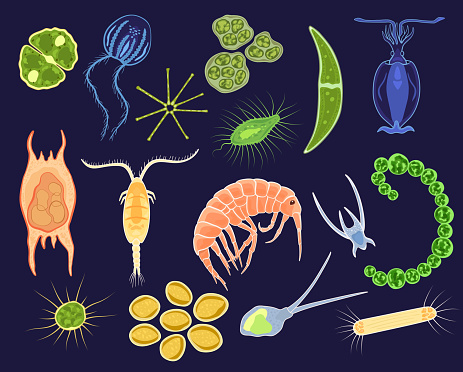
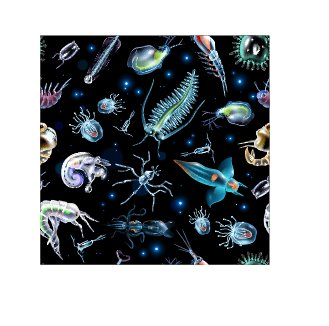
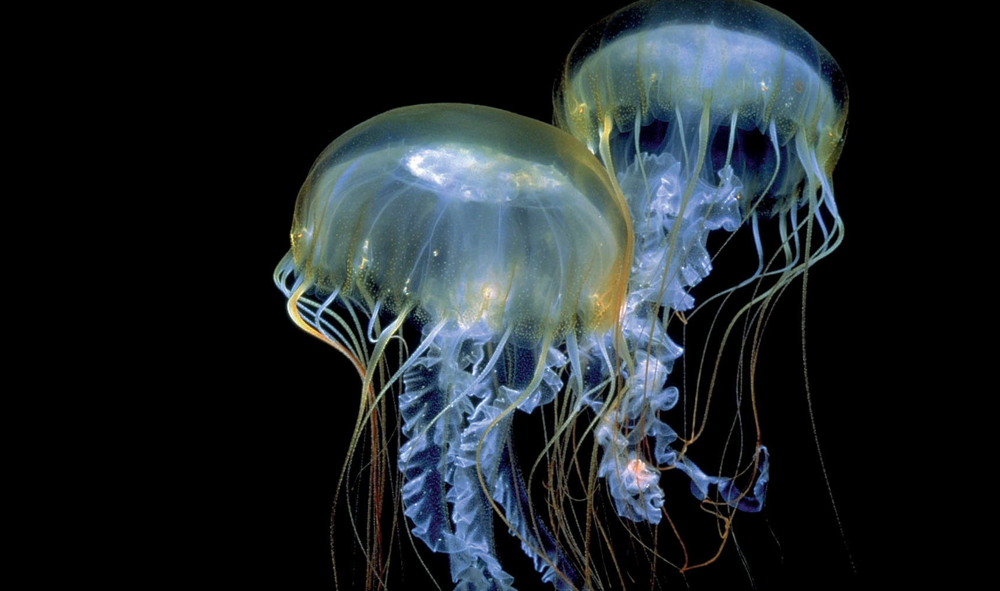
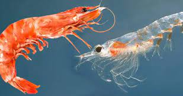
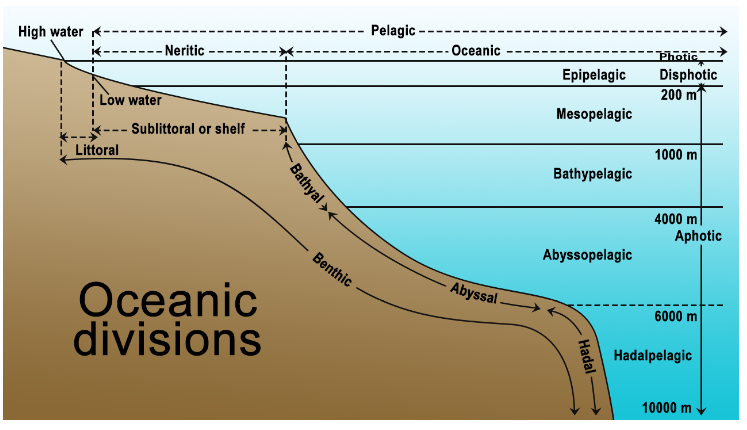

# [What is Plankton?]{style="background: #433E49; color: #ABDFF1"}

## [Plankton]{style="background: #433E49; color: #ABDFF1"}

::: {.columns}
::: {.column width="60%"}
- The word **plankton** comes from a Greek word ***planktos***, meaning ***drifter*** or ***wanderer***.
- Aquatic organisms that are incapable of swimming or moving on their own.
- Their movement in water is aided by water movement such as tides, currents, waves
- Most plankton are microscopic, often less than one inch in length.
:::

::: {.column width="40%"}

:::
:::

## [Plankton...]{style="background: #433E49; color: #ABDFF1"}

::: {.columns}
::: {.column width="60%"}
- They also include larger species like some crustaceans and jellyfish.
- Some organisms are planktonic for their entire life cycle.
- Others are planktonic only when they are young, but they eventually grow large enough to swim against the currents.
:::

::: {.column width="40%"}

 

:::
:::

## [Classification of Plankton]{style="background: #433E49; color: #ABDFF1"}

- Plankton can be classified in several ways based on their;
    - Size
    - Life cycle
    - Trophic level

## [Classification based on size]{style="background: #433E49; color: #ABDFF1"}

-   Based on their size, plankton can be classified as
    -   **Megaplankton** -- \> 20 cm eg. Jellyfish
    -   **Macroplankton** -- 2-20 cm eg. Pteropods, krill
    -   **Mesoplankton** -- 0.2 mm-2 cm eg. copepods, Foraminifera
    -   **Microplankton** -- 20-200 ${\mu}m$ eg. Ciliates, coccolithophores
    -   **Nanoplankton** -- 2-20 ${\mu}m$ eg. Diatoms, dinoflagellates
    -   **Picoplankton** -- 0.2-2 ${\mu}m$ eg. smaller eukaryotic protists, bacteria
    -   **Femtoplankton** -- \< 0.2 ${\mu}m$ eg. marine viruses

## [Classification based on life cycle]{style="background: #433E49; color: #ABDFF1"}

- Depending on mode of life cycle, plankton can be classified as:

    - Holoplankton or
    - Meroplankton

-  **Holoplankton** are organisms that are planktonic for their entire life cycle.

-  [Holoplankton](http://marinebio.net/marinescience/03ecology/mlplankton.htm) lives in **pelagic zone** in aquatic environment

## [Classification based on life cycle]{style="background: #433E49; color: #ABDFF1"}

- Pelagic organisms are divided into two groups; **plankton** and **nekton**.
- **Nektons** are capable of swimming against water current and include most species of sharks, rays, fishes, seals, sea lions, and whales.

- Examples of holoplankton are some diatoms, radiolarians, some dinoflagellates, foraminifera, amphipods, krill, copepods, and salps, as well as some gastropod mollusk species.

## [Classification based on life cycle]{style="background: #433E49; color: #ABDFF1"}

- **Meroplankton** are aquatic organisms which have both *planktonic* and *benthic* stages in their life cycles.
- Many of the meroplankton consists of larval stages of larger organism [@stubner16]
- After a period of time in the plankton, many meroplankton changes to the nekton or adopt a benthic (often sessile) lifestyle on the seafloor.
- Many benthic community are planktonic during their larval stages [@ershova19]

## [Classification based on life cycle]{style="background: #433E49; color: #ABDFF1"}

- The planktonic larval stage is particularly crucial to many benthic invertebrate in order to disperse their young.
- Depending on particular species and environmental conditions, larval or juvenile-stage meroplankton may remain in the pelagic zone for duration ranging from an hour to months

## [Classification based on Trophic level]{style="background: #433E49; color: #ABDFF1"}

- Plankton can also be divided based on the trophic level
- This is the most basic category that divide plankton into two groups;
    - **Phytoplankton** -- plants and
    - **Zooplankton** -- animals.
- Zooplankton and other small marine organisms feed on phytoplankton and they become food for fish, crustaceans, and other larger species.

## [Distribution of plankton]{style="background: #433E49; color: #ABDFF1"}

- Plankton inhabits oceans, seas, lakes and ponds.
- Their abundance varies both horizontally, vertically and seasonally.
- This is due to availability of light.
- Another factor causing plankton variation is nutrient availability.
- Although large areas of tropical and sub-tropical oceans have abundant light, but they experience relatively low primary production because they offer limited nutrients such as nitrate, phosphate, iron and silicate.
- In such regions, primary production usually occurs at greater depth, but at a reduced level due to limited nutrient level.

# [Division of the aquatic environment]{style="background: #433E49; color: #ABDFF1"}

## [Aquatic environment divisions]{style="background: #433E49; color: #ABDFF1"}

- Aquatic ecosystems can be sub-divided into:
    - Vertical division
    - Horizontal division

## [Vertical division]{style="background: #433E49; color: #ABDFF1"}

- This has two sub-groups:

    - **Benthic**

    Entire bottom, or the substratum and its attached and crawling organisms on the substratum.

    - **Pelagic**

    Entire water body excluding the benthic system; It deals with floating and swimming organisms.

## [Horizontal division]{style="background: #433E49; color: #ABDFF1"}

- Two major parts:

    - **Neritic province:** -- Shallow water above the continental shelf.

    - **Oceanic:** -- Deep water beyond the continental shelf.

## [Aquatic environment divisions]{style="background: #433E49; color: #ABDFF1"}

## [References]{style="background: #1f2937; color: #ffffff"}