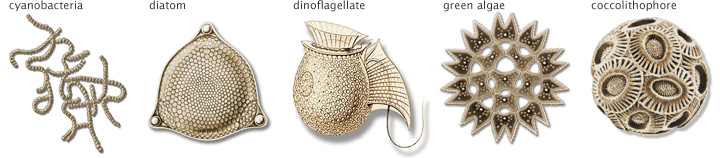
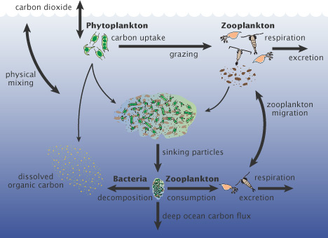
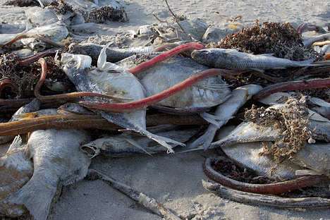

## [Terminologies used in Plankton Ecology]{style="background: #433E49; color: #ABDFF1"}

**Plankton systematics**

- The study of the classification and taxonomy of planktonic organisms.
- It involves identifying and categorizing different species of plankton based on their morphological, physiological, ecological, and genetic characteristics of planktonic organisms.
- This field helps us understand the diversity and evolutionary relationships among planktonic species, as well as their distribution patterns and ecological roles in aquatic ecosystems.

## [Terminologies...]{style="background: #433E49; color: #ABDFF1"}

**Plankton ecology**

- Plankton ecology is the study of planktonic organisms and their interactions with each other and their environment within aquatic ecosystems.
- It includes the distribution, abundance, diversity, behavior, physiology, and ecological roles of plankton.

## [Terminologies...]{style="background: #433E49; color: #ABDFF1"}

**Plankton productivity**

- Plankton productivity refers to the rate at which planktonic organisms produce organic matter through photosynthesis and other metabolic processes.
- It is a critical component of aquatic ecosystems, as plankton are the primary producers that form the base of the food web and support the entire ecosystem.
- Understanding plankton productivity is essential for understanding the dynamics of aquatic ecosystems and the impacts of human activities on these ecosystems.

# [Phytoplankton]{style="background: #1f2937; color: #ffffff"}

## [What is Phytoplankton?]{style="background: #1f2937; color: #ffffff"}

- Phytoplankton is derived from the Greek words:

    - ***Phyto*** -- (***plant***)
    - ***Plankton*** --- (***wanderer*** or ***drifter***)

- Phytoplankton are microscopic aquatic plants which do not have ability to swim
- They are free-floating aquatic organisms that depend entirely on water movement such as surface currents for their movement.

## [Phytoplankton...]{style="background: #1f2937; color: #ffffff"}

- They thrive in euphotic zone; the upper water column of the world's oceans, lakes, rivers, ponds.
- The euphotic zone receives energy from the sun that allows phytoplankton to photosynthesize -- a chemical reaction that converts light energy into chemical energy [@michi18].

## [Phytoplankton...]{style="background: #1f2937; color: #ffffff"}



# [Phytoplankton Ecology]{style="background: #433E49; color: #ABDFF1"}

## [What is Phytoplankton Ecology?]{style="background: #433E49; color: #ABDFF1"}

- **Definition:** Study of phytoplankton organisms and their interactions with each other and their aquatic environment

- **Key focus areas:**

    - Distribution and abundance patterns
    - Physiological responses to environmental factors
    - Population dynamics and growth rates
    - Ecological roles in food webs and nutrient cycling
    - Community structure and biodiversity

## [Photosynthesis: The Heart of Phytoplankton Ecology]{style="background: #433E49; color: #ABDFF1"}


::: {.columns}

::: {.column width="60%"}
- Phytoplankton contain **Chlorophyll-a (Chl-*a*)** -- a green pigment responsible for photosynthesis
- Chl-*a* captures light energy and converts it into chemical energy (glucose)
- This is the foundation of all aquatic food webs

**The Photosynthetic Equation:**

$$6CO_2 + 6H_2O \xrightarrow{\text{Sunlight + Chlorophyll}} C_6H_{12}O_6 + 6O_2$$

:::

::: {.column width="40%"}
**Key products:**

- **Organic matter (glucose)** - food for consumers
- **Oxygen (O₂)** - byproduct for respiration
- **Accounts for ~50% of Earth's oxygen production**
:::
:::


## [Primary Productivity]{style="background: #433E49; color: #ABDFF1"}

- **Definition:** Rate at which phytoplankton produce organic matter through photosynthesis

- **Two types:**

    - **Gross Primary Productivity (GPP):** Total organic matter produced
    - **Net Primary Productivity (NPP):** Organic matter remaining after phytoplankton respiration

- **Global significance:** Phytoplankton account for ~50% of total organic matter production on Earth

## [Factors Controlling Phytoplankton Growth]{style="background: #433E49; color: #ABDFF1"}

**1. Light (Photosynthetically Active Radiation - PAR)**

- PAR is the portion of sunlight (400-700 nm) that phytoplankton can use for photosynthesis
- Light is required for photosynthesis
- It penetrates only upper **200 meters** (euphotic zone)
- Its intensity decreases with depth
- Affects vertical distribution of phytoplankton
- **Limiting factor:** In deep water and winter months

## [Factors...]{style="background: #433E49; color: #ABDFF1"}

**2. Nutrient Availability**


::: {.columns}

::: {.column width="50%"}
**Macronutrients:**

- **Nitrogen (N)** - essential for proteins and nucleic acids
- **Phosphorus (P)** - crucial for ATP and DNA production
- **Silica (Si)** - needed by diatoms for cell walls 
- **Carbon (C)** - primary building block of photosynthesis
:::

::: {.column width="50%"}
**Micronutrients/Trace Elements:**

- **Iron (Fe)** - critical enzyme co-factor (often limiting) 
- **Manganese (Mn)** - photosynthesis component 
- **Zinc (Zn)** - enzyme co-factor (often limiting)
- **Copper (Cu)** - respiration and photosynthesis component

- **Nutrient limitation:** Occurs when essential nutrients become depleted
- Some phytoplankton can fix nitrogen and can grow in areas where nitrate concentrations are low.
:::
:::


## [Factors...]{style="background: #433E49; color: #ABDFF1"}

**3. Temperature**

- Affects metabolic rates and enzyme activity in phytoplankton
- **Optimal range:** 15-30°C for most species, in tropics, optimal temperature is between 25-30°C
- **Seasonal effects:** Growth varies with seasonal temperature changes
- **Geographic pattern:** Higher productivity in temperate zones seasonally, but lower in tropical areas

## [Factors...]{style="background: #433E49; color: #ABDFF1"}

**4. Salinity**

- Determines osmotic balance for phytoplankton cells
- Influences nutrient availability and uptake 
- Affects species composition (freshwater vs. marine species)

## [Factors...]{style="background: #433E49; color: #ABDFF1"}

**5. Water Turbulence and Mixing**

- **Vertical mixing:** Brings nutrient-rich deeper water to surface
- **Reduces light availability:** Deeper mixing = less average light exposure 
- **Prevents sinking:** Keeps phytoplankton in euphotic zone 
- **Optimal conditions:** Moderate mixing

## [Factors...]{style="background: #433E49; color: #ABDFF1"}

**6. Grazing Pressure**

- **Predation by zooplankton:** Controls phytoplankton biomass
- **Top-down control:** High grazing = lower phytoplankton abundance
- **Species selectivity:** Zooplankton prefer certain phytoplankton types

## [Nutrient Limitation and the "Redfield Ratio"]{style="background: #433E49; color: #ABDFF1"}

- **Redfield Ratio:** C:N:P = 106:16:1
- Represents the average elemental composition of phytoplankton biomass
- Used to predict which nutrient will limit growth

**Application:**

- If actual N:P ratio **< 16:1** → Nitrogen limited
- If actual N:P ratio **> 16:1** → Phosphorus limited
- Helps predict ecosystem productivity

## [Phytoplankton Growth Phases: Overview]{style="background: #433E49; color: #ABDFF1"}

- Phytoplankton populations follow a characteristic growth pattern with **four distinct phases**
- Each phase represents different population dynamics
- Understanding these phases is crucial for predicting bloom events and managing aquatic ecosystems

## [Phase 1: Lag Phase (Adaptation)]{style="background: #433E49; color: #ABDFF1"}

::: {.columns}

::: {.column width="50%"}
**Characteristics:**

- Phytoplankton acclimate to new environment
- Low growth rate
- Enzyme and nutrient uptake mechanisms are activated
- Cells preparing for rapid growth

**Duration:**

- Variable, typically days to weeks
- Depends on environmental conditions
:::

::: {.column width="50%"}
**What is happening:**

- Cells synthesize enzymes
- Photosynthetic machinery activated
- Nutrient transport systems established
- Building internal reserves
:::
:::

## [Phase 2: Exponential (Log) Growth Phase]{style="background: #433E49; color: #ABDFF1"}

::: {.columns}

::: {.column width="50%"}
**Characteristics:**

- **Rapid population growth** under optimal conditions
- Resources are abundant
- Biomass doubles at regular intervals
- Maximum growth rate achieved

**Duration:**

- Weeks to months
- Continues while resources available
:::

::: {.column width="50%"}
**What is happening:**

- Cells dividing at maximum rate
- Nutrients abundant
- Light optimal
- Waste products not yet limiting
- This is when algal blooms occur
:::
:::

## [Phase 3: Stationary Phase]{style="background: #433E49; color: #ABDFF1"}


::: {.columns}

::: {.column width="50%"}
**Characteristics:**

- Growth rate **equals death rate**
- Nutrient depletion begins
- Waste accumulation occurs
- Biomass plateaus at **carrying capacity**

**Duration:**

- Variable, typically weeks
- Reflects resource availability
:::

::: {.column width="50%"}
**What is happening:**

- Nutrient availability declining
- Competition for resources intensifying
- Toxin accumulation possible
- Population stabilizes at maximum sustainable level
:::
:::

## [Phase 4: Death (Decline) Phase]{style="background: #433E49; color: #ABDFF1"}

::: {.columns}
::: {.column width="50%"}
**Characteristics:**

- Nutrients are exhausted
- Toxic metabolites accumulate
- Death rate **exceeds birth rate**
- Population **crashes**

**Duration:**

- Days to weeks
- Depends on toxin levels

:::

::: {.column width="50%"}
**What is happening:**

- Essential nutrients depleted
- Waste products toxic to cells
- Cell lysis and death accelerates
- Biomass rapidly decreases
- Dead cells sink (detritus)

:::
:::

## [Phytoplankton Growth Curve]{style="background: #433E49; color: #ABDFF1"}

```{r}
#| echo: false
#| fig-width: 12
#| fig-height: 7

require(tidyverse)
require(ggplot2)

time <- seq(0, 100, length.out = 500)
biomass <- numeric(500)

for (i in 1:500) {
  if (i <= 80) {
    biomass[i] <- 0.1 * exp(0.04 * time[i])  # Lag phase
  } else if (i <= 250) {
    biomass[i] <- biomass[80] * exp(0.06 * (time[i] - time[80]))  # Exponential
  } else if (i <= 380) {
    biomass[i] <- biomass[250]  # Stationary - stays at peak around 0.8 mg/m3
  } else {
    biomass[i] <- max(biomass[250] * exp(-0.08 * (time[i] - time[380])), 0.1)  # Death
  }
}

data.frame(Time = time, Biomass = biomass) |>
  ggplot(aes(x = Time, y = Biomass)) +
  geom_line(linewidth = 2, color = "#2E7D32") +
  geom_area(alpha = 0.3, fill = "#81C784") +
  # Phase annotations with boxes
  annotate("rect", xmin = 0, xmax = 16, ymin = 0, ymax = 1.5, alpha = 0.1, fill = "#FF6B6B") +
  annotate("rect", xmin = 16, xmax = 50, ymin = 0, ymax = 1.5, alpha = 0.1, fill = "#4ECDC4") +
  annotate("rect", xmin = 50, xmax = 76, ymin = 0, ymax = 1.5, alpha = 0.1, fill = "#FFE66D") +
  annotate("rect", xmin = 76, xmax = 100, ymin = 0, ymax = 1.5, alpha = 0.1, fill = "#95E1D3") +
  # Phase labels
  annotate("text", x = 8, y = 1.4, label = "LAG\nPHASE", size = 5.5, fontface = "bold", color = "#C92A2A") +
  annotate("text", x = 33, y = 1.4, label = "EXPONENTIAL\nGROWTH", size = 5.5, fontface = "bold", color = "#0B8176") +
  annotate("text", x = 63, y = 1.4, label = "STATIONARY\nPHASE", size = 5.5, fontface = "bold", color = "#C89B04") +
  annotate("text", x = 88, y = 1.4, label = "DEATH\nPHASE", size = 5.5, fontface = "bold", color = "#2B7A78") +
  # Add reference line for Tanzania coastal average
  geom_hline(yintercept = 0.7, linetype = "dashed", color = "gray50", linewidth = 0.8, alpha = 0.7) +
  annotate("text", x = 2, y = 0.75, label = "Tanzania coastal\naverage < 1 mg/m³", size = 3.5, color = "gray50", hjust = 0) +
  labs(
    title = "Phytoplankton Population Growth Curve",
    x = "Time (days)",
    y = "Chlorophyll-a Biomass (mg/m³)",
    subtitle = "Growth dynamics reflecting Tanzania coastal waters - typically oligotrophic to mesotrophic"
  ) +
  theme_minimal() +
  theme(
    plot.title = element_text(face = "bold", size = 18),
    plot.subtitle = element_text(size = 13, color = "gray40"),
    axis.title = element_text(size = 14, face = "bold"),
    axis.text = element_text(size = 12),
    panel.grid.major = element_line(color = "lightgray", linewidth = 0.3)
  )

```

## [Key Takeaways: Growth Phases]{style="background: #433E49; color: #ABDFF1"}

| Phase | Growth Rate | Limiting Factors | Population Size |
|-------|------------|------------------|-----------------|
| **Lag** | Low | Acclimation, enzyme synthesis | Slowly increasing |
| **Exponential** | Maximum | None (optimal conditions) | Rapidly doubling |
| **Stationary** | Zero | Nutrient depletion, waste | Constant (carrying capacity) |
| **Death** | Negative | Toxins, starvation | Rapidly declining |

## [Factors Triggering Phase Transitions]{style="background: #433E49; color: #ABDFF1"}

**Lag → Exponential:**

- Temperature stabilizes
- Enzyme systems fully activated
- Initial nutrient uptake

## [Factors Triggering Phase Transitions]{style="background: #433E49; color: #ABDFF1"}

**Exponential → Stationary:**

- Key nutrients become limiting (N, P, Si, or Fe)
- Waste metabolites accumulate
- Light intensity decreases
- Grazing pressure increases

## [Factors Triggering Phase Transitions]{style="background: #433E49; color: #ABDFF1"}

**Stationary → Death:**

- Complete nutrient depletion
- Toxic compound buildup
- pH changes
- Oxygen depletion in enclosed systems


## [Biogeographic Distribution of Phytoplankton]{style="background: #433E49; color: #ABDFF1"}

### **Spatial Patterns:**

- **Coastal waters (Neritic):** HIGH productivity

    - Nutrient input from rivers and upwelling
    - Better light penetration
    
- **Open ocean (Oceanic):** VARIABLE productivity

    - Often nutrient-poor (oligotrophic)
    - "Oceanic deserts" in tropical regions
    - High productivity in upwelling zones

## [Biogeographic Distribution of Phytoplankton]{style="background: #433E49; color: #ABDFF1"}

### **Temporal Patterns:**

- **Seasonal cycles:** Spring and fall blooms in temperate zones
- **Monsoon-driven cycles:** In tropical regions with seasonal rains 
- **Daily vertical migration:** Some species move up/down
- **Interannual variability:** Related to climate patterns (El Niño, etc.)

## [Phyto. as Primary Producers]{style="background: #433E49; color: #ABDFF1"}


```
┌─────────────────────────────────────────────────┐
│ PHYTOPLANKTON (Primary Producers)               │
│ • Contain chlorophyll                           │
│ • Fix CO₂ into organic matter                   │
│ • Foundation of marine food webs                │
└────────────────┬────────────────────────────────┘
                 │ Consumed by
        ┌────────┴────────┐
    ┌───▼────────┐   ┌────▼─────────┐ 
    │Zooplankton │   │Filter feeders│
    └───┬────────┘   └───┬──────────┘
        └────────┬───────┘Consumed by
       ┌─────────▼─────────────┐
       │Fish & other consumers │
       └───────────────────────┘         
               
```

## [Environmental Responses of Phytoplankton]{style="background: #433E49; color: #ABDFF1"}

| Environmental Change | Phytoplankton Response |
|-----|-----|
| **Increased nutrients** | Biomass increase, potential bloom |
| **Temperature rise** | Species composition shift, range changes |
| **Decreased light** | Reduced productivity, migration to shallower water |
| **Ocean acidification** | Reduced calcification, cell size changes |
| **Increased UV-B** | Cellular damage, reduced photosynthesis |
| **Salinity change** | Species turnover, osmotic stress |

## [Indicator Species and Ecosystem Health]{style="background: #433E49; color: #ABDFF1"}

- **Phytoplankton as bioindicators:**

    - Changes in species composition = ecosystem changes
    - Diversity patterns reflect environmental stress
    - Sensitive to pollution and nutrient enrichment

- **Eutrophication indicator:**

    - High chlorophyll-a = nutrient pollution
    - Dominated by fast-growing species (e.g., cyanobacteria)

- **Climate change indicator:**

    - Shifting species ranges and phenology
    - Changes in bloom timing and intensity

# [Importances of Phytoplankton]{style="background: #433E49; color: #ABDFF1"}


## [Ecological Roles of Phytoplankton]{style="background: #433E49; color: #ABDFF1"}

1.  **Primary Production**:

- Phytoplankton are primary producers, meaning they convert sunlight, carbon dioxide, and nutrients into organic matter through photosynthesis
- They form the base of the marine food web, providing energy and nutrients to higher trophic levels.
- Phytoplankton are the foundation of all aquatic food web

## [Ecological Roles of Phytoplankton]{style="background: #433E49; color: #ABDFF1"}

2.**Carbon Sequestration**:

- Phytoplankton absorb CO₂ from the atmosphere during photosynthesis and incorporate it into their biomass.
- Through photosynthesis, phytoplankton consume carbon dioxide on a scale equivalent to forests and other land plants.
- Some of this carbon is carried to the deep ocean when phytoplankton die -- effectively removing carbon from the atmosphere and contributing to the regulation of climate.
- Some is transferred to different layers of the ocean as phytoplankton are eaten by other creatures, which themselves reproduce, generate waste, and die.

## [Ecological Roles of Phytoplankton]{style="background: #433E49; color: #ABDFF1"}

2.**Carbon Sequestration**...:

- Worldwide, this **biological carbon pump** transfers about 10 gigatonnes of carbon from the atmosphere to the deep ocean each year.
- Even a small changes in the growth of phytoplankton may affect atmospheric carbon dioxide concentrations, which would feed back to global surface temperatures.
- **How ????**

## 



## [Understanding Carbon Flux: The Biological Carbon Pump]{style="background: #433E49; color: #ABDFF1"}

**What is the Biological Carbon Pump?**

- Mechanism by which carbon dioxide (CO₂) is converted into organic matter by phytoplankton and transported to the deep ocean
- Acts as a major regulator of atmospheric CO₂ and global climate

## [Understanding Carbon Flux...]{style="background: #433E49; color: #ABDFF1"}

### **The Process (Four key steps):**

1. **Photosynthetic Fixation (Surface)**
   - Phytoplankton fix atmospheric CO₂ into organic compounds (glucose, proteins, lipids)
   - Occurs in euphotic zone (0-200 m) where light is available

2. **Food Web Transfer (Surface to Mid-Water)**
   - Zooplankton consume phytoplankton
   - Fish consume zooplankton
   - Energy and carbon transfer up the food chain
   - ~90% of energy lost at each trophic level

## [Understanding Carbon Flux...]{style="background: #433E49; color: #ABDFF1"}

3. **Particle Sinking (Active Transport)**
   - Dead phytoplankton cells form aggregates ("marine snow")
   - Dead zooplankton and fecal pellets sink
   - Particles fall through water column (1-100 m/day)
   - **Passive transport** of carbon to depth

4. **Remineralization (Deep Ocean)**
   - Bacteria decompose sinking organic matter
   - Some carbon sequestered in deep ocean (1000+ years residence time)
   - Some carbon recycled back to surface via upwelling

## [Understanding Carbon Flux...]{style="background: #433E49; color: #ABDFF1"}

### **Global Carbon Flux Numbers:**

- **~10 gigatonnes of carbon/year** transferred from atmosphere to deep ocean
- **~50% of Earth's primary production** is from phytoplankton
- **~0.5-2 gigatonnes/year** permanently sequestered in deep ocean
- Equivalent to all carbon emissions from fossil fuels and deforestation combined!

### **Why This Matters for Climate:**

- Reduces atmospheric CO₂ by ~25-50% compared to no biological pump
- Small changes in phytoplankton productivity = major climate impacts
- Ocean warming/acidification affects phytoplankton → reduced CO₂ removal → positive feedback loop

## [Ecological Roles of Phytoplankton]{style="background: #433E49; color: #ABDFF1"}

3.  **Food Source**:

- Phytoplankton are consumed by a wide range of marine organisms, including zooplankton, small fish, shellfish, and whales.
- They feed all aquatic organisms from microscopic, animal-like zooplankton to multi-ton whales.
- Some small fish and invertebrates they also graze on the phytoplankton, and then those smaller animals are eaten by bigger ones.
- They are essential food sources for many marine species, forming the foundation of marine food webs.

## [Ecological Roles of Phytoplankton]{style="background: #433E49; color: #ABDFF1"}

4. **Nitrogen fixation**

- Nitrogen fixation is the biological process by which certain microorganisms, primarily bacteria and cyanobacteria, convert atmospheric nitrogen (N~2~) into ammonia (NH~3~) or other nitrogen compounds that can be used by plants and other organisms.
- They contribute significant amounts of fixed nitrogen to marine ecosystems.
- This input of fixed nitrogen can alleviate nitrogen limitation in phytoplankton communities, promoting their growth and productivity.
- Example of nitrogen fixers are such as *Trichodesmium* and *Richelia* species

## [Ecological Roles of Phytoplankton]{style="background: #433E49; color: #ABDFF1"}

5. **Nutrient Cycling**:

- Phytoplankton contribute to nutrient cycling in marine ecosystems by recycling nutrients such as nitrogen, phosphorus, and iron.
- They play a vital role in maintaining nutrient balance and productivity in marine environments.

## [Ecological Roles of Phytoplankton]{style="background: #433E49; color: #ABDFF1"}

6. **Indicator of Ecosystem Health**:

-   Changes in phytoplankton populations can serve as indicators of environmental changes and ecosystem health.
-   Monitoring phytoplankton abundance, species composition, and distribution can provide insights into water quality, nutrient levels, and ecosystem dynamics.

## [Ecological Roles of Phytoplankton]{style="background: #433E49; color: #ABDFF1"}

7. **Climate Regulation**:

- Phytoplankton influence climate by reducing atmospheric CO~2~ levels during photosynthesis process


## [Ecological Roles of Phytoplankton]{style="background: #433E49; color: #ABDFF1"}

8. **Oxygen Production:**

- Phytoplankton produce a significant portion of oxygen on the Earth through photosynthesis, contributing more than 50% of the oxygen in the Earth's atmosphere.
- They play a major role in maintaining global oxygen levels.

## [Importance of Phytoplankton]{style="background: #433E49; color: #ABDFF1"}

9. **Biotechnological Applications**:

- Some species of phytoplankton are used in biotechnological applications, such as producing biofuels, pharmaceuticals, and nutritional supplements.
- For example, certain types of microalgae are cultivated for their high lipid content, which can be converted into biodiesel.
- Microalgae with the highest lipid content, ranging from 10 to 67%, belong to *Chlorella, Dunaliella*, and *Scenedesmus* species
- A *Spirulina* species -- a blue-green algae, holds immense potential in the field of biotechnology.
- Its ability to produce valuable secondary metabolites like nutraceuticals and pharmaceuticals makes it a promising source for drug development
- They are effective in managing allergies, cancer, and other diseases

## [Importance of phytoplankton]{style="background: #1f2937; color: #ffffff"}

**10. Aquaculture**

- Phytoplankton are a key food item in both aquaculture and mariculture.
- Both utilize phytoplankton as food for the animals being farmed.
- In mariculture, the phytoplankton is naturally occurring and is introduced into enclosures with the normal circulation of seawater.
- In aquaculture, phytoplankton must be introduced directly.
- The plankton can either be collected from a body of water or cultured.

## [Importance of phytoplankton]{style="background: #1f2937; color: #ffffff"}

**11. Economic Importance of Phytoplankton**

- Phytoplanktons have several uses and their mass cultivation can also be a major source of income.
- They are mostly used as food supplements and play a vital role in both animal and human nutrition.
- Phytoplanktons are also used in the manufacture of drugs.
- Also, they have proven to be suitable for synthesizing vaccines.

```{r}
#| warning: false
#| message: false
#| 
require(tidyverse)
require(flextable)

```

## 

**Phytoplanktons and their uses**

```{r}

Phytoplankton = c("Chlorella vulgaris", "Spirulina", "Odontella aurita", "Phaeodactylum tricornutum", "Porphyridium cruentum") 
Application = c("Food supplement, animal feed", "Food supplement and cosmetics", "Cosmetics, pharmaceuticals and food for both adults and infants", "Fuel production and nutrition", "Cosmetics, pharmaceuticals and nutrition")

data.frame(Phytoplankton,Application) |> 
  flextable(cwidth = 4) |> 
  flextable::fontsize(size = 24, part = "all")


```

## [Importance of phytoplankton]{style="background: #1f2937; color: #ffffff"}

**12. Negative importance of phytoplankton**

- Some phytoplankton species can be the source of death or disease to other aquatic organisms.
- Certain species of phytoplankton produce powerful **biotoxins** -- leading to the development of ***red tides***, or ***harmful algal blooms*** (HABs).
- These toxic blooms can kill marine life and people who eat contaminated seafood.
- Phytoplankton may cause mass mortality in other ways.
- In the aftermath of a massive bloom, dead phytoplankton sink to the ocean or lake floor.
- Then, decomposition occurs aided by bacteria.
- This process lead to depletion of oxygen in the water, causing to suffocation of animals.
- This may result to a massive death of aquatic organisms.

## 




## [References]{style="background: #1f2937; color: #ffffff"}
