```{r}
#| warning: false
#| message: false
#| include: false
#| 
require(tidyverse)
require(gt)
```

# [Commonly used terms in phytoplankton taxonomy]{style="background: #1f2937; color: #ffffff"}

## [Terms in phytoplankton]{style="background: #433E49; color: #ABDFF1"}


**Hormogonia** – Motile trichomes of cells (used for dispersal) that are often gas-vacuolated and devoid of heterocysts, with a distinct cell shape and size compared to vegetative cells.

::::: columns
::: column
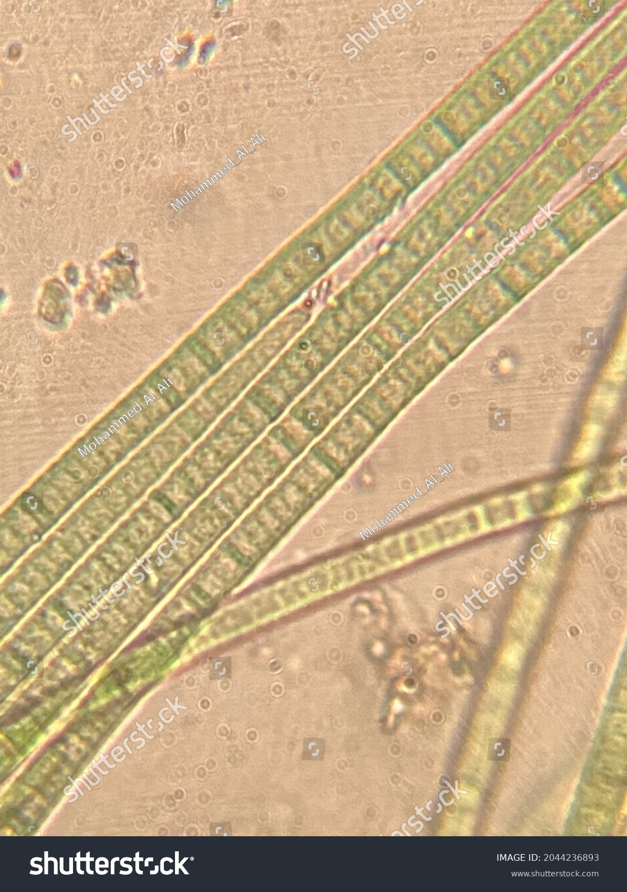
:::

::: column
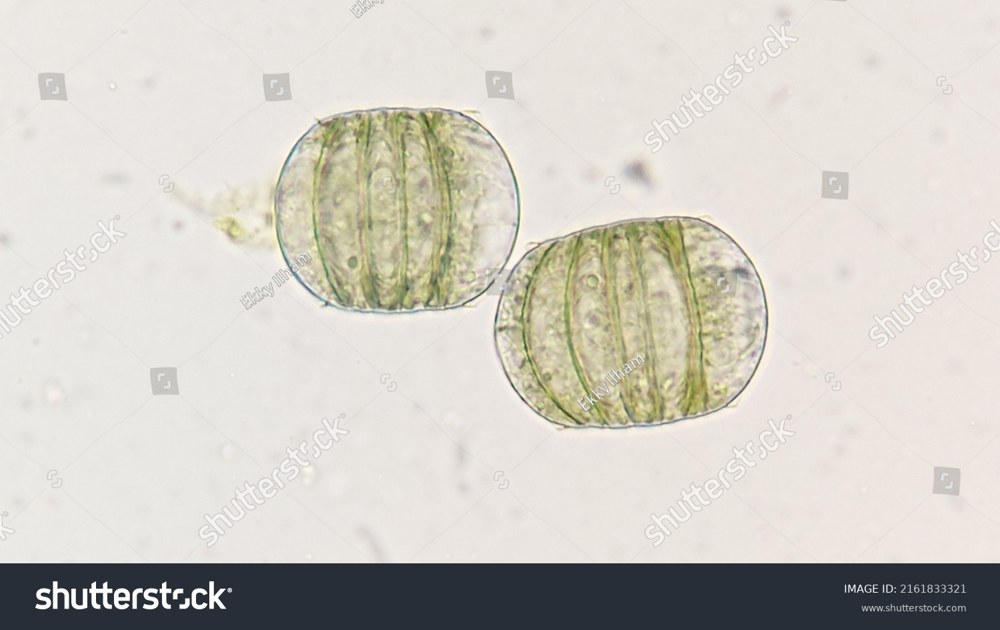
:::
:::::

## [Terms in phytoplankton]{style="background: #433E49; color: #ABDFF1"}

::::: columns
::: column
**Trichome** is a chain of connected cells in filamentous cyanobacteria, functioning as a single physiological unit.

- Trichomes are simply linear or coiled arrangements of cells within a shared sheath.
- It includes the cell wall but not the sheath.
:::

::: column
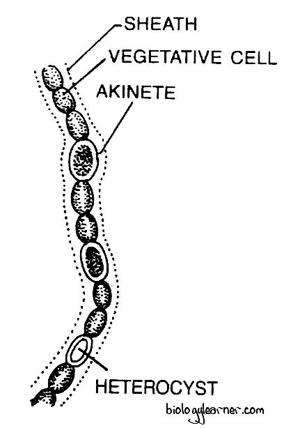
:::
:::::

## [Features of Trichomes]{style="background: #433E49; color: #ABDFF1"}

::::: columns
::: column
- Composed of a cell.
- This can be uniform (e.g., Oscillatoria) or differentiated into specialized cells:

    1.  **Vegetative cells**: Perform photosynthesis.
    2.  **Heterocysts**: Fix nitrogen (thick-walled, pale).
    3.  **Akinetes**: Dormant cell (spores) (survival under stress).
:::

::: column

:::
:::::

## [Terms in phytoplankton]{style="background: #433E49; color: #ABDFF1"}

::::: columns
::: column
**Filament** refers to a multicellular, thread-like structure composed of a linear chain of cells (trichome) enclosed within a protective mucilaginous sheath.

- Filamentous cyanobacteria are among the most ecologically significant, as they often dominate blooms and contribute to nitrogen fixation.
:::

::: column

:::
:::::

## [Terms in phytoplankton]{style="background: #433E49; color: #ABDFF1"}


::::: columns
::: column
**Heterocyst** is a specialized, nitrogen-fixing cell found in filamentous cyanobacteria (e.g., Anabaena, Nostoc).

- These cells are critical for converting atmospheric nitrogen ($N_2$) into ammonia ($NH_3$), a process called **nitrogen fixation**, which is essential for nutrient cycling in aquatic and terrestrial ecosystems.
:::

::: column
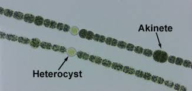
:::
:::::

## [Structural and Functional Features of Heterocysts]{style="background: #433E49; color: #ABDFF1"}


- **Thickened cell wall**: Contains glycolipids to block oxygen ($O_2$) which inhibits nitrogenase, the enzyme for $N_2$ fixation). 
- **Pale appearance**: Lacks phycobiliproteins (no photosynthesis) but retains chlorophyll-*a*.
- Triggered by nitrogen limitation (e.g., low $NO_3^-$ or $NH_4^+$).
- **No Photosystem II (PS-II)**: Prevents $O_2$ production.
- Uses Photosystem I (PS-I): Generates ATP for nitrogenase.

## [Ecological importance of Heterocysts]{style="background: #433E49; color: #ABDFF1"}

**Nitrogen Supply**:

- It provides fixed nitrogen ($NH_3$) to cyanobacteria and surrounding organisms.

**Bloom formation**:

- It enables cyanobacteria (e.g., Anabaena) to dominate in nitrogen-poor waters.

# [Why are heterocysts oxygen-sensitive?]{style="background: #1f2937; color: #ffffff"}

## [Why are heterocysts oxygen-sensitive?]{style="background: #433E49; color: #ABDFF1"}

+ Nitrogenase, the enzyme that catalyzes nitrogen fixation ($N_2 \rightarrow NH_3$), is irreversibly inactivated/damaged by $O_2$.
- Therefore, heterocysts maintain an anaerobic environment by:
 
    - Blocking $O_2$ diffusion (thickened wall).
    - Respiration: Uses $O_2$ for ATP synthesis.
    - No PS-II: Prevents $O_2$ generation.

## [Terms in phytoplankton]{style="background: #433E49; color: #ABDFF1"}

- **Akinete**: Is a thick-walled, dormant spore formed by some filamentous cyanobacteria under unfavorable conditions (e.g., nutrient limitation, cold, or desiccation).
- Akinetes allow survival in harsh environments and regenerate when conditions improve.

## [Structure of Akinetes]{style="background: #433E49; color: #ABDFF1"}

- **Enlarged cells**: Larger than vegetative cells, with thickened cell walls.
- **Storage reserves**: Accumulate glycogen, cyanophycin (nitrogen reserve), and lipids.
- **Pigments**: Retain chlorophyll-*a* but reduce photosynthetic activity.

## [Formation of akinetes]{style="background: #433E49; color: #ABDFF1"}


- Akinetes are formed if the conditions are unfavorable when there is:

1.  Nutrient depletion (especially phosphorus or nitrogen).
2.  Temperature shifts (cold or freezing).
3.  Desiccation (prolonged dryness).
4.  Light limitation.

## [Germination of akinetes]{style="background: #433E49; color: #ABDFF1"}

-   When favorable conditions return:

1.  Wall breaks down.
2.  Cell divides to form a new filament.

## [Vegetative cells]{style="background: #433E49; color: #ABDFF1"}

-   Vegetative cells are the primary photosynthetic cells in cyanobacteria, responsible for growth and energy production.
-   They contain chlorophyll-*a* and phycobiliproteins for photosynthesis and are typically thin-walled and actively dividing under favorable conditions.


## [Types of vegetative cell structures]{style="background: #433E49; color: #ABDFF1"}

::::: columns
::: column
1.  Unicellular – Individual cells exist independently, often spherical or rod-shaped. Example: *Chroococcus*.
:::

::: column
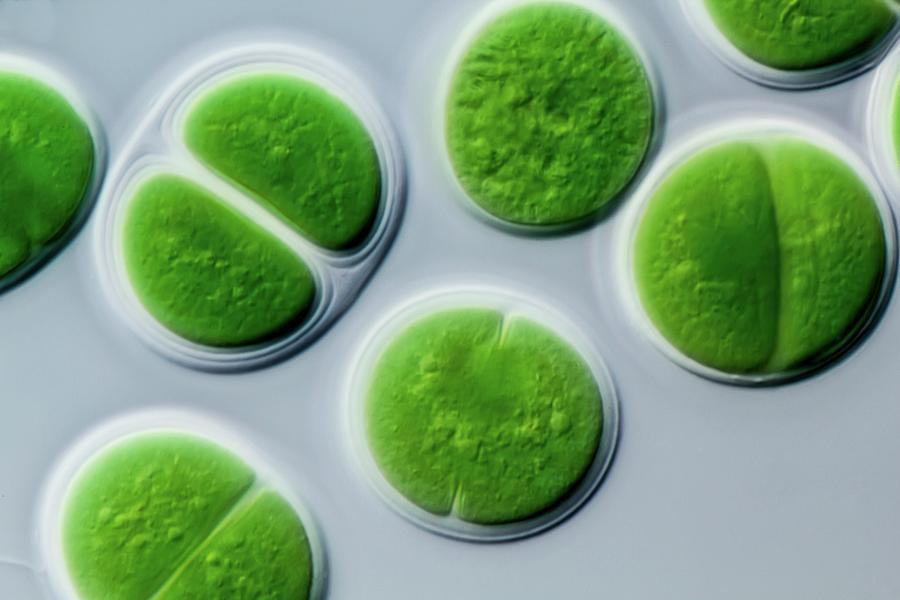
:::
:::::

## [Types of vegetative cell structures]{style="background: #433E49; color: #ABDFF1"}

::::: columns
::: column
2.  Colonial – Groups of cells are held together by a mucilaginous sheath but remain loosely associated. Example: *Microcystis*.
:::

::: column
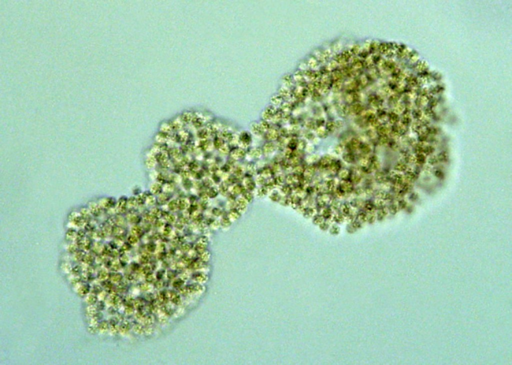
:::
:::::

## [Types of vegetative cell structures]{style="background: #433E49; color: #ABDFF1"}

::::: columns
::: column
3.  Pseudofilamentous – Cells form a chain-like arrangement but lack true cellular connections, appearing filamentous. Example: *Merismopedia*.
:::

::: column
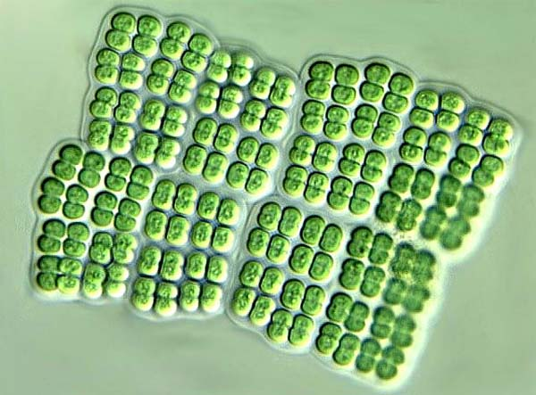
:::
:::::

## [Types of vegetative cell structures]{style="background: #433E49; color: #ABDFF1"}


::::: columns
::: column
4.  Filamentous – Cells form long, connected chains called trichomes, sharing a common sheath. Example: *Oscillatoria*.
:::

::: column

:::
:::::

## [Types of vegetative cell structures]{style="background: #433E49; color: #ABDFF1"}

::::: columns
::: column
5.  False Branching – Filaments appear branched but lack continuous cytoplasmic connections. Example: *Scytonema*.
:::

::: column
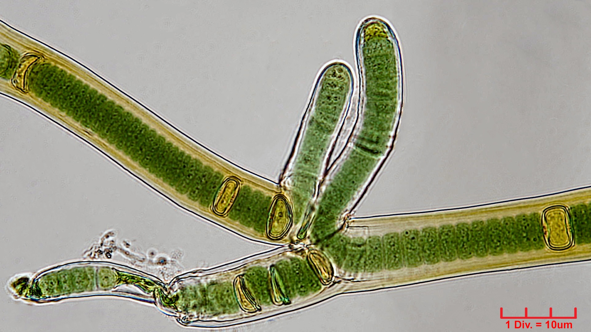
:::
:::::

## [Types of vegetative cell structures]{style="background: #433E49; color: #ABDFF1"}

::::: columns
::: column
6.  True Branching – Filaments divide in different directions with continuous cytoplasmic connections. Example: *Stigonema*.
:::

::: column
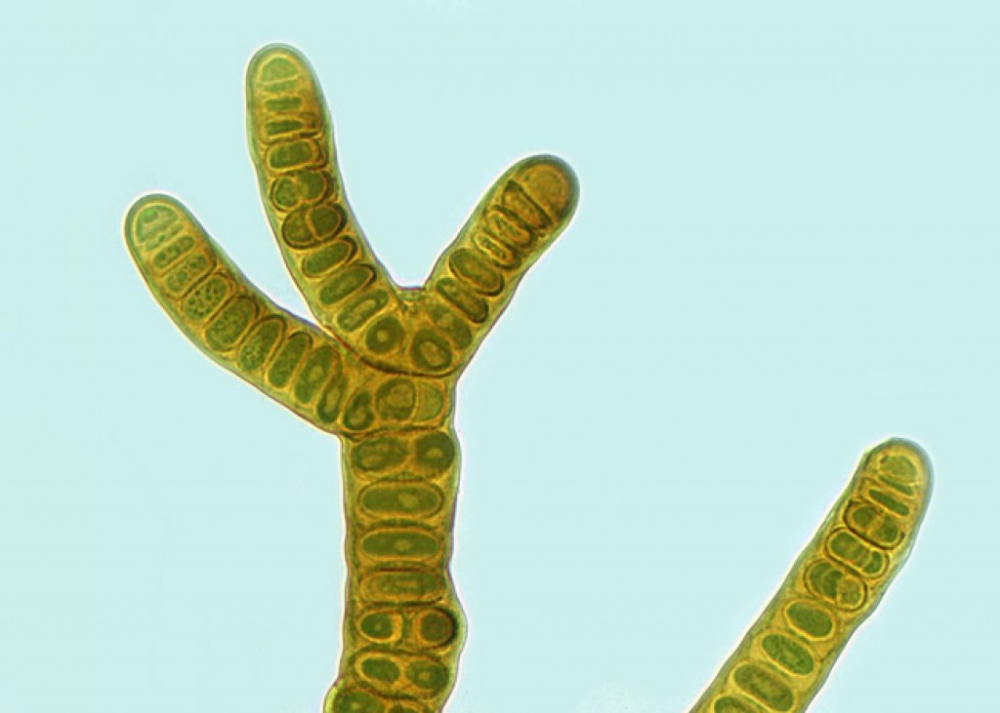
:::
:::::

## [Comparison between akinetes, heterocysts & vegetative cells]{style="background: #433E49; color: #ABDFF1"}

```{r}
cyano = tibble(
  Traits = c("Functions", "Cell wall", "Pigments", "Metabolism"),
  Akinetes = c("Dormant survival (spores)", "Thick, multilayered", "Reduced chlorophyll", "Dormant (low activity)"),
  Heterocysts = c("Nitrogen fixation (N₂ → NH₃)", "Thick, glycolipid-rich", "No phycobilins (pale)", "PSI only (no O₂ production)"),
  Vegetative_cells = c("Photosynthesis & Growth", "Thin", "Chlorophyll + phycobilins", "PSII + PSI (O₂ production)")
  )

cyano |>
  gt() |> 
  tab_header(
    title = "Comparison of Cyanobacterial Cell Types",
    subtitle = "Functional and structural differentiation in filamentous species"
  ) |> 
  cols_label(
    Traits = "",
    Vegetative_cells = "Vegetative Cells"
  ) |> 
  tab_style(
    style = cell_text(weight = "bold"),
    locations = cells_body(columns = Traits)
  ) |> 
  opt_stylize(style = 1, color = "green") |> 
  tab_options(container.height = px(500))
```

# [Phytoplankton taxonomy]{style="background: #1f2937; color: #ffffff"}


## [Classification of phytoplankton]{style="background: #433E49; color: #ABDFF1"}


- Phytoplankton can be classified into three major groups which include the **Cyanobacteria (Cyanophyta)**, **Diatoms (Bacillariophyta)**, and **Dinoflagellates (Dinophyta)**.
- Some other groups includes **Coccolithophores (Haptophyta)**, **Green Algae (Chlorophyta)**, **Cryptophytes (Cryptophyta)**.

## [Cyanobacteria (Blue-green Algae)]{style="background: #433E49; color: #ABDFF1"}

+ Cyanobacteria are group of autotrophic, Gram-negative bacteria that obtain biological energy via oxygenic photosynthesis.
+ The name *cyanobacteria* originates from the Greek word *kyanós*, referring to their characteristic bluish-green (cyan) color.
+ This color forms the basis of their informal name, "blue-green algae," although as prokaryotes, they are not scientifically classified as true algae.

## [Cyanobacteria (Blue-green algae)]{style="background: #433E49; color: #ABDFF1"}

-   They utilize photosynthetic pigments—including **chlorophyll-a**, **carotenoids**, and **phycobilins** (phycocyanin and phycoerythrin)—to harvest light energy.
-   Unlike most other bacteria, they possess an extensive system of internal membranes called **thylakoids -- flattened sacs**, from which photosynthesis is performed.
-   They are the only prokaryotes capable of **oxygenic photosynthesis**, a process that significantly contributed to the oxygenation of Earth's early atmosphere.
-   Many species produce potent **cyanotoxins** (e.g., microcystins, anatoxins) that pose significant risks to water quality, livestock, and human health.

## [Cyanobacteria Orders]{style="background: #433E49; color: #ABDFF1"}


The Phylum Cyanobacteria is traditionally divided into several orders based on their morphological complexity:

::: {.incremental}
1.  **Chroococcales**: Unicellular or colonial forms; no filaments.
2.  **Oscillatoriales**: Simple filamentous forms; no specialized cells (heterocysts/akinetes).
3.  **Nostocales**: Filamentous forms with specialized cells (heterocysts and akinetes); false branching.
4.  **Stigonematales**: Most complex; true branching and multiseriate filaments.
:::

## [Cyanobacteria Orders...](style="background: #433E49; color: #ABDFF1")

::: {.callout-note}
### Evolutionary Trend
The classification reflects an evolutionary progression from simple single cells to complex, multicellular-like structures with functional division of labor.
:::

## [Order Chroococcales]{style="background: #433E49; color: #ABDFF1"}

- The **Chroococcales** is an order of cyanobacteria known for including significant bloom-forming species like *Microcystis aeruginosa*.
- They are primarily characterized by **unicellular** or **colonial** (non-filamentous) growth forms.
- As one of the most ancient lineages, they are globally distributed across freshwater, brackish, and marine environments.

## [Characteristics of Chroococcales]{style="background: #433E49; color: #ABDFF1"}

::::: columns
::: column
**Morphology**

- They are unicellular (e.g., *Synechococcus*) or colonial (e.g., *Microcystis*).
- Cells are typically spherical, oval, or rod-shaped.
- Colony formations include:

  - Irregular clusters (*Microcystis*).
  - Cubical packets (*Merismopedia*).
  - Embedded in a gelatinous matrix (*Gloeocapsa*).
:::

::: column
  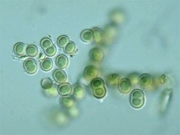
:::
:::::

## [Characteristics of Chroococcales...]{style="background: #433E49; color: #ABDFF1"}

**Cell Structure**

- **Prokaryotic organization**: Lack a membrane-bound nucleus and organelles.
- **Gram-negative cell wall**: Composed of a peptidoglycan layer and an outer membrane.
- **Mucilaginous sheath**: A protective polysaccharide layer that aids in buoyancy and protection against desiccation.

## [Characteristics of Chroococcales...]{style="background: #433E49; color: #ABDFF1"}

**Reproduction**

- Reproduction by binary fission (asexual reproduction).
- Colony fragmentation: Large colonies break into smaller aggregates to establish new populations.
- Lack specialized reproductive cells (no akinetes or heterocysts).

## [Characteristics of Chroococcales...]{style="background: #433E49; color: #ABDFF1"}

**Pigments & photosynthesis**

- They utilize chlorophyll-*a* alongside accessory phycobiliproteins (phycocyanin and phycoerythrin) to capture a broad spectrum of light.
- They perform oxygenic photosynthesis within thylakoid membranes.
- Unlike filamentous orders, they lack heterocysts; therefore, they cannot fix atmospheric nitrogen and rely on dissolved inorganic nitrogen (e.g., $NO_3^-$, $NH_4^+$).
- Many species (e.g., *Microcystis*) possess gas vacuoles to regulate their position in the water column for optimal light harvesting.

## [Taxonomic classification of Chroococcales]{style="background: #433E49; color: #ABDFF1"}

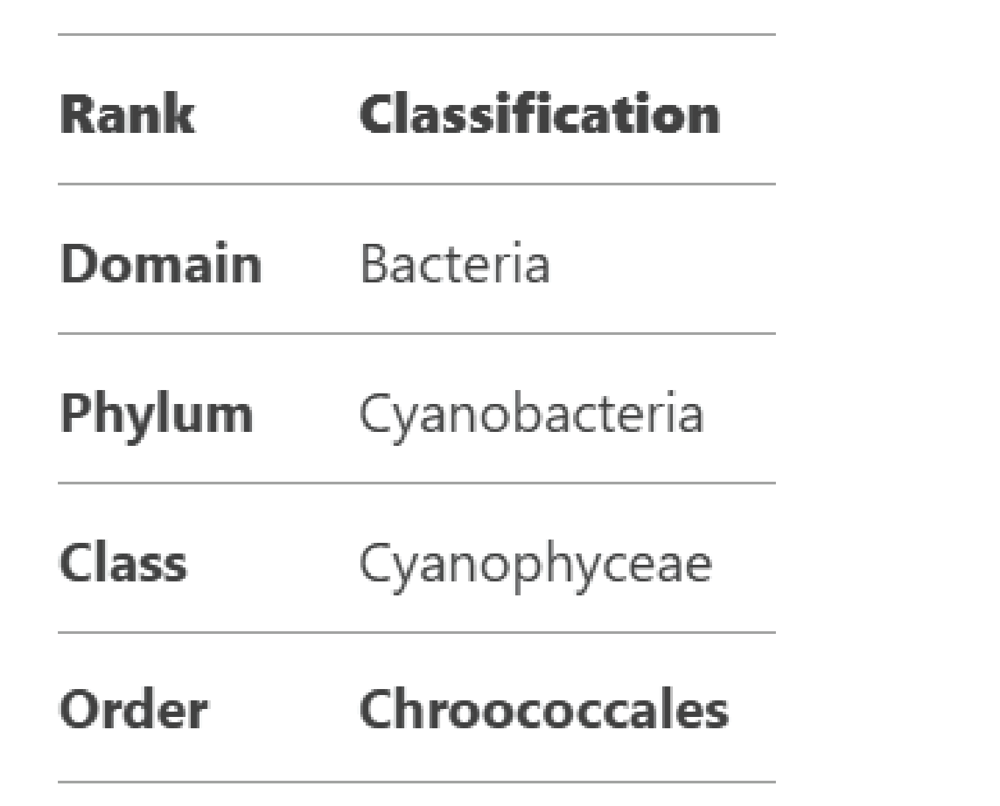

## 

```{r}
#| eval: false

tibble(
  Rank = c("Domain", "Phylum", "Class", "Order"),
  Classification = c("Bacteria", "Cyanobacteria", "Cyanophyceae", "Chroococcales")
) |> 
  gt()
```

## [Common Genera & Species]{style="background: #433E49; color: #ABDFF1"}


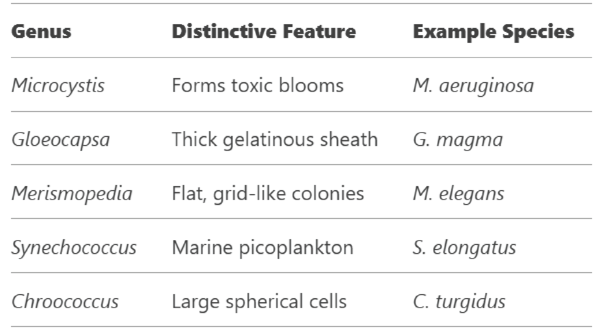

## [Ecological & economic importance of Chroococcales]{style="background: #433E49; color: #ABDFF1"}

**Harmful Algal Blooms (HABs)**:

- *Microcystis* and *Chroococcus* can form dense surface scums that deplete oxygen and block light.
- *Microcystis* produces **microcystins**, potent hepatotoxins (liver toxins) that threaten drinking water and aquatic life.

**Primary Production**:

- Genera like *Synechococcus* are major contributors to global carbon fixation, especially in oligotrophic (nutrient-poor) oceans.

**Bioindicators**:

- High abundance of *Microcystis* is often used as a bioindicator of **eutrophication** (excessive nutrient enrichment).

## [Order Oscillatoriales]{style="background: #433E49; color: #ABDFF1"}

::::: columns
::: column
The **Oscillatoriales** is an order of filamentous cyanobacteria distinguished by their structural simplicity:

- **Unbranched trichomes**: Simple, linear chains of cells.
- **No specialized cells**: They lack heterocysts and akinetes, relying on dissolved nitrogen.
- **Reproduction**: Primarily through **hormogonia** (short motile segments) or filament fragmentation.
:::

::: column

:::
:::::

## [Characteristics of Oscillatoriales]{style="background: #433E49; color: #ABDFF1"}

::::: columns
::: column
**Morphology & structure**

- **Unbranched trichomes**: Simple linear chains of cells.
- **No specialized cells**: Lack heterocysts and akinetes.
- **Cell Shape**: Discoid or cylindrical with distinct cross-walls.
- **Sheath**: Usually thin or absent, allowing for movement.

**Cellular Composition**

- **Pigments**: Chlorophyll-*a*, phycocyanin, and phycoerythrin.
- **Prokaryotic**: No membrane-bound organelles.
:::

::: column
**Motility & reproduction**

- **Gliding movement**: Active movement via mucilage secretion and contractile fibrils.
- **Fragmentation**: Trichomes break into smaller pieces (hormogonia) to grow.
- **Hormogonia**: Specialized short, motile segments used for dispersal.

**Ecological niche**

- Often found in **eutrophic** (nutrient-rich) waters.
- Can form dense benthic mats or surface blooms.
:::
:::::

::: {.callout-tip}
### Key identification
The absence of **heterocysts** and **akinetes** in a filamentous cyanobacterium is a primary diagnostic feature of the Order **Oscillatoriales**, distinguishing them from the more complex **Nostocales**.
:::


## [Taxonomic classification]{style="background: #433E49; color: #ABDFF1"}

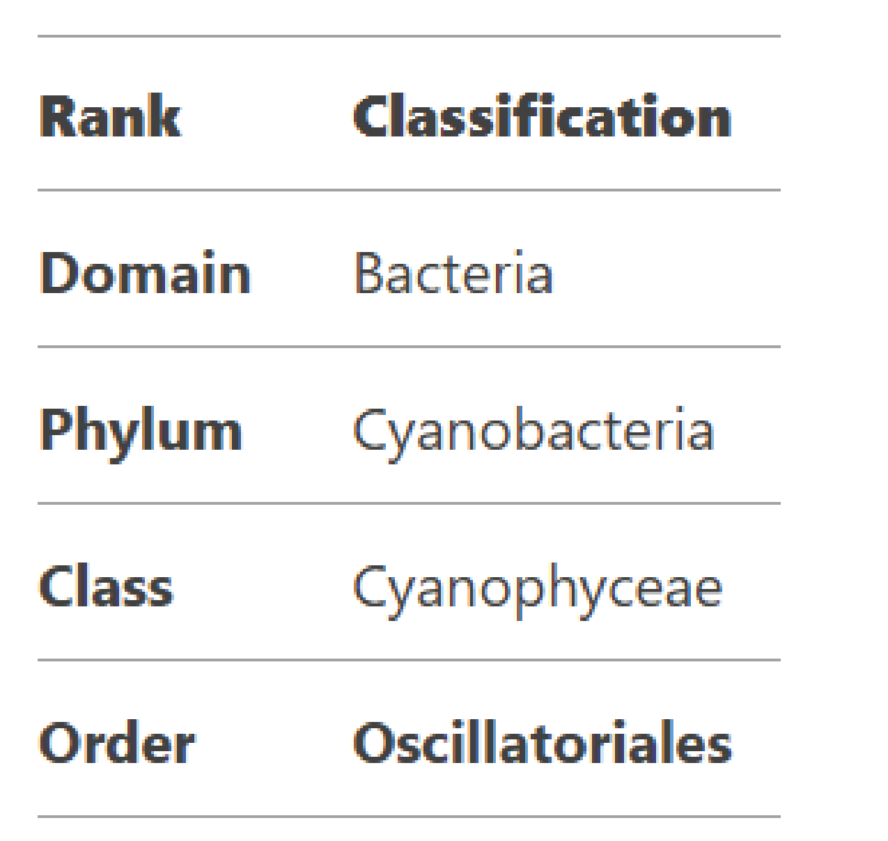

## [Common genera & species]{style="background: #433E49; color: #ABDFF1"}
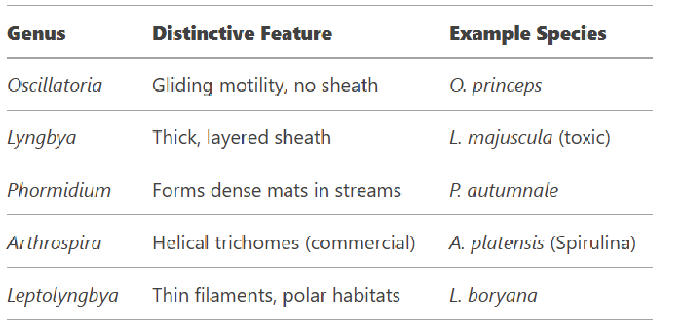

## [Ecological & Economic Importance]{style="background: #433E49; color: #ABDFF1"}

**Harmful Algal Blooms (HABs):**

- *Lyngbya* produces **lyngbyatoxin**, a potent skin irritant causing "swimmers' itch."
- *Oscillatoria* can dominate eutrophic waters, leading to oxygen depletion and foul odors.

**Biofilms & Mats:**

- *Phormidium* forms dense benthic mats in freshwater, stabilizing sediments but potentially harboring toxins.

**Commercial Uses:**

- *Arthrospira* (**Spirulina**) is globally cultivated as a nutrient-rich "superfood" due to its high protein and vitamin content.

## [Order Nostocales]{style="background: #433E49; color: #ABDFF1"}

- The Nostocales are a morphologically diverse order of filamentous cyanobacteria characterized by the presence of specialized nitrogen-fixing cells (**heterocysts**) and often dormant spores (**akinetes**).
- They play crucial ecological roles in nitrogen cycling and form symbiotic relationships with plants and fungi.

## [Characteristics of Nostocales]{style="background: #433E49; color: #ABDFF1"}

**Morphology**

- Consists of a filamentous structure composed of **trichomes** (cell chains) enclosed in a mucilaginous **sheath**.

- They have a specialized cells composed of:

    - **Heterocysts**: Thick-walled, pale cells for nitrogen fixation.
    - **Akinetes**: Enlarged, spore-like cells for survival under harsh environment.

## 

::::: columns
::: column
Common growth forms include:

- **Linear filaments** (*Anabaena*): Simple, straight chains of cells that often dominate open-water phytoplankton communities.
- **Coiled or Globose filaments** (*Nostoc*): Filaments that twist or aggregate into gelatinous colonies, providing protection against grazing.
:::

::: column
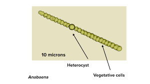 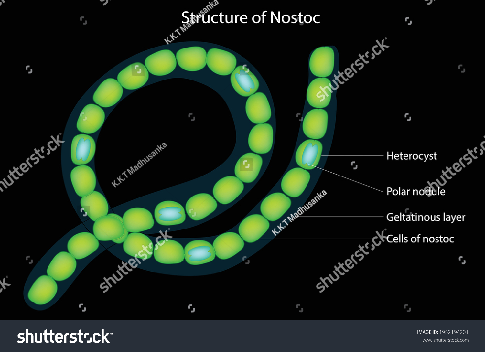 
:::
:::::

## [Characteristics of Nostocales]{style="background: #433E49; color: #ABDFF1"}

**Cell Structure**

- **Prokaryotic organization**: Lack a membrane-bound nucleus and organelles.
- **Photosynthetic pigments**:

    - **Chlorophyll-*a***: Primary pigment for photosynthesis.
    - **Phycobiliproteins**: Accessory pigments (phycocyanin, allophycocyanin) for light harvesting.
    - **Carotenoids**: Provide photoprotection and light absorption.

- **Cell Wall**: Gram-negative structure featuring a distinct peptidoglycan layer and an outer membrane.

## [Characteristics of Nostocales]{style="background: #433E49; color: #ABDFF1"}

::::: columns
::: column
**Nitrogen Fixation**

- Heterocysts provide the low-oxygen conditions required for the **nitrogenase** enzyme to function.

-  **Heterocyst positioning**: -- where these cells are located along the filament (trichome) can vary by species and environmental conditions and  used to identify different genera:

    -   **Terminal**: Located at the ends of filaments (e.g., *Cylindrospermum*).
    -   **Intercalary**: Located between vegetative cells (e.g., *Anabaena*).
    -   **Suppression**: Formation is often inhibited in nitrogen-rich environments.
:::

::: column
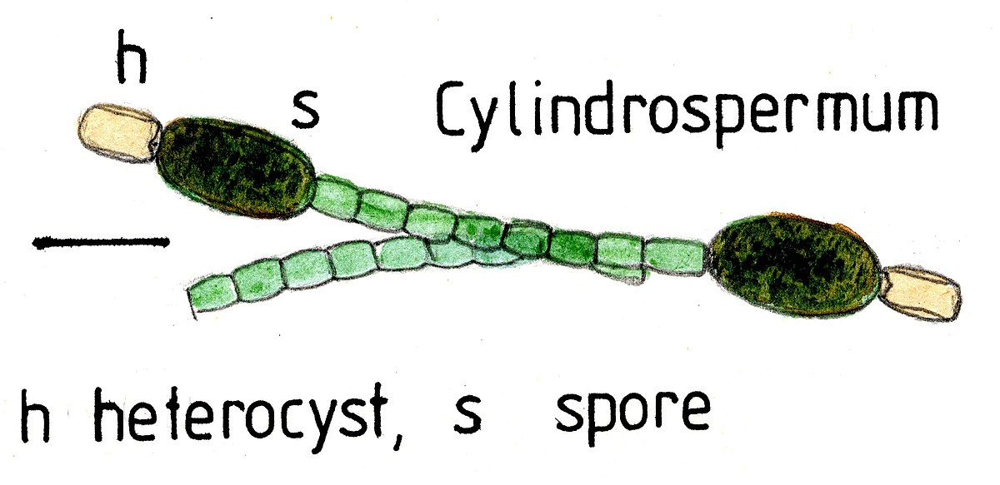 
:::
:::::

## [Characteristics of Nostocales]{style="background: #433E49; color: #ABDFF1"}

**Reproduction & dispersal**

- **Binary fission**: Standard cell division for filament elongation.
- **Fragmentation**: Mechanical breaking of filaments into smaller colonies.
- **Hormogonia**: Specialized, short, motile segments that detach for dispersal.
- **Akinetes**: Thick-walled resting spores that ensure survival during environmental stress.

## [Taxonomic classification of Nostocales]{style="background: #433E49; color: #ABDFF1"}


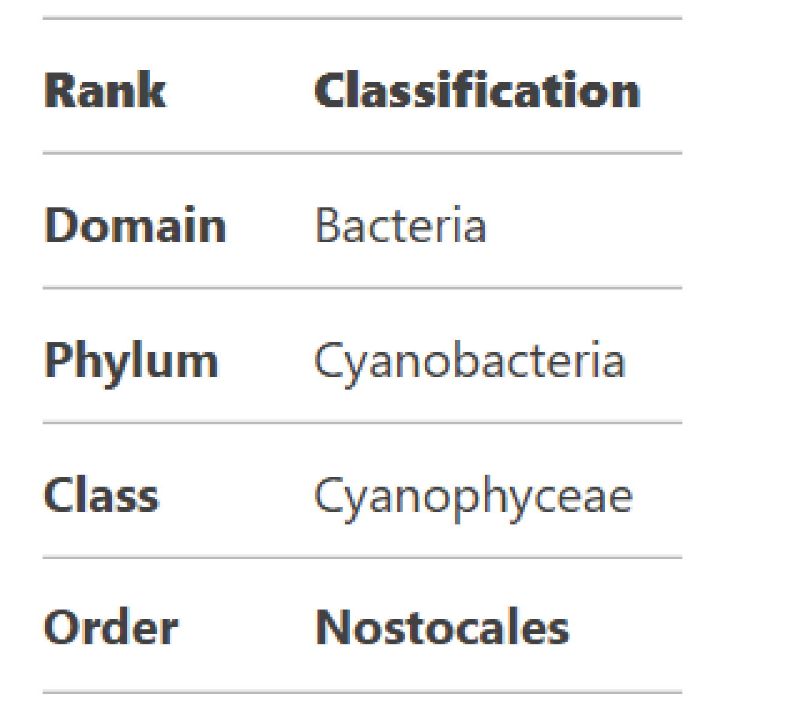

## [Common genera & species]{style="background: #433E49; color: #ABDFF1"}

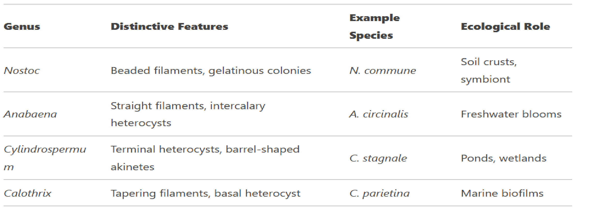

## [Order Stigonematales]{style="background: #433E49; color: #ABDFF1"}

- The Stigonematales represent the most morphologically complex cyanobacteria, characterized by true branching filaments and multiseriate trichomes (filaments with cells arranged in multiple rows).
- This order contains species with the highest degree of cellular differentiation among cyanobacteria.

## [Characteristics of Stigonematales]{style="background: #433E49; color: #ABDFF1"}

::::: columns
::: column
**Morphological complexity**

-   **True branching**: Both T-type (transverse cell division) and Y-type (longitudinal division) branching
-   **Multiseriate trichomes**: Filaments composed of multiple cell rows (unlike other cyanobacteria)
-   **Thick, laminated sheaths**: Often pigmented (yellow, brown, or red)
-   Cell differentiation composed of:

    -   **Heterocysts** (nitrogen-fixing cells)
    -   **Akinetes** (resting spores)
    -   **Vegetative cells** of varying shapes/sizes
:::

::: column

:::
:::::

## [Characteristics of Stigonematales]{style="background: #433E49; color: #ABDFF1"}

**Cellular structure**

-   Prokaryotic organization but with complex thylakoid arrangements

-   Pigments composed of:

    -   Chlorophyll-*a*
    -   Phycobiliproteins (phycocyanin dominant)
    -   Unique carotenoids (e.g., nostoxanthin)

-   Cell walls: Thickened with additional structural layers

## [Characteristics of Stigonematales]{style="background: #433E49; color: #ABDFF1"}

**Growth forms & habitat**

-   Mat-forming species
-   Symbiotic species (with bryophytes)
-   Commonly found in moist soils, rocks, and thermal springs.

## [Reproduction in Stigonematales]{style="background: #433E49; color: #ABDFF1"}

- **Hormogonia**: Short, motile segments of the trichome that detach for dispersal and colonization.
- **Akinetes**: Thick-walled resting spores that allow survival during periods of desiccation or nutrient stress.
- **Fragmentation**: Mechanical breaking of the complex branched filaments into smaller viable units.
- **Binary Fission**: Occurs in multiple planes, leading to the characteristic true branching and multiseriate (multiple rows) structure.

## [Taxonomic classification]{style="background: #433E49; color: #ABDFF1"}

-   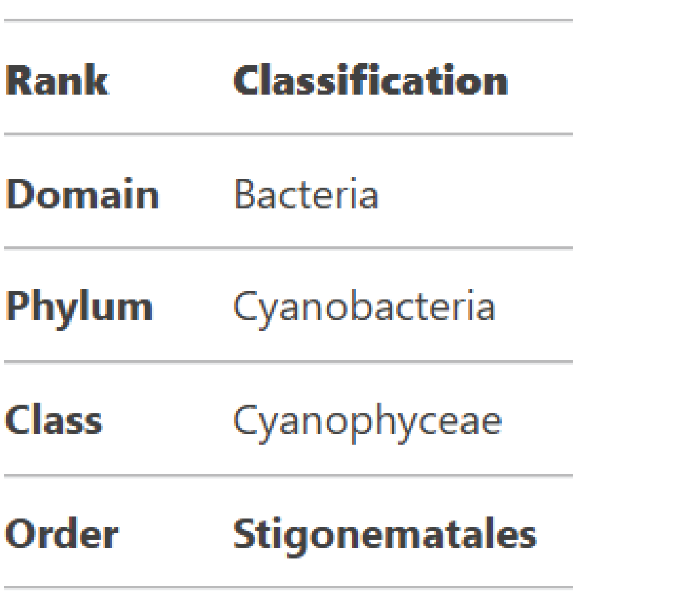


## [References]{style="background: #1f2937; color: #ffffff"}
