```{r}
#| warning: false
#| message: false
#| include: false
#| 
require(tidyverse)
require(gt)
```

# [Phylum Bacillariophyta]{style="background: #1f2937; color: #ffffff"}


## [Bacillariophyta (Diatoms)]{style="background: #1f2937; color: #ffffff"}

+ Bacillariophyta, commonly known as **diatoms**, are a major group of phytoplankton distinguished by their **silica-based cell walls** (frustules).
- They inhabit diverse aquatic ecosystems including freshwater, brackish, and marine waters, as well as wetlands and moist soils.
- Diatoms are ecologically critical, comprising a significant portion of marine phytoplankton and contributing up to **20–50% of global photosynthetic carbon fixation**.
- They exhibit diverse lifestyles: some are **benthic** (attached to substrates), while others are **planktonic**, and many possess a **raphe**—a specialized slit-like structure that enables active gliding motility over sediment surfaces.

## [Characteristics features of diatoms]{style="background: #1f2937; color: #ffffff"}

**1. Symmetry and Morphology**

::::: columns
::: column
-   Diatoms are divided into two major groups based on symmetry:

    -   *Pennate diatoms*
    -   *Centric diatoms*

-   **Pennate diatoms**: Bilaterally symmetric (elongated, boat-shaped, or pen/needle-like).
:::

::: column
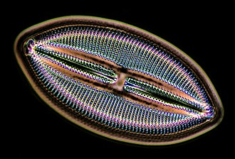 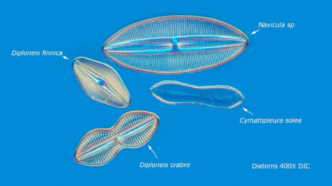
:::
:::::

## 

::::: columns
::: column
-   **Centric diatoms**: Radially symmetric (circular, triangular, or cylindrical). 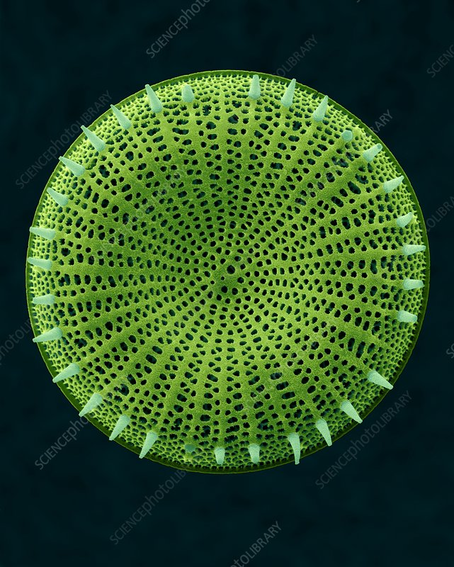
:::

::: column
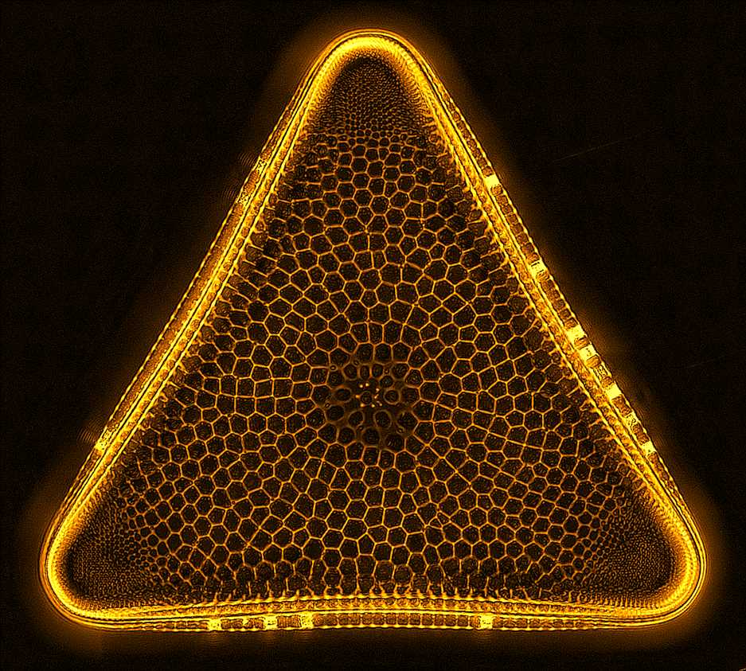 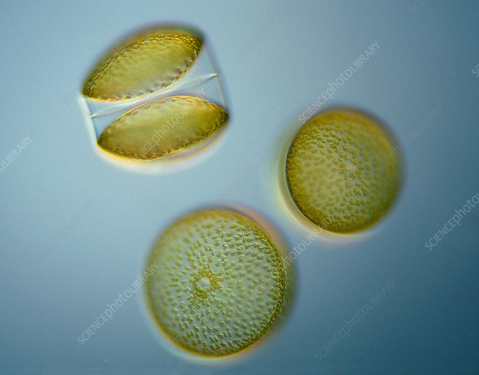
:::
:::::

## 

**2. Silica-based cell wall (frustule)**

::::: columns
::: column
- A cell wall of diatoms are characterised by having an external skeleton called **frustule** made of hydrated silica ($SiO_2.nH_2O$), which is like a box.
- The lid of the box is called a **valve** and the sides are made of a series of bands called **girdle**.
:::

::: column
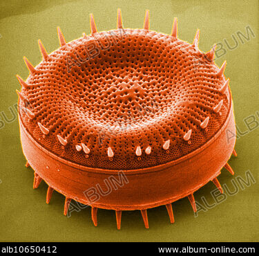 
:::
:::::

## 

::::: columns
::: column
-   The frustule composed of a larger half called the *epitheca* fitting over a separate, slightly smaller half known as a *hypotheca*.
    -   An *epitheca* -- larger upper valve and
    -   A *hypotheca* -- smaller lower valve that fit together like a petri dish.
:::

::: column
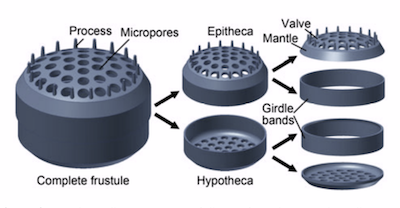 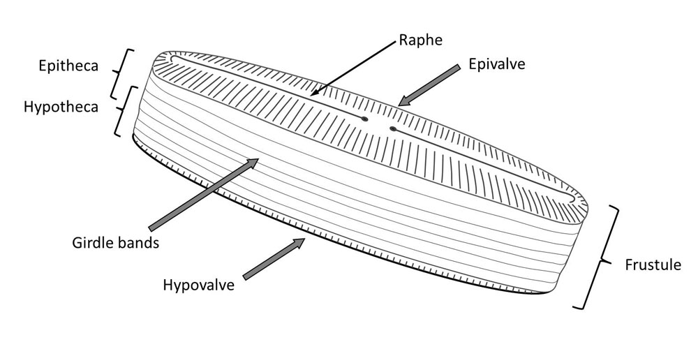
:::
:::::

## 

::::: columns
::: column
-   The valve & bands are not solid silica, but have open structures
-   An individual opening is called **areola**
-   The areolae may be arranged in rows called **striae**
:::

::: column
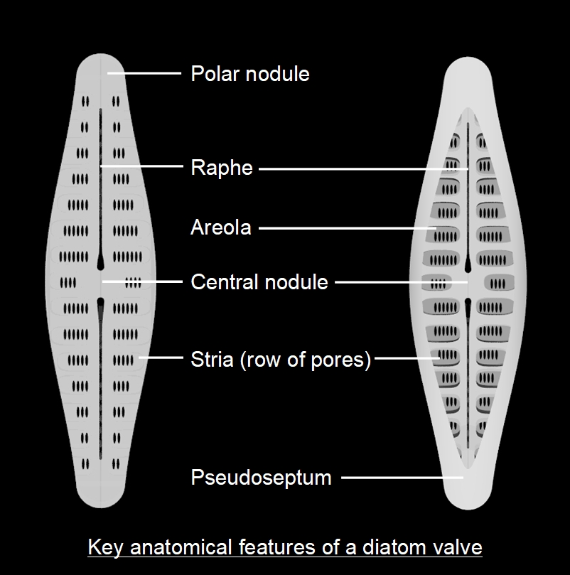
:::
:::::

## 

::::: columns
::: column
- In centric diatoms the striae are oriented towards a point and in pennate diatoms towards a line. 
:::

::: column

:::
:::::


## 

**3. Locomotion**

-   Pennate diatoms have a **raphe**, a slit-like structure that secretes mucopolysaccharides, allowing them to **glide** on surfaces.
-   Centric diatoms lack a raphe and are mostly *non-motile*, relying on water currents for movement.

## 

**4. Pigments and photosynthesis**

-   They possess **chlorophyll-*a* & c** (no chlorophyll b).
-   They also have **fucoxanthin** (a brown carotenoid) gives diatoms their **golden-brown color**.
-   They store energy as **chrysolaminarin** instead of starch.

## 

**5. Reproduction**

-   A dominant mode of reproduction is asexual reproduction by **binary fission**, where each daughter cell inherits one half of the frustule and regenerates the smaller half.

-   Over time, this leads to size reduction.

-   They also undergo sexual reproduction (size restoration):

    -   **Pennate diatoms**: Auxospore formation (fusion of gametes to restore original size).
    -   **Centric diatoms**: Oogamy (large non-motile egg + small motile sperm).

## [Classification of diatoms]{style="background: #1f2937; color: #ffffff"}


-   The phylum Bacillariophyta (diatoms) is traditionally divided into two main classes, primarily based on **symmetry** and **morphological** features of their silica frustules;

1.  Class bacillariophyceae (pennate diatoms)
2.  Class coscinodiscophyceae (centric diatoms)

##

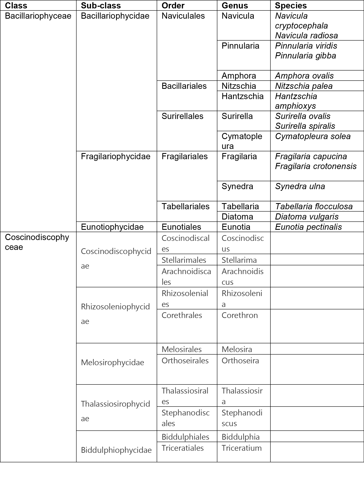


## [1. Class bacillariophyceae (pennate diatoms)]{style="background: #1f2937; color: #ffffff"}

-   **Body symmetry:** -- Bilateral (elongated, boat-shaped, or needle-like).
-   Many possess a **raphe** (slit for gliding motility).
-   Mostly benthic (attached to surfaces), but some planktonic.
-   Reproduction: **Auxospores** restore cell size after division.

## [Subclasses & orders]{style="background: #1f2937; color: #ffffff"}


**Subclass bacillariophycidae**

-   These are raphid (have raphe) pennate diatoms; two orders;

## 

**i). Order naviculales**

::::: columns
::: column
-   They are bilaterally symmetric (elongated, boat-shaped
-   They possess a raphe (slit-like structure) for gliding motility.
-   Frustules have parallel striations (striae) and intricate pore patterns.
-   Examples: *Navicula*, *Pinnularia*.
:::

::: column
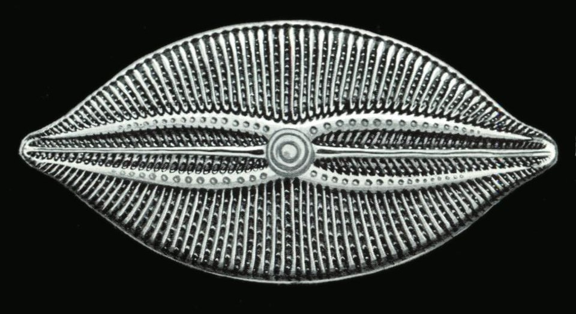 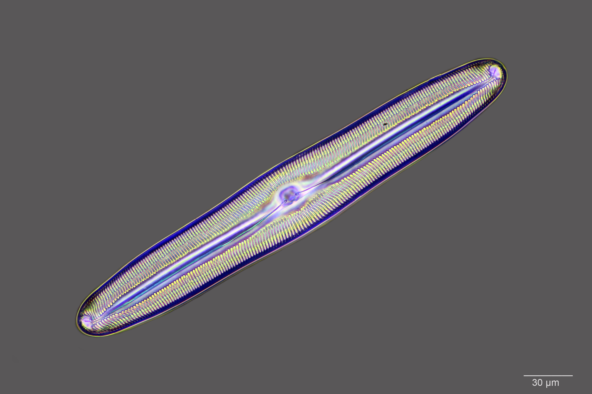
:::
:::::

## [Common genera of naviculales]{style="background: #1f2937; color: #ffffff"}


```{r}
#| eval: false
#| 
tibble(
  Genus = c("Navicula", "Pinnularia", "Amphora"),
  Feature = c("boat-shaped, elongated", "Large, striated frustules", "kidney-shaped"),
  Habitat = c("Common in clean freshwaters", "Freshwater, benthic, acid-tolerant", "Marine/brackish water"),
  Species = c(" Navicula cryptocephala, Navicula radiosa", "Pinnularia viridis, Pinnularia gibba", "Amphora ovalis")) |> 
    gt::gt() |> 
    gt::gtsave("picha/naviculales_genera.png")

   
```

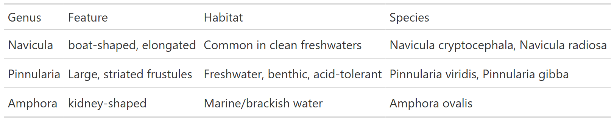

## 

**ii). Order bacillariales**

::::: columns
::: column
-   Order Bacillariales is a group of raphid pennate diatoms known for their elongated, needle-like or sigmoid (S-shaped) frustules and active motility.
-   They are found in both freshwater and marine environments.
-   Examples are *Nitzschia*, *Hantzschia*
:::

::: column
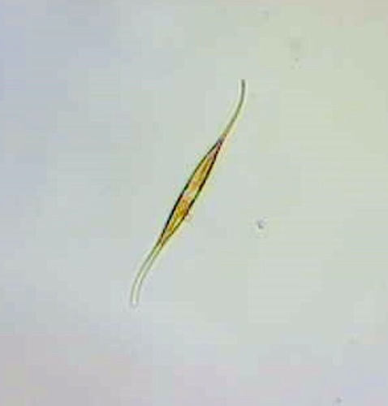 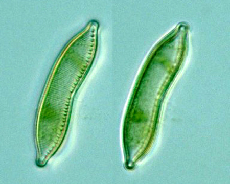
:::
:::::

## [Characteristics of bacillariales]{style="background: #1f2937; color: #ffffff"}

**Morphology**

::::: columns
::: column
-   They have an elongated, needle-like, or sigmoid (S-shaped) shape.
-   Some have keeled raphe systems (*Nitzschia*).
-   Unlike the central raphe of *Naviculales*, the keeled raphe is elevated on a raised ridge or **keel** along the edge of the valve
-   They have fine parallel lines (striae) or (pores) on the valve surface.
:::

::: column
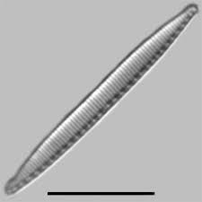
:::
:::::

## 

**Motility**

-   Raphe secretes mucopolysaccharides, enabling active gliding on surfaces.
    -   This helps in escaping sedimentation, nutrient foraging, and biofilm formation.

## [Order bacillariales]{style="background: #1f2937; color: #ffffff"}


::::: columns
::: column
-   Two genera;

**Genus Nitzschia**\
- Pollution-tolerant, freshwater -- *Nitzschia palea* - S-shaped, marine/brackish -- *Nitzschia sigmoidea*
:::

::: column

:::
:::::

## 

::::: columns
::: column
**Genus Hantzschia**

-   Benthic, moist habitats -- *Hantzschia amphioxys*.
:::

::: column

:::
:::::

## [Order Surirellales]{style="background: #1f2937; color: #ffffff"}

::::: columns
::: column
-   Two genera;

**Genus Surirella**

-   Wing-like keel, freshwater -- *Surirella ovalis*
-   Spiral-shaped, marine -- *Surirella spiralis*
:::

::: column
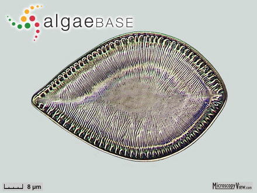 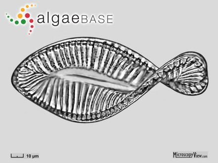
:::
:::::

## 

::::: columns
::: column
**Genus Cymatopleura**

-   Wavy margins, freshwater -- *Cymatopleura solea*
:::

::: column
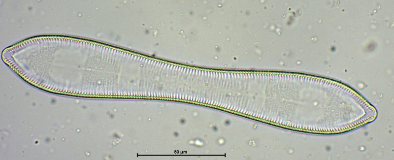
:::
:::::

## [Subclass: Fragilariophycidae (Araphid pennate diatoms)]{style="background: #1f2937; color: #ffffff"}

-   Lack a raphe (non-motile), often form colonies.

## [Order fragilariales]{style="background: #1f2937; color: #ffffff"}


::::: columns
::: column
**Genus Fragilaria**

-   They are chain-forming, freshwater *Fragilaria capucina*
-   Eg. *Fragilaria crotonensis*.
:::

::: column
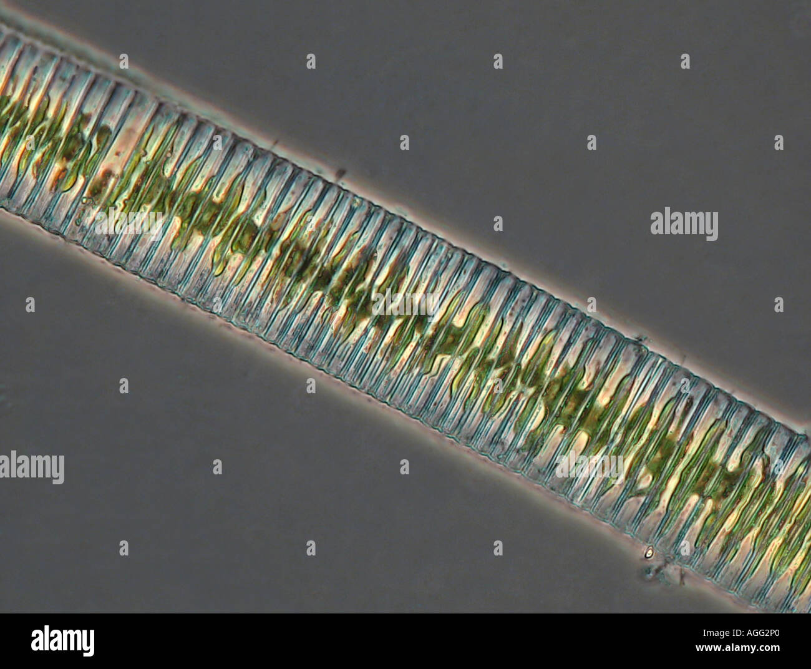 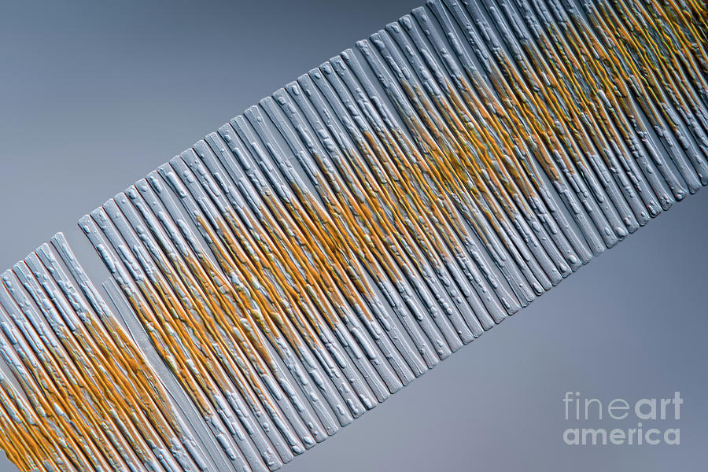
:::
:::::

## 

::::: columns
::: column
**Genus Synedra** - Needle-like, attached to surfaces -- *Synedra ulna*
:::

::: column
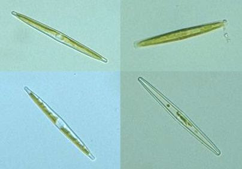
:::
:::::

## [Order Tabellariales]{style="background: #1f2937; color: #ffffff"}

::::: columns
::: column
**Genus Tabellaria**

-   Zigzag colonies, found in acidic waters -- *Tabellaria flocculosa*

**Genus Diatoma** - Band-like colonies, found in freshwater -- *Diatoma vulgaris*.
:::

::: column
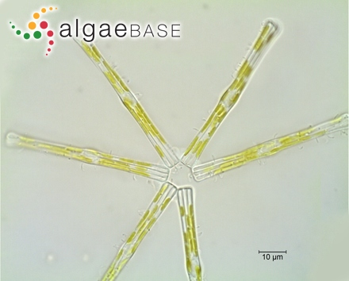 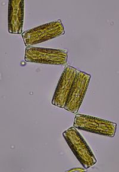
:::
:::::

## [Subclass: Eunotiophycidae (Asymmetric Pennate Diatoms)]{style="background: #1f2937; color: #ffffff"}

-   They have unequal valve symmetry, reduced raphe.

## [Order Eunotiales]{style="background: #1f2937; color: #ffffff"}

::::: columns
::: column
**Genus Eunotia** - Some are moon-shaped -- *Eunotia pectinalis* - Some are small, found in peat bog -- *Eunotia exigua*.
:::

::: column
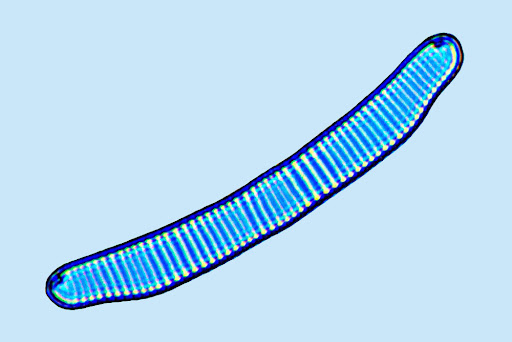
:::
:::::

## [2. Class coscinodiscophyceae (centric diatoms)]{style="background: #1f2937; color: #ffffff"}

-   They are composed of centric diatoms, characterized by radial symmetry and the absence of a raphe.
-   Five (5) subclasses

1.  Subclass Coscinodiscophycidae
2.  Subclass Rhizosoleniophycidae
3.  Subclass Melosirophycidae
4.  Subclass Thalassiosirophycidae
5.  Subclass Biddulphiophycidae

## [1. Subclass Coscinodiscophycidae]{style="background: #1f2937; color: #ffffff"}

-   Includes diatoms with predominantly radially symmetrical valves.
-   These are primarily marine planktonic species, though some occur in freshwater or benthic habitats.

## [Order Coscinodiscales]{style="background: #1f2937; color: #ffffff"}

::::: columns
::: column
-   They are radial symmetry
-   They are found in marine environment\
-   Common genera are *Coscinodiscus*, *Hemidiscus*\
:::

::: column
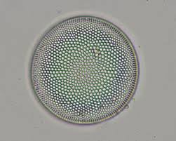 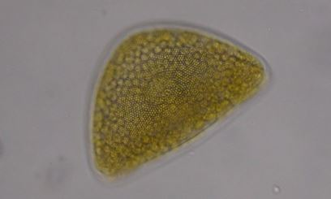
:::
:::::

## [Order Stellarimales]{style="background: #1f2937; color: #ffffff"}

::::: columns
::: column
-   They are star-like central structure\
-   Found in marine
-   Common genera are *Stellarima, Actinocyclus*
:::

::: column
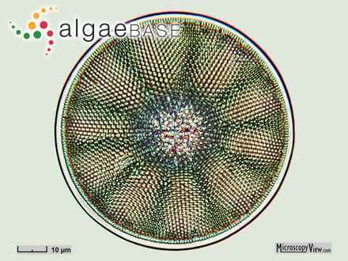 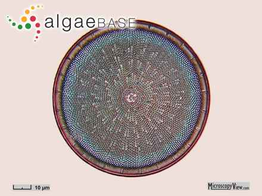
:::
:::::

## [Order Arachnoidiscales]{style="background: #1f2937; color: #ffffff"}


::::: columns
::: column
-   They are web-like valve patterns
-   Common genera are *Arachnoidiscus, Aulacodiscus*
:::

::: column
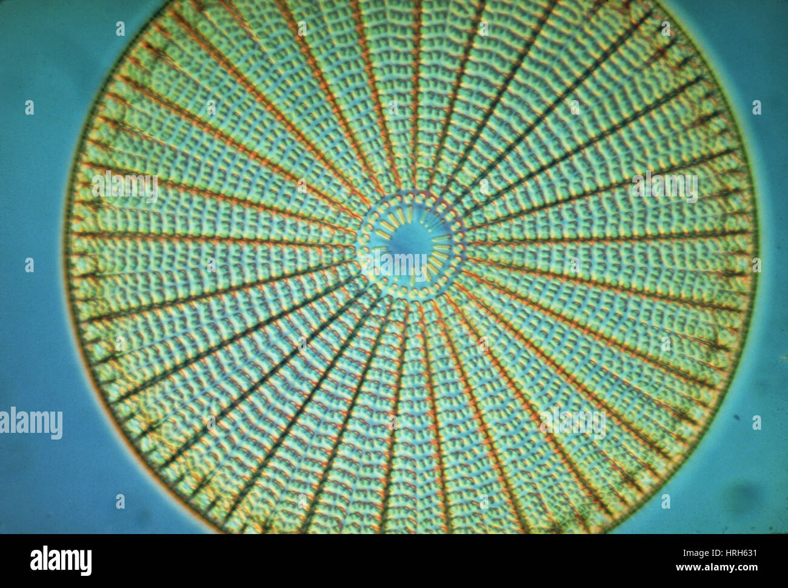 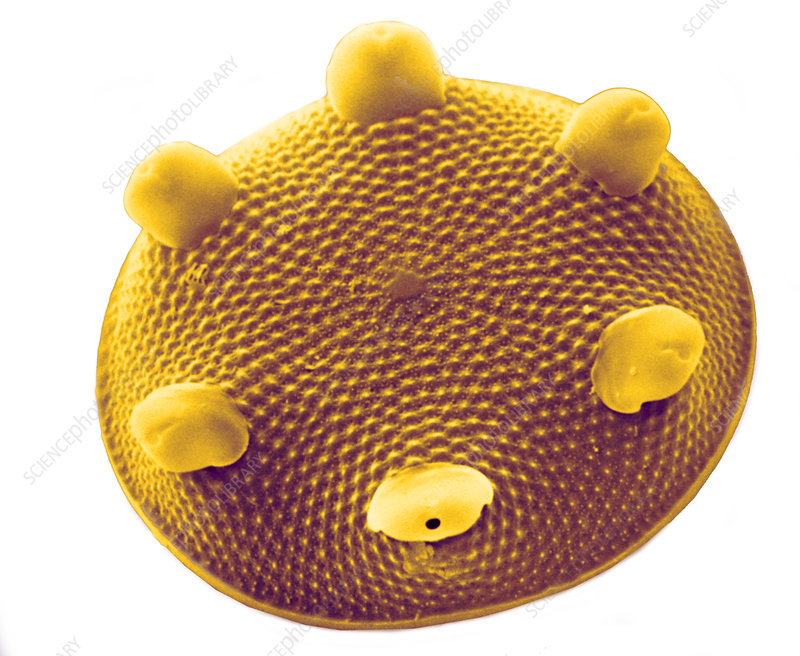
:::
:::::

## [2. Subclass Rhizosoleniophycidae]{style="background: #1f2937; color: #ffffff"}

-   Consists of elongated, tubular, or needle-like diatoms with bilateral or radial symmetry.
-   Many are important oceanic plankton, contributing significantly to marine primary productivity.
-   Two orders:

1.  Order rhizosoleniales
2.  Order corethrales

## [Order rhizosoleniales]{style="background: #1f2937; color: #ffffff"}


::::: columns
::: column
-   Their valve are elongated, needle-like shape (pennate-like but still centric).
-   They have bipolar or slightly radial body symmetry.
-   Often with elongated spines or extensions (e.g., "feet" in Rhizosolenia).
-   They have numerous, discoid or plate-like chloroplasts.
-   Found in marine (some form chains).
:::

::: column
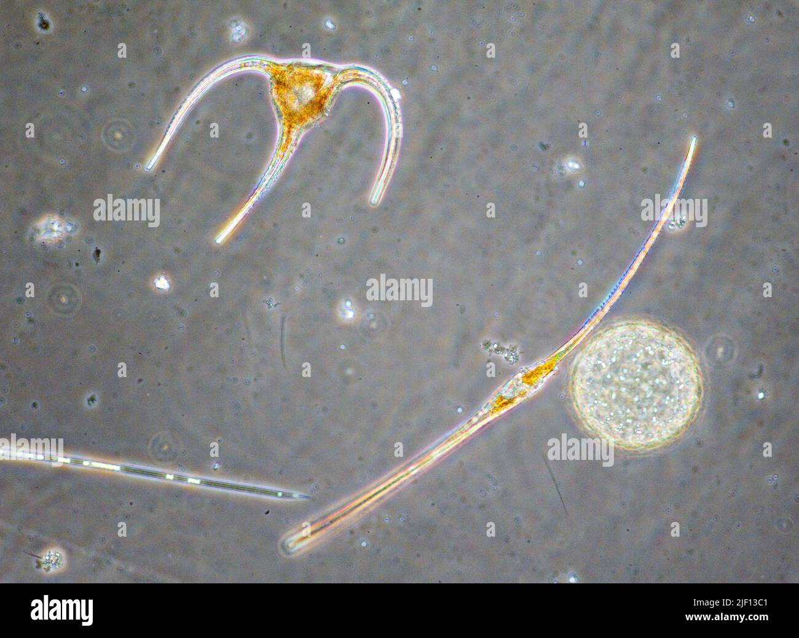 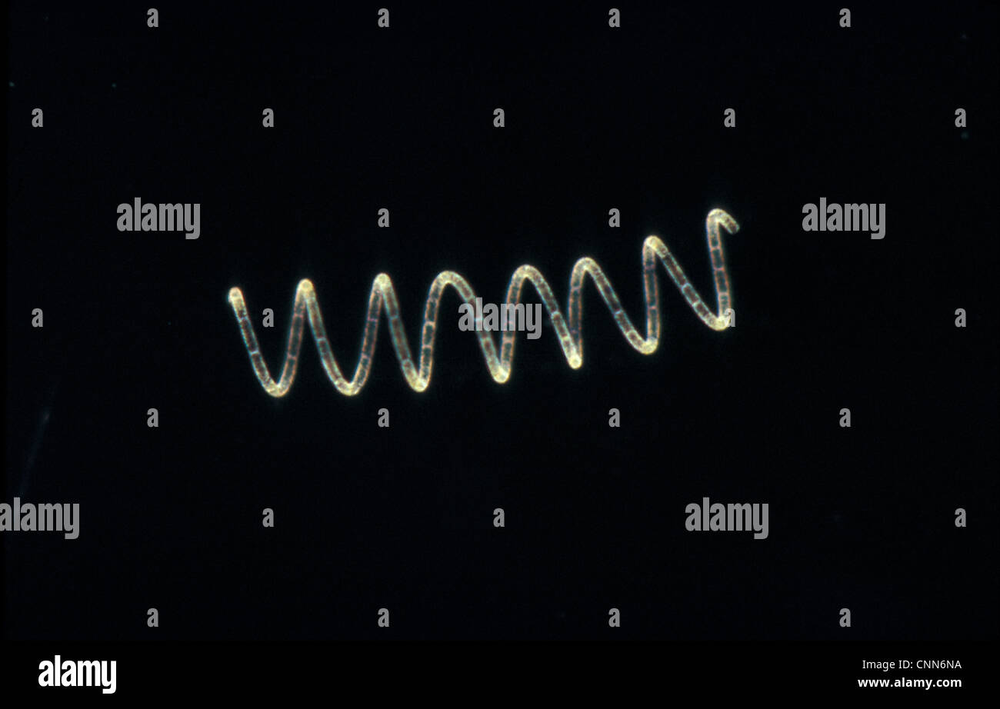
:::
:::::

## 

::::: columns
::: column
-   Three genera;
-   **Genus Rhizosolenia** -- (eg. *Rhizosolenia setigera*)
-   Some are long, needle-like with spines
-   **Genus Pseudosolenia** -- (eg. *Pseudosolenia calcar-avis*)
-   **Genus Guinardia** -- (eg. *Guinardia flaccida* – forms loose, ribbon-like chains)
:::

::: column
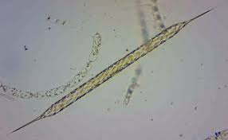 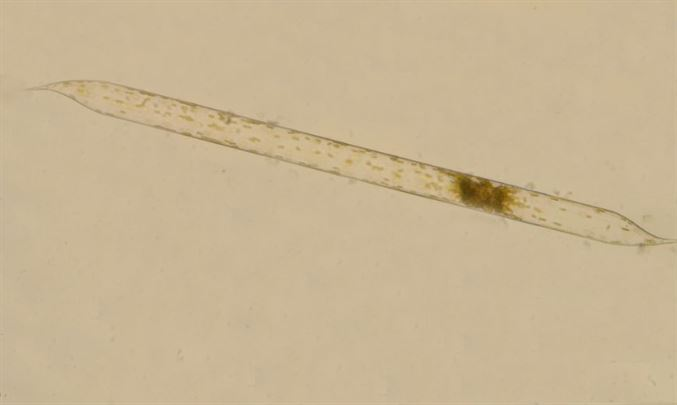 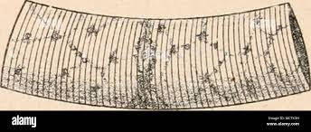
:::
:::::

## [Order corethrales]{style="background: #1f2937; color: #ffffff"}

-   They have a cylindrical valve shape with distinctive spine-like projections.
-   Have few chloroplasts which are large and lobed.
-   Found in marine often in cold or nutrient-rich waters.
-   Some species have long, hair-like setae.

## 

::::: columns
::: column
-   Common genera are;
-   **Genus Corethron** (eg. *Corethron criophilum* – Antarctic diatom with long spines)
-   **Genus Dactyliosolen** – forms zig-zag chains (e.g., *Dactyliosolen blavyanus*)
:::

::: column
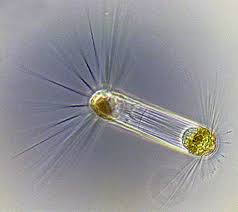 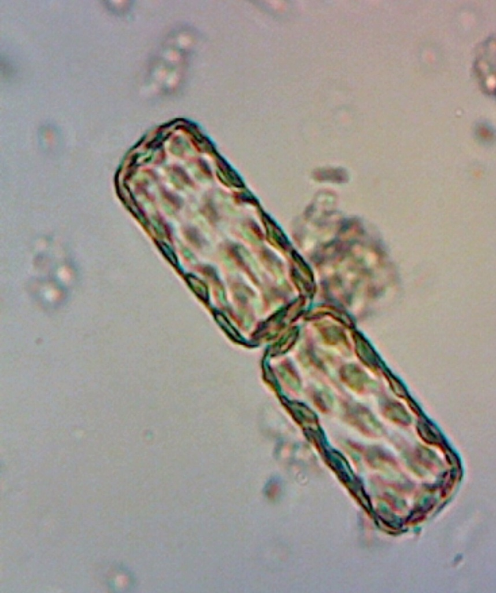
:::
:::::

## [3. Subclass Melosirophycidae]{style="background: #1f2937; color: #ffffff"}


-   Consists of centric diatoms that often form chains or colonies.

## [Order Melosirales]{style="background: #1f2937; color: #ffffff"}


::::: columns
::: column
-   Forms linear or zig-zag chains held together by organic threads or valve connections.
-   Have cylindrical or drum valve shape (discoid in some species).
-   Eg. Melosira
:::

::: column
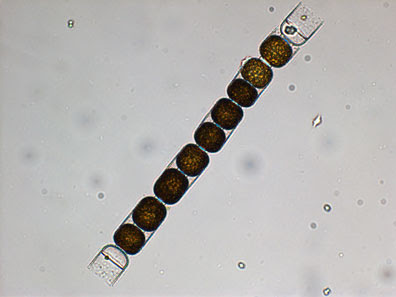
:::
:::::

## 

::::: columns
::: column
-   Common genera are:
-   **Genus Melosira** -- common in freshwater, forms long chains (eg. *Melosira varians*)
-   **Genus Paralia** -– marine, heavily silicified, benthic (eg. *Paralia sulcata*)
-   **Genus Hyalodiscus** -– found in marine (eg. *Hyalodiscus subtilis*)
:::

::: column
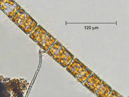 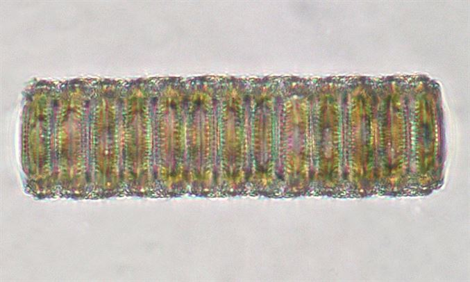
:::
:::::

# [4. Subclass Thalassiosirophycidae]{style="background: #1f2937; color: #ffffff"}

## [Order Thalassiosirales]{style="background: #1f2937; color: #ffffff"}

::::: columns
::: column
-   Circular to slightly oval with radial symmetry mophology
-   Areolae are typically arranged in radial or tangential patterns
-   Example: Thalassiosira
:::

::: column
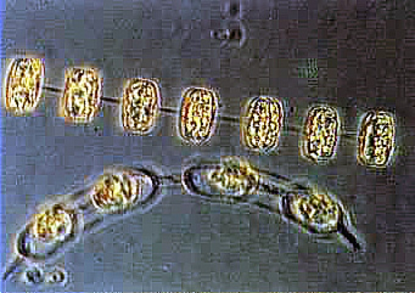
:::
:::::

## 

::::: columns
::: column
-   Common genera;
-   **Genus Thalassiosira** (Thalassiosira pseudonana)
-   **Genus Porosira** (*Porosira glacialis*)
-   **Genus Skeletonema** (*Skeletonema costatum*) 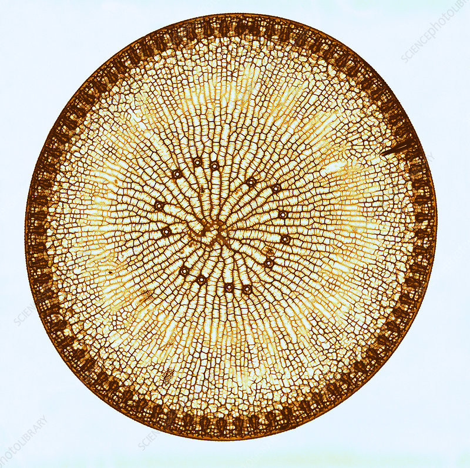
:::

::: column
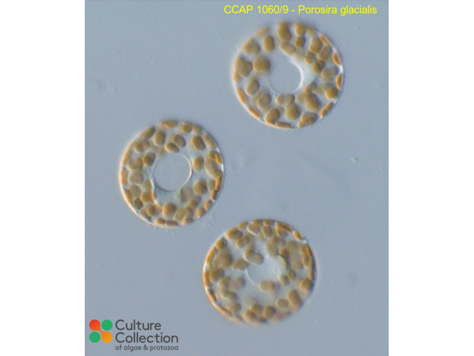 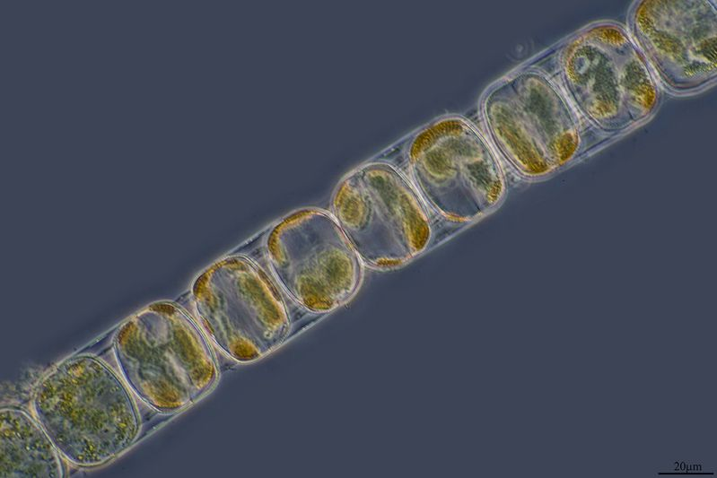
:::
:::::

# 5. Subclass Biddulphiophycidae

## [Order Biddulphiales]{style="background: #1f2937; color: #ffffff"}


::::: columns
::: column
-   Typically bipolar or multipolar symmetry valve
-   Often elongated, triangular, or wedge-shaped valves
-   Primarily marine, both planktonic and benthic forms
-   Example *Biddulphia alternans*, *Triceratium favus*, *Odontella mobiliensis* 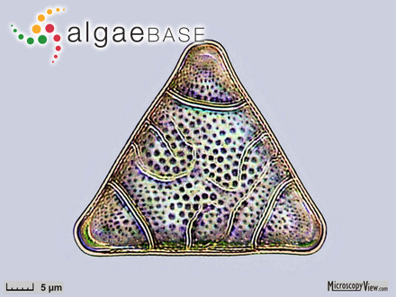
:::

::: column
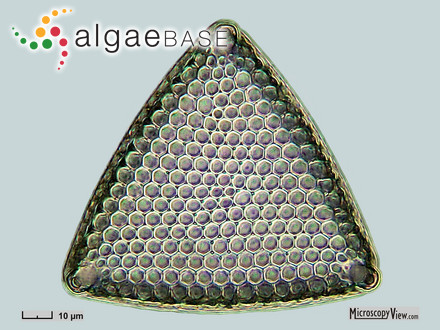 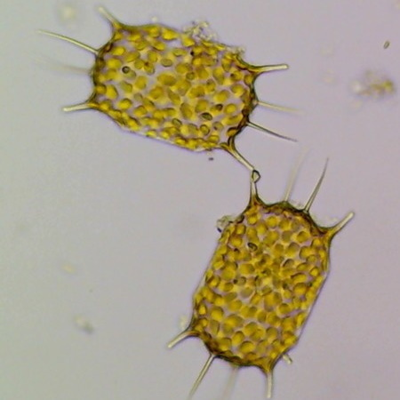
:::
:::::


## [References]{style="background: #1f2937; color: #ffffff"}
