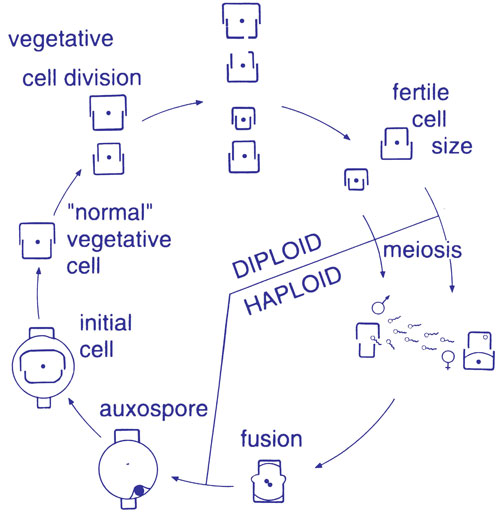

## [Diatoms life cycle]{style="background: #1f2937; color: #ffffff"}

-  Diatoms have a complex life cycle that includes both asexual and sexual reproduction.
- It has a unique pattern of **size reduction through asexual reproduction** followed by **size restoration through sexual reproduction**.
-   This cycle is driven by their rigid silica frustule structure, which constrains cell division and creates a progressive size reduction problem.
- The reduction is periodically corrected through sexual reproduction.
- Step in diatoms life cycle:

## [1. Asexual reproduction (dominant phase)]{style="background: #1f2937; color: #ffffff"}

**Binary fission:**

- The diatom nucleus divides mitotically.
- The two halves of the frustule (*epitheca* and *hypotheca*) separate.
- Each daughter cell inherits one parent valve:
    - One receives the larger **epitheca** (becomes the new epitheca)
    - One receives the smaller **hypotheca** (becomes the new epitheca)
- Each daughter regenerates a new, smaller **hypotheca** inside the inherited valve.

## [Consequence - progressive size reduction]{style="background: #1f2937; color: #ffffff"}

- With each division, the daughter cell that inherited the hypotheca becomes smaller.
- Over multiple generations (10-20+ divisions), average population size decreases.
- **Pennate diatoms**: can shrink to ~30% of original size.
- **Centric diatoms**: can shrink to ~50% of original size.

## [Physiological impact]{style="background: #1f2937; color: #ffffff"}

The size reduction has significant physiological consequences for diatoms:

  - Smaller cells have reduced metabolic capacity.
  - Decreased nutrient storage.
  - Lower reproductive success.
  - Eventually triggers sexual reproduction.

## [2. Sexual reproduction (size restoration)]{style="background: #1f2937; color: #ffffff"}

- Occurs when cells reach a **species-specific critical minimum size** (~30-50% of maximum).
- Cells become sexually competent at this threshold.
- Sexual reproduction in diatoms also is triggered by some environmental factors such as light, temperature & nutrient availability


## [Environmental factors triggering sexual reproduction]{style="background: #1f2937; color: #ffffff"}

- **Photoperiod changes** (day length) 

- Many diatoms use light as a seasonal cue. 

A shift toward shorter days (autumn) often signals the end of the bloom season, triggering sexual reproduction to produce hardy auxospores or resting stages.

## [Environmental factors...]{style="background: #1f2937; color: #ffffff"}

- **Temperature shifts** 

Sudden changes in water temperature (e.g., the cooling of surface waters) can synchronize the sexual cycle across a population, ensuring that many individuals produce gametes simultaneously to maximize fertilization success.

## [Environmental factors...]{style="background: #1f2937; color: #ffffff"}

- **Nutrient limitation** -- When essential nutrients like Nitrogen or Phosphorus become scarce, vegetative growth slows down. Specifically, **Silica limitation** prevents the formation of new rigid valves during asexual division, forcing the cell to bypass normal division and initiate the auxospore (expansion) phase to survive.

## [Sexual reproduction by diatom groups]{style="background: #1f2937; color: #ffffff"}

**Pennate diatoms**

- Cells produce gametes.
- Most pennates are **heterothallic** (require two compatible mating types).
- Two types of gametes may be involved;

    - **Isogamy**: Two similar, motile, non-flagellated gametes fuse (e.g., *Navicula*).
    - **Anisogamy**: One larger non-motile gamete + one smaller motile gamete (eg. *Cocconeis*).
- Gametes fuse to form a zygote, which develops into an **auxospore**.
- An auxospore is a specialized cell that expands to restore the maximum size of the species, allowing the life cycle to continue.

## [Sexual reproduction by diatom groups]{style="background: #1f2937; color: #ffffff"}

**Centric diatoms**

- In centric diatoms, sexual reproduction is by **oogamy** which is the union of unlike cells, usually a large non-motile female gamete and a small flagellated motile male gamete.

The **Oogamy** is the advanced sexual reproduction in which the:

  - Female gametangium produces large, non-motile **egg**.
  - Male gametangium produces small, flagellated **sperm**.
  - Sperm swims to fertilize egg and form a zygote.
  - Zygote expands to form an **auxospore**, which resets the cell to maximum size.
  - Examples: *Thalassiosira*, *Melosira*

## [Auxospore formation]{style="background: #1f2937; color: #ffffff"}

1.  Fertilization produces a **zygote**.
2.  Zygote expands dramatically, breaking free of size constraints.
3.  Forms an **auxospore** - a specialized expansion cell lacking rigid frustule.
4.  Auxospore grows to species's **maximum size** (size restoration).
5.  New silica valves form around the expanded cell.
6.  Produces an **initial cell** with full-size frustule.
7.  Asexual reproduction resumes.


## [3. Resting stages (survival strategy)]{style="background: #1f2937; color: #ffffff"}

- Some diatoms form resting spores (thick-walled, sink to sediments) 
- Resting spores is formed under environmental stress:
    - Nutrient depletion
    - Temperature extremes
    - Unfavorable light conditions

## [Characteristics of resting spores]{style="background: #1f2937; color: #ffffff"}

- Thick, heavily silicified walls
- Sink to sediments
- Metabolically dormant
- Can survive months to years
- Common in centric diatoms (*Chaetoceros*, *Thalassiosira*)

## [Germination of a resting spore]{style="background: #1f2937; color: #ffffff"}

- Occurs when favorable conditions return.
- Spring blooms often result from sediment spore germination.

## [Life cycle summary]{style="background: #1f2937; color: #ffffff"}

```
Initial Cell (maximum size)
    ↓
Binary Fission (asexual) → Size Reduction
    ↓ (repeated divisions)
Smaller Cells → Physiological Stress
    ↓ (critical size reached)
Sexual Reproduction Triggered
    ↓
Gamete Formation → Fertilization
    ↓
Auxospore (expansion phase)
    ↓
Initial Cell (restored to maximum size)
    ↓
Cycle Repeats
```

## [Diagram of diatom life cycle]{style="background: #1f2937; color: #ffffff"}




## [Factors triggering diatom sexual reproduction]{style="background: #1f2937; color: #ffffff"}

- Diatoms rely on external environmental signals to initiate sexual reproduction, ensuring survival and genetic diversity.
- These factors vary by species and habitat and include:

## [1. Cell size reduction]{style="background: #1f2937; color: #ffffff"}

-  This is the primary factor that trigger the sexual reproduction in diatoms
- Asexual reproduction (binary fission) gradually reduces cell size.
- When cells reach a species-specific minimum size, they become sexually competent.
- Example: Some *Nitzschia* species trigger sex at *\~30%* of original size.

## [2. Light conditions]{style="background: #1f2937; color: #ffffff"}

- Photoperiod (day length): -- many diatoms respond to seasonal light changes (e.g shorter days in autumn).
- Example: marine centric diatoms like *Thalassiosira* reproduce sexually as daylight decreases.
- Light quality -- shifts in blue/green light spectra (e.g. underwater light gradients) can signal sexual reproduction.

## [3. Nutrient availability]{style="background: #1f2937; color: #ffffff"}

- Silicon (Si) depletion: -- diatoms require **silica** (Si) for **frustule** formation.
- Low Si induces **auxospore** formation.
- Example: *Skeletonema marinoi* initiates sexual reproduction during Si limitation.
- Nitrogen (N) or Phosphorus (P) stress: -- nutrient starvation accelerates size reduction, pushing cells toward sexual reproduction.

## [4. Temperature shifts]{style="background: #1f2937; color: #ffffff"}

- Cooling or warming: -- spring/autumn temperature changes synchronize sexual cycles.
- Example: *Pseudo-nitzschia* blooms often transition to sexual reproduction after sudden cooling.

## [Ecological significance of diatom life cycle]{style="background: #1f2937; color: #ffffff"}

- **Asexual phase**: Enables rapid population growth during favorable conditions (blooms).
- **Sexual phase**: Maintains genetic diversity and restores fitness.
- **Resting spores**: Ensure survival through adverse periods and seed future blooms.

## [Global importance]{style="background: #1f2937; color: #ffffff"}

- This life cycle strategy allows diatoms to dominate many aquatic ecosystems.
- Diatoms contribute **20-50% of global ocean primary productivity**.
- Their unique reproductive strategy ensures both rapid growth and long-term survival.


## [Heteromorphy in diatoms]{style="background: #1f2937; color: #ffffff"}

- Heteromorphy refers to the phenomenon where a single diatom species produces morphologically different frustule forms at different stages of its life cycle.

## [Why does it happen?]{style="background: #1f2937; color: #ffffff"}

- **Structural constraints**: 

Because the silica frustule is rigid, the cell cannot simply grow larger. Any change in volume or physiological state (like preparing for dormancy) requires the synthesis of a completely  valve with a different architecture.

- **Functional adaptation**: 

Different forms serve different purposes. Vegetative cells are optimized for **nutrient uptake and floating** in the photic zone, while resting spores (a heteromorphic form) are optimized for **sinking and protection** against grazers or decay.

- **Genetic reset**: 

The *initial cell* formed after sexual reproduction often lacks the complex features (like specific spines or colony-linking structures) seen in mature vegetative cells, representing a morphological *reset*. This occurs primarily due to the size reduction-cycle and can involve changes in shape, ornamentation, or symmetry.

## [Causes of Heteromorphy]{style="background: #1f2937; color: #ffffff"}

**1. Life cycle-driven heteromorphy**

- Initial cells vs. vegetative cells

    - Initial cells (post-auxospore) have the largest and most symmetric frustules.
    - Vegetative cells (after repeated divisions) become smaller and may develop different shapes (e.g. more elongated or tapered).

- Sexual vs. asexual phases

    - Some centric diatoms (e.g., *Chaetoceros*) produce resting spores with thick, heavily silicified walls, differing from their vegetative forms.

## [Causes of Heteromorphy...]{style="background: #1f2937; color: #ffffff"}
 

**Environmental stress responses**

- Resting spores 

  - Form under nutrient limitation, temperature shifts, or salinity changes.
  - Example: *Thalassiosira* produces spiny resting spores in winter.

- Morphological plasticity: -- Some diatom species alter valve structure in response to:

  - Low silica → Thinner, more porous frustules.
  - High predation pressure → Heavily armored forms.

## [Types of heteromorphy]{style="background: #1f2937; color: #ffffff"}

**1. Size-dependent heteromorphy**

- Centric diatoms:

    - Early divisions produce radially symmetric cells.
    - Later divisions may shift toward oval or bipolar forms (e.g. *Aulacoseira*).

- Pennate diatoms:

  - Example: In *Nitzschia*, smaller cells may develop more pronounced keels.

## [Types of heteromorphy...]{style="background: #1f2937; color: #ffffff"}
 

**2. Sexual phase heteromorphy**

- Oogamous centrics:

  - Male (sperm-producing) and female (egg-producing) gametangia may have different frustule shapes.

- Auxospore expansion:

  - Post-sexual initial cells often have unusual shapes before reverting to the species's typical form.


## [References]{style="background: #1f2937; color: #ffffff"}
