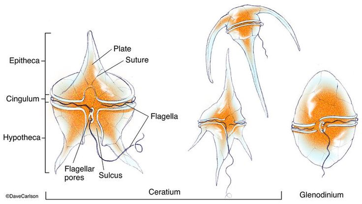
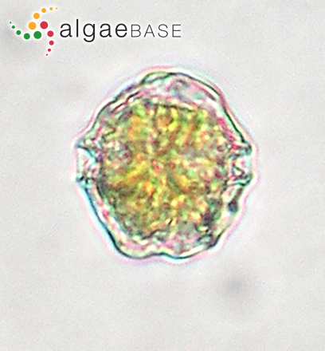
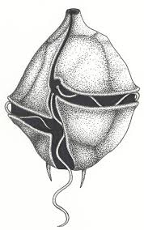
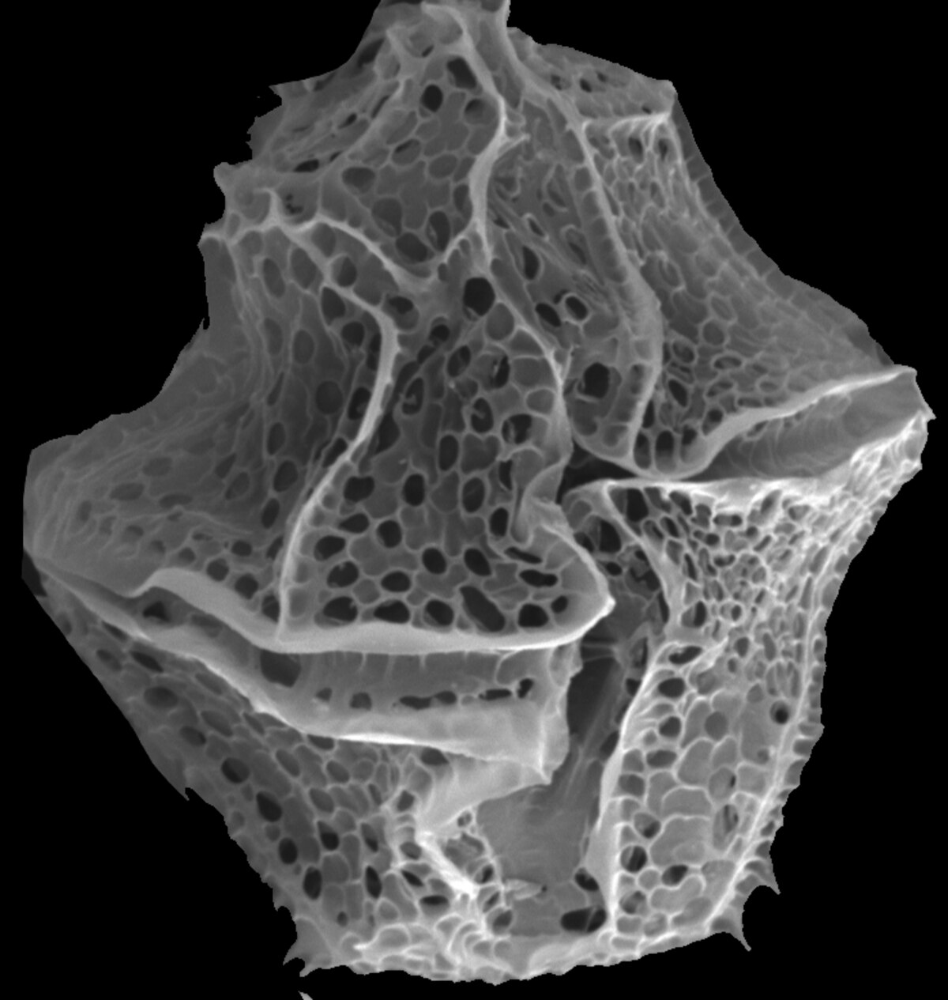
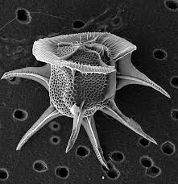
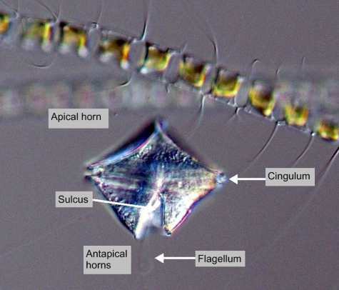
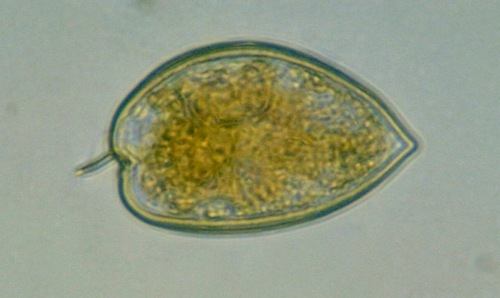
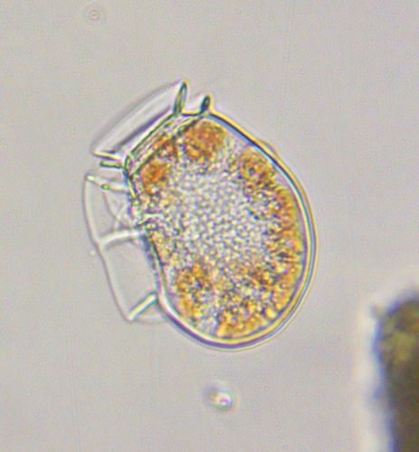
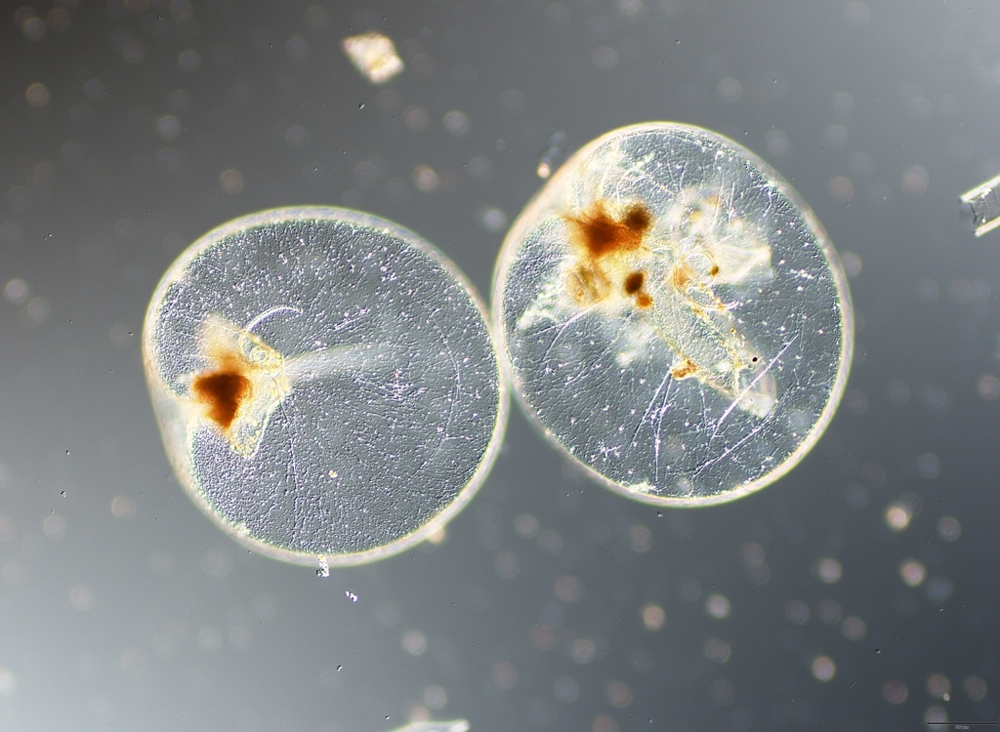
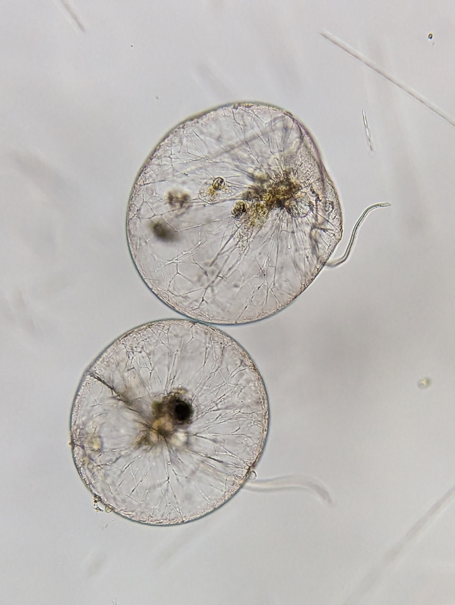

```{r}
#| warning: false
#| message: false
#| include: false
#| 
require(tidyverse)
require(gt)
```

# [Phylum Dinoflagellata]{style="background: #1f2937; color: #ffffff"}

## [General characteristics]{style="background: #1f2937; color: #ffffff"}

**Taxonomy & diversity:**

- Approximately **2,000-4,000 species** described worldwide.
- Primarily **marine** (90%), but also found in freshwater and some terrestrial habitats.
- Both **photosynthetic** (autotrophic) and **heterotrophic** species exist in this group.
- Size ranges between **20-200 μm**, though some species reach **2 mm** (*Noctiluca*).

## [Distinctive morphological features of dinoflagellates]{style="background: #1f2937; color: #ffffff"}


::: {.columns}

::: {.column}

**1. Flagellar apparatus:**

- Possess **two flagella** with distinct orientations:
    - **Transverse flagellum**: Lies in the **cingulum** (groove encircling the cell), creates spinning motion.
    - **Longitudinal flagellum**: Extends posteriorly from the **sulcus** (longitudinal groove), provides forward propulsion.
:::

::: {.column}



- This arrangement produces the characteristic **spinning, tumbling motion** (*dinos* = whirling).
:::

:::


## [Distinctive morphological features...]{style="background: #1f2937; color: #ffffff"}

::::: columns
::: column
**2. Cell covering:**

- **Thecate (armored)**: Some possess cellulose plates called **theca/thecae** arranged in a protective **lorica**.
    - Plates organized in specific patterns (**tabulation**).
    - Provides structural support and protection.
- Some are **Athecate (naked)**: Lack rigid plates, have only a cell membrane.
    - More flexible but less protected.
:::

::: column


:::
:::::

## [Distinctive morphological features...]{style="background: #1f2937; color: #ffffff"}

**3. Unique dinokaryon nucleus:**

- Chromosomes remain **permanently condensed** throughout cell cycle.
- DNA not associated with histones (uses different proteins).
- Nuclear envelope persists during division (**closed mitosis**).
- This unique nuclear structure distinguishes dinoflagellates from other eukaryotes.

## [Pigmentation & photosynthesis in dinoflagellates]{style="background: #1f2937; color: #ffffff"}

**Autotrophic species:**

-   Chloroplasts contain:
    - **Chlorophyll a** and **c**.
    - **Peridinin** (unique carotenoid giving golden-brown color).
    - Some species have different pigments due to **secondary endosymbiosis**.
- Autotrophs perform photosynthesis, contributing to primary production.

**Storage products:**

- They store energy as **starch** and **lipids**.

## [Nutritional Modes of dinoflagellates]{style="background: #1f2937; color: #ffffff"}

**1. Autotrophic:**

- Some are photosynthetic (e.g., *Ceratium*, *Peridinium*).

**2. Heterotrophic:**

- Some are heterotrophic (predators or parasites, e.g., *Pfiesteria*).
- They ingest bacteria, other protists, or organic particles.
- Some are **parasitic** (e.g., *Pfiesteria*).

## [Nutritional Modes...]{style="background: #1f2937; color: #ffffff"}
 

**3. Mixotrophic:**

- Some are Mixotrophs (both photosynthetic and heterotrophic). 
- Combine photosynthesis with prey ingestion.
- Provides nutritional flexibility (e.g., *Dinophysis*, *Karlodinium*).

**4. Symbiotic:**

- **Zooxanthellae** (*Symbiodinium*): Live symbiotically in coral tissues, providing photosynthates.
- Critical for coral reef health and survival.


## [Reproduction in dinoflagellates]{style="background: #1f2937; color: #ffffff"}

**Asexual reproduction (dominant):**

- Asexual reproduction is by **Binary fission** -- cell divides longitudinally.
- This leads to rapid population growth during favorable conditions.


**Sexual reproduction:**

- This occurs less frequently.
- It involves **gamete fusion** and **meiosis**.
- It is often triggered by environmental stress.
 

## [Reproduction in dinoflagellates...]{style="background: #1f2937; color: #ffffff"}
 
**Resting cysts:**

- Many species form **resting cysts** (hypnozygotes):
    - This is the thick-walled, dormant stages.
    - Normally sink to sediments.
    - It germinate when conditions improve.
    - This is important for surviving adverse conditions and dispersal.


## [Ecological roles of dinoflagellates]{style="background: #1f2937; color: #ffffff"}

**1. Primary production:**

- Support food webs in coastal and oceanic environments.
- Major contributors to marine phytoplankton biomass.


**2. Coral symbiosis:**

- Zooxanthellae provide up to **90% of coral energy** requirements.
- Coral bleaching occurs when symbionts are expelled.

## [Ecological roles of dinoflagellates...]{style="background: #1f2937; color: #ffffff"}

**3. Harmful Algal Blooms (HABs) -- Red Tides**

- Higher nutrient enrichment can lead to rapid population growth of certain species of dinoflagellates in aquatic ecosystems (e.g., *Karenia*, *Alexandrium*).
- The growth can cause water discoloration (reddish-brown).
- These species also produce potent toxins that can accumulate in shellfish and fish, posing risks to human health and marine life.

## [Harmful Algal Blooms...]{style="background: #1f2937; color: #ffffff"}

- The toxins produced include:

    - **Saxitoxins** (*Alexandrium sp*) → Paralytic Shellfish Poisoning (PSP).
    - **Brevetoxins** (*Karenia sp*) → Neurotoxic Shellfish Poisoning (NSP).
    - **Okadaic acid** (*Dinophysis sp*, *Prorocentrum sp*) → Diarrhetic Shellfish Poisoning (DSP).
    - **Ciguatoxins** (*Gambierdiscus sp*) → Ciguatera Fish Poisoning.

## [Ecological roles of dinoflagellates...]{style="background: #1f2937; color: #ffffff"}
 

- The toxins can cause various illnesses in humans, such as paralytic shellfish poisoning (PSP), neurotoxic shellfish poisoning (NSP), and diarrhetic shellfish poisoning (DSP).
- They can also lead to fish kills and marine mammal deaths, resulting in significant ecological and economic impacts on fisheries and tourism industries.

## [Ecological roles of dinoflagellates...]{style="background: #1f2937; color: #ffffff"}

**4. Bioluminescence**

- Some species of dinoflagellates emit light when disturbed (e.g., *Noctiluca sp*, *Lingulodinium sp*).
- These produce spectacular **glowing waves** at night.
- They uses **luciferin-luciferase** reaction.
- This may serve as defense mechanism against predators.


## [Taxonomy of Dinoflagellates]{style="background: #1f2937; color: #ffffff"}

**Class Dinophyceae**

- This is the largest and most diverse class of dinoflagellates, containing the majority of known species.
- It includes both photosynthetic and heterotrophic species, as well as many that are mixotrophic or symbiotic.
- Members of this class are found in a wide range of aquatic environments, from freshwater to marine habitats.


## [Major Orders of Dinophyceae]{style="background: #1f2937; color: #ffffff"}

- This class is divided into several orders based on morphological and genetic characteristics. The major orders include:

1.  Gonyaulacales (e.g., *Alexandrium* — toxin producers).
2.  Peridiniales (e.g., *Peridinium*).
3.  Prorocentrales (e.g., *Prorocentrum*).
4.  Dinophysiales (e.g., *Dinophysis* — diarrhetic shellfish poisoning).
5.  Noctilucales (non-photosynthetic, bioluminescent).

## [Order Gonyaulacales]{style="background: #1f2937; color: #ffffff"}

- Composed of a theca -- thecate with cellulose plates arranged in specific tabulation patterns.
- Often have a polygonal or spherical shape, with pronounced cingulum (transverse groove).
- Chloroplasts contain chlorophyll *a*, c, and peridinin.

## [Order Gonyaulacales...]{style="background: #1f2937; color: #ffffff"}
 

::::: columns
::: column
**Some species produce Toxin;**

- *Alexandrium* (**saxitoxins** → paralytic shellfish poisoning/PSP).
- *Gonyaulax* (**yessotoxins** → diarrhetic shellfish poisoning/DSP).
:::

::: column
 
:::
:::::


## [Order Gonyaulacales...]{style="background: #1f2937; color: #ffffff"}
 

::::: columns
::: column
**Bloom formation:**

- *Lingulodinium* (bioluminescent; forms red tides).
- *Ceratocorys* (tropical, armored species).
:::

::: column
 
:::
:::::

## [Order Gonyaulacales...]{style="background: #1f2937; color: #ffffff"}
 
 **Bioluminescence**

- Some species (e.g., *Lingulodinium polyedra*) emit light via luciferase enzymes.
- Most are free-living, rarely symbiosis

## [Order Peridiniales]{style="background: #1f2937; color: #ffffff"}

::::: columns
::: column
- Composed of armored (**thecate**) with cellulose plates arranged in a distinctive tabulation pattern.
- Typically compressed anteroposteriorly, with a pronounced cingulum (transverse groove) and sulcus (longitudinal groove).
:::

::: column

:::
:::::

## [Order Peridiniales...]{style="background: #1f2937; color: #ffffff"}
 

- Chloroplasts contain chlorophyll *a*, c₂, and accessory pigments like peridinin (in autotrophic species).
- Many species are mixotrophic or fully heterotrophic (e.g., *Protoperidinium*).
- Some species produce toxins.
- Many species produce resting cysts.

## [Order Peridiniales...]{style="background: #1f2937; color: #ffffff"}

**Key genera:**

- *Peridinium* (freshwater/marine; often bloom-forming).
- *Scrippsiella* (calcareous cysts; common in coastal waters).

## [Order Prorocentrales]{style="background: #1f2937; color: #ffffff"}


::: {.columns}

::: {.column}

- The Prorocentrales are a small order of dinoflagellates. 
- They are laterally compressed, often heart-shaped or oval.
- They are distinguished by having their two flagella inserted apically, rather than ventrally as in other groups. 
:::

::: {.column}



:::

:::

## [Order Prorocentrales...]{style="background: #1f2937; color: #ffffff"}


::: {.columns}

::: {.column}

- One flagellum extends forward and the other circles its base, and there are no flagellar grooves. 
- This arrangement is called **desmokont**, in contrast to the **dinokont** arrangement found in other groups.
- Accordingly, the Prorocentrales may be called desmoflagellates, and in some classifications were treated as a separate class Desmophyceae.

:::

::: {.column}


:::
:::

## [Order Prorocentrales...]{style="background: #1f2937; color: #ffffff"}

- All members have chloroplasts and a theca, which is composed of two large plates joined by a sagittal suture. 
- This structure is shared with the *Dinophysiales*, and they are probably sister groups. 
- Several species produce toxins and form harmful algal blooms:

    - *Prorocentrum lima*: Produces okadaic acid (causes diarrhetic shellfish poisoning)
    - *Prorocentrum cordatum*: Common bloom-former in coastal waters
    - *Prorocentrum minimum*: Forms red tides, may be toxic

## [Order Prorocentrales...]{style="background: #1f2937; color: #ffffff"}

**Distinctive features:**

- **No cingulum or sulcus** (unlike most dinoflagellates).
- Two large symmetrical thecal plates.
- Apical pore complex where flagella emerge.
- Example: 
    - *Prorocentrum* (most diverse genus, includes toxic species).
    - *Mesoporos* (less common, marine species).

## [Order Dinophysiales]{style="background: #1f2937; color: #ffffff"}


::: {.columns}

::: {.column}
- Laterally compressed cells with prominent **wing-like lists** (membranous extensions).
- Theca structure: Thin cellulose plates with characteristic ridges and pores
- Locomotion: Slow swimmers with reduced flagellar apparatus
- They are mixotrophic -- combination of autotrophic and heterotrophic nutrition


:::

::: {.column}
 

:::

:::


## [Order Dinophysiales...]{style="background: #1f2937; color: #ffffff"}


::: {.columns}

::: {.column}
- Several species produce toxins and causes diarrhetic shellfish poisoning (DSP)
- Example:

    - *Dinophysis* (most significant genus, contains many toxic species)
    - *Phalacroma* (closely related, sometimes merged with Dinophysis)
    - *Ornithocercus* (notable for extremely developed lists)

:::

::: {.column}
 
:::
:::

## [Order Noctilucales]{style="background: #1f2937; color: #ffffff"}


::: {.columns}

::: {.column}
- **Unarmored cells**: Lack cellulose plates (naked).
- **Size**: Exceptionally large for dinoflagellates (200-2000 μm).
- **Bioluminescence**: Most species produce light (*luciferin-luciferase* system).
- They are exclusively heterotrophic.
- They are exclusively heterotrophic, feeding on other plankton and organic matter.

:::

::: {.column}



:::

:::


## [Order Noctilucales]{style="background: #1f2937; color: #ffffff"}

::: {.columns}

::: {.column}
- Some species have tentacle-like structures for prey capture 
- Vacuolated cytoplasm - contains large fluid-filled spaces
- Have highly flexible cell membrane that allows shape changes during feeding
- Example: *Noctiluca scintillans* (bioluminescent, forms red tides).
:::

::: {.column}



:::

:::


## [References]{style="background: #1f2937; color: #ffffff"}
