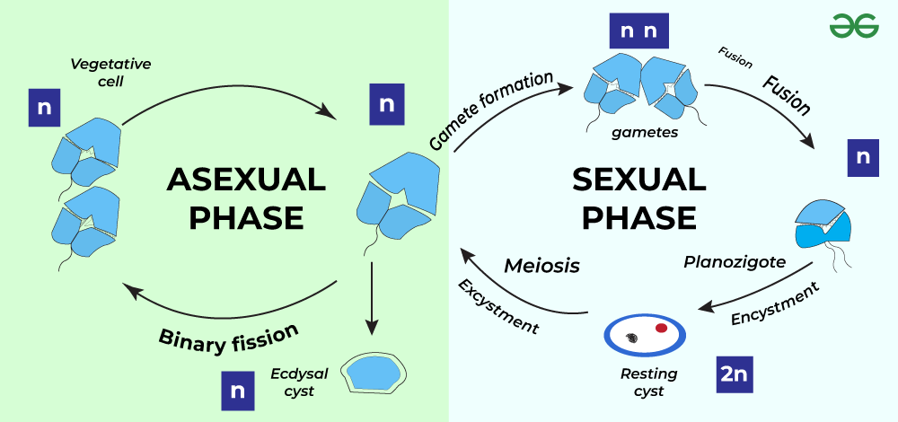

## [Overview]{style="background: #1f2937; color: #ffffff"}

Dinoflagellates employ two reproductive strategies that enable both rapid population growth and long-term survival through environmental challenges.

## [Asexual reproduction (primary)]{style="background: #1f2937; color: #ffffff"}

+ Asexual reproduction is the most common reproductive mode in dinoflagellates and occurs through **binary fission**.

## [Steps in asexual reproduction]{style="background: #1f2937; color: #ffffff"}

- The cell divides longitudinally along the sulcus (a groove on the cell surface)
- Chromosomes remain condensed throughout the cell cycle, which is unusual among eukaryotes
- Cells remain **haploid (n)** during this phase
- The protective theca (covering) may be shed before division or split between daughter cells
- This allows rapid population growth under favorable conditions

## [Sexual reproduction -- stress response)]{style="background: #1f2937; color: #ffffff"}

+ Sexual reproduction is triggered by environmental stress and serves as a mechanism for dormancy and genetic recombination.
+ It is mainly induced by factors such as nutrient depletion and temperature changes.

## [Sexual reproduction process]{style="background: #1f2937; color: #ffffff"}

1. Most vegetative cells are haploid
2. Two compatible **haploid gametes** fuse to form a **diploid zygote (2n)**
3. This creates a **Planozygote**, which:

   - Consumes excess fat and oil reserves
   - Increases in size
   - Prepares for dormancy

## [Resting cysts and dormancy]{style="background: #1f2937; color: #ffffff"}

Under unfavorable conditions, dinoflagellates form protective dormant stages for survival.

## [The Hypnozygote stage]{style="background: #1f2937; color: #ffffff"}

- A hard outer shell forms around the Planozygote
- Similar to biological hibernation
- Protects the organism during extended periods of environmental stress

## [Recovery stage]{style="background: #1f2937; color: #ffffff"}

When favorable conditions return:

- The shell of the Hypnozygote breaks
- The dinoflagellate enters a temporary **Planomeiocyte** stage
- Regains its normal size and shape
- Resumes active vegetative existence

## [Dinoflagellates reproduction]{style="background: #1f2937; color: #ffffff"}

## [Summary]{style="background: #1f2937; color: #ffffff"}

| Aspect | Asexual | Sexual |
|--------|---------|--------|
| **Frequency** | Most common | Under stress |
| **Method** | Binary fission | Gamete fusion |
| **Ploidy** | Haploid (n) | Diploid (2n) → Haploid |
| **Cyst formation** | No | Yes (Hypnozygote) |
| **Purpose** | Population growth | Survival/Dormancy |

## [Dinoflagellates reproduction...]{style="background: #1f2937; color: #ffffff"}

::: {.callout-note}
This flexible reproductive strategy makes dinoflagellates highly adaptable organisms capable of thriving in variable marine environments through rapid reproduction during favorable periods and dormancy during environmental stress.

:::

