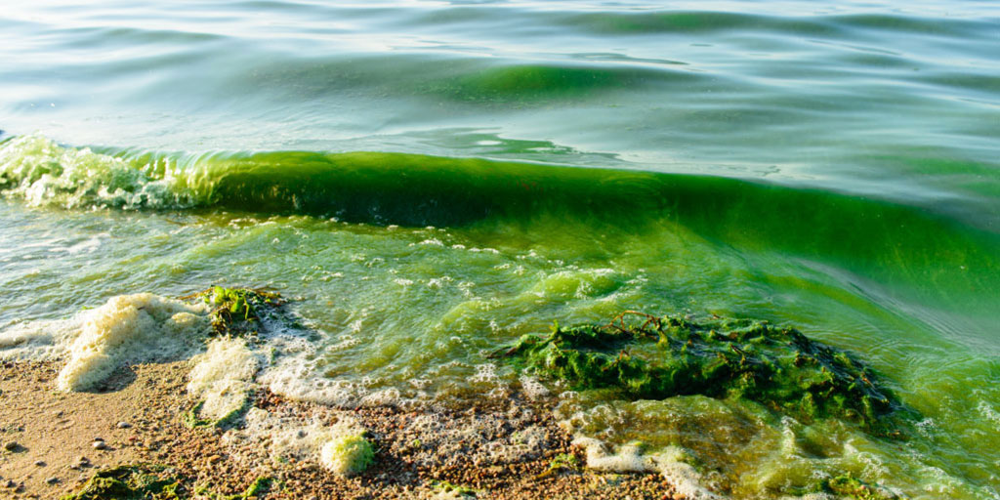
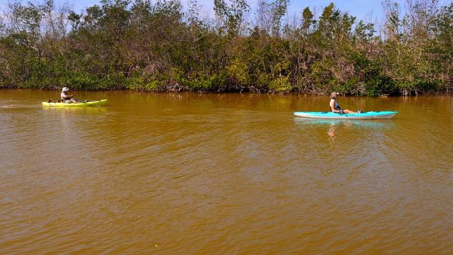
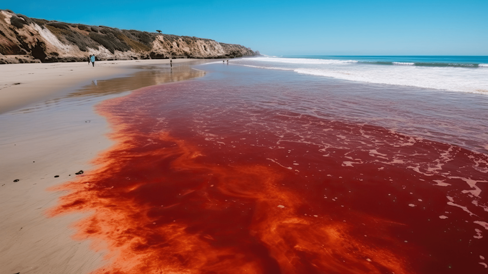

## [Algal Blooms: Definition and Nature]{style="background: #1f2937; color: #ffffff"}

::: {.columns}
::: {.column width="60%"}
*   Algal Blooms is a rapid increase in the population density of algae, particularly phytoplankton, in aquatic environments.
*   This can be found in both marine and freshwater ecosystems.
*   It is often characterized by visible accumulation on the water surface, changing coloration to green, brown, or reddish.
:::
::: {.column width="40%"}

*   Not all blooms are harmful; many are natural components of the ecosystem.

:::
:::

## [The Ecological Role of Blooms]{style="background: #1f2937; color: #ffffff"}

*   **Primary production**: Serve as the base of aquatic food webs by converting inorganic nutrients into organic matter.
*   **Nutrient cycling**: Contribute significantly to the cycling of nitrogen and phosphorus in aquatic environments.
*   **Oxygen production**: As photosynthetic organisms, they contribute to dissolved oxygen levels (though excessive blooms can lead to the opposite effect during decomposition).
*   **Imbalance**: Problems arise when blooms become **excessive** or **prolonged**, leading to habitat degradation and ecological shifts.

## 

## 

## [Harmful Algal Bloom (HAB)]{style="background: #1f2937; color: #ffffff"}

::: {.columns}
::: {.column width="60%"}
*   A **Harmful Algal Bloom (HAB)** is a specific type of bloom that poses risks to human health, animal health, or the environment.
*   Unlike non-harmful blooms, HABs are often dominated by species that produce **potent toxins**.
*   These toxins can contaminate drinking water supplies, shellfish beds, and recreational waters.
*   Risks to public health occur through **ingestion, inhalation, or skin contact**.
:::
::: {.column width="40%"}

:::
:::

## [Consequences of HABs]{style="background: #1f2937; color: #ffffff"}

**Health & economic impacts:**

*   **Human & animal health**: Exposure can cause gastrointestinal illness, neurological disorders, respiratory problems, and even death.
*   **Economic losses**: Impacts industries such as fisheries, aquaculture, tourism, and recreational activities through beach closures and harvest restrictions.
*   **Ecological disruption**: Leads to fish kills, loss of biodiversity, and habitat degradation due to hypoxia or direct toxicity.

::: {.callout-important}
### Public health risk
HAB toxins can contaminate drinking water and seafood, posing risks through ingestion, inhalation, or skin contact.
:::

## [Causes of Algal Blooms]{style="background: #1f2937; color: #ffffff"}
::: {.columns}
::: {.column width="60%"}
**Nutrient pollution (eutrophication):**

*   Primary driver: Excess **nitrogen** and **phosphorus**.
*   Sources: Agricultural runoff, urban stormwater, wastewater discharges, and atmospheric deposition.
*   Leads to rapid proliferation of phytoplankton.
:::
::: {.column width="40%"}

:::
:::

## [Causes of Algal Blooms...]{style="background: #1f2937; color: #ffffff"}
 

**Temperature and climate change:**

*   Algal metabolism is temperature-dependent; warmer waters generally promote faster growth and higher biomass.
*   Seasonal blooms are often triggered by spring warming.
*   Rising global temperatures are increasing the frequency, intensity, and geographic range of blooms.
*   Warmer surface waters create a stable layer that traps nutrients and keeps algae in the sunlit euphotic zone.

## [Causes of Algal Blooms...]{style="background: #1f2937; color: #ffffff"}
 
**Light availability:**

*   Phytoplankton require sunlight for photosynthesis; light availability directly influences the growth and distribution of algal populations.
*   Factors such as water clarity, turbidity, depth of the euphotic zone, and seasonal day length affect the extent of bloom development.
*   **Euphotic zone**: The depth at which light penetrates sufficiently for photosynthesis.
*   In some cases, dense surface blooms can create a **self-shading** effect, limiting light for organisms deeper in the water column.

## [Causes of Algal Blooms...]{style="background: #1f2937; color: #ffffff"}

**Hydrodynamic conditions:**

*   Water movement and circulation patterns play a critical role in the formation and dispersal of blooms.
*  Calm, stagnant conditions reduce vertical mixing, allowing buoyant species (like some cyanobacteria) to accumulate at the surface.
*   Physical forces such as currents, tides, and winds can concentrate algal cells in specific areas like bays or inlets.
*   Conversely, high turbulence and strong currents can disperse blooms, preventing the accumulation of high biomass.

## [Causes of Algal Blooms...]{style="background: #1f2937; color: #ffffff"}
 

**Salinity:**

*   Salinity levels influence the composition and distribution of algal communities.
*   Species are often adapted to specific salinity ranges; shifts can favor certain algae over others.
*   In areas where freshwater and seawater mix, fluctuations due to tides and river flow create niches for specific bloom-forming species.
*   Some harmful species thrive specifically in **brackish water** conditions during periods of high freshwater runoff.

## [Causes of Algal Blooms...]{style="background: #1f2937; color: #ffffff"}

**Biological factors (grazing pressure):**

*   Grazing by zooplankton and other herbivores acts as a natural top-down control on algal populations.
*   If zooplankton populations decline (due to pollution or increased predation by fish), the reduced grazing pressure allows phytoplankton to proliferate unchecked.
*   Some harmful algae are unpalatable or toxic to grazers, further reducing grazing rates and facilitating bloom formation.
*   The balance between nutrient-driven growth (bottom-up) and grazing (top-down) determines whether a bloom occurs.

## [Consequences of Algal Blooms]{style="background: #1f2937; color: #ffffff"}

**Ecological impacts**

::: {.columns}
::: {.column width="60%"}
*   **Shading**: Dense blooms block sunlight, killing submerged aquatic vegetation (e.g., seagrasses).
*   **Hypoxia**: Decomposition of dead algae by bacteria consumes dissolved oxygen, leading to "dead zones."
*   **Food Web disruption**: Altered plankton communities can lead to starvation of higher trophic levels.
*   **Mortality**: Direct toxicity or anoxia causes massive fish kills and declines in biodiversity.
:::
::: {.column width="40%"}

:::
:::

## [Consequences of Algal Blooms...]{style="background: #1f2937; color: #ffffff"}
 

**Human health risks:**

*   Exposure to HAB toxins occurs via **ingestion** (contaminated seafood/water), **inhalation** (aerosolized toxins), or **skin contact**.
*   **Common symptoms include:**

    *   Skin rashes and irritation.
    *   Gastrointestinal distress (nausea, vomiting, diarrhea).
    *   Neurological symptoms (muscle cramps, twitching, numbness).
    *   Severe cases: Paralysis, cardiac or respiratory failure.

::: {.callout-caution}
* Prolonged or repeated exposure to certain algal toxins can lead to more severe conditions, including liver damage and chronic neurological disorders.
+ Severe exposure can result in the death of humans, wildlife, and domestic pets.

:::

## [Consequences of Algal Blooms...]{style="background: #1f2937; color: #ffffff"}

**Economic losses:**

::: {.columns}
::: {.column width="60%"}
*   **Industry impacts**: Significant losses in fisheries, aquaculture, and tourism.
*   **Operational costs**: Increased expenses for water treatment and desalination.
*   **Closures**: Beach closures and shellfish harvesting bans directly impact coastal livelihoods.
*   **Property values**: Decline in waterfront property values due to odors and unsightly scums.
:::
::: {.column width="40%"}

:::
:::

## [Management Strategies for Algal Blooms]{style="background: #1f2937; color: #ffffff"}

**Nutrient management:**

*   Addressing nutrient pollution is crucial for preventing and mitigating algal blooms.
*   **Agricultural BMPs**: Implementing best management practices to reduce fertilizer runoff.
*   **Infrastructure**: Upgrading wastewater treatment facilities to remove nitrogen and phosphorus.
*   **Restoration**: Restoring riparian buffers and wetlands to intercept and filter nutrients before they reach water bodies.

## [Management Strategies...]{style="background: #1f2937; color: #ffffff"}

**Monitoring and Early Warning Systems:**

- Regular monitoring of water quality parameters, algal biomass, and toxin levels can help detect and predict the onset of algal blooms.
- Early warning systems can alert authorities and stakeholders to potential health risks and enable timely management actions.

## [Management Strategies...]{style="background: #1f2937; color: #ffffff"}

**Mechanical and Chemical Control:**

- **Mechanical methods**: Aeration, dredging, and physical harvesting of algal biomass can be used to reduce bloom density.
- **Chemical treatments**: Algaecides (e.g., copper sulfate) or flocculants (e.g., clay) can be employed to kill or sink algal cells.

::: {.callout-caution}

These methods can have unintended environmental implications, such as releasing toxins from lysed cells or harming non-target species, and should be used with caution.
:::

## [Management Strategies...]{style="background: #1f2937; color: #ffffff"}

**Integrated watershed management:**

- Adopting an integrated watershed management approach that addresses land-based sources of nutrient pollution, promotes sustainable land use practices, and protects natural ecosystems can help reduce the risk of algal blooms and enhance the resilience of aquatic systems to environmental stressors.

## [Organisms/Species involved]{style="background: #1f2937; color: #ffffff"}

- Nearly **1/4** of these are known to produce toxins.
- **Causative agents**: Dinoflagellates, diatoms, haptophytes, cyanobacteria, and some silicoflagellates.
- **Terminology**: Often referred to as phytoplankton blooms, toxic algae, red tides, or HABs.
- **Appearance**: Streaks of reddish-brown to greenish-yellow floating debris, often extending for several miles.

## [Different Blooms]{style="background: #1f2937; color: #ffffff"}

**Harmless water discolorations**

 **Example species**: *Gonyaulax poligramma* (found in temperate to tropical waters worldwide).
*   **Nature**: These are non-toxin producing species.
*   **Indirect harm**: While not toxic, massive fish and invertebrate kills may still result under exceptional conditions.
*   **Mechanism**: High biomass leads to **anoxia** (oxygen depletion), as well as sulfide and ammonia accumulation during cell decomposition.

::: {.columns}
::: {.column width="100%"}

:::
:::

## [Different blooms...]{style="background: #1f2937; color: #ffffff"}

**Harmless water discolorations**
 

*   **Cyanobacteria**: Possess algal characteristics such as chlorophyll and oxygenic photosynthesis.
*   **Habitat**: Found across fresh, estuarine, and marine waters.
*   **Toxicity**: Freshwater blooms may consist of toxic species, non-toxic species, or a mix of both.
*   **Cyanotoxins**:
    *   Produced **intracellularly** within the cyanobacteria.
    *   Released into the water (**extracellularly**) primarily through cell death and lysis, rather than active excretion.
*   Major toxin producers include *Microcystis*, *Anabaena*, and *Planktothrix*.
*   **Impact**: Can contaminate drinking water and cause severe health issues in humans and livestock.

## [Different blooms...]{style="background: #1f2937; color: #ffffff"}

- Example of species is *Karenia brevis* (producing **brevetoxins**) or *Alexandrium spp.*
- The affected water turns murky, varying in color: purple, pink, red, or green.

## References
